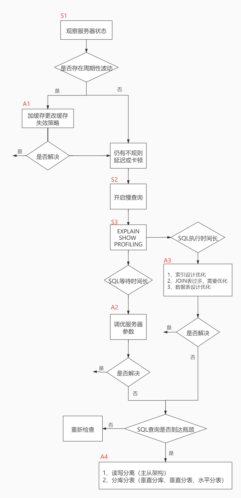
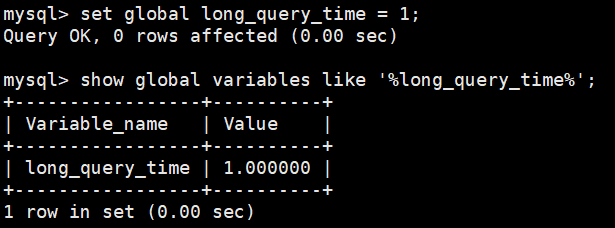
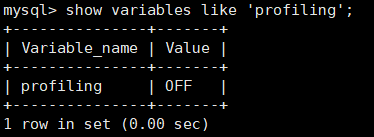
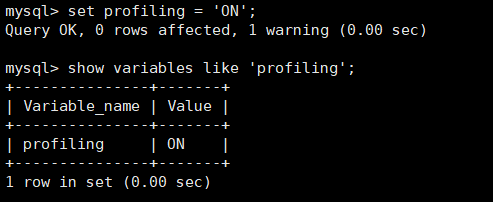
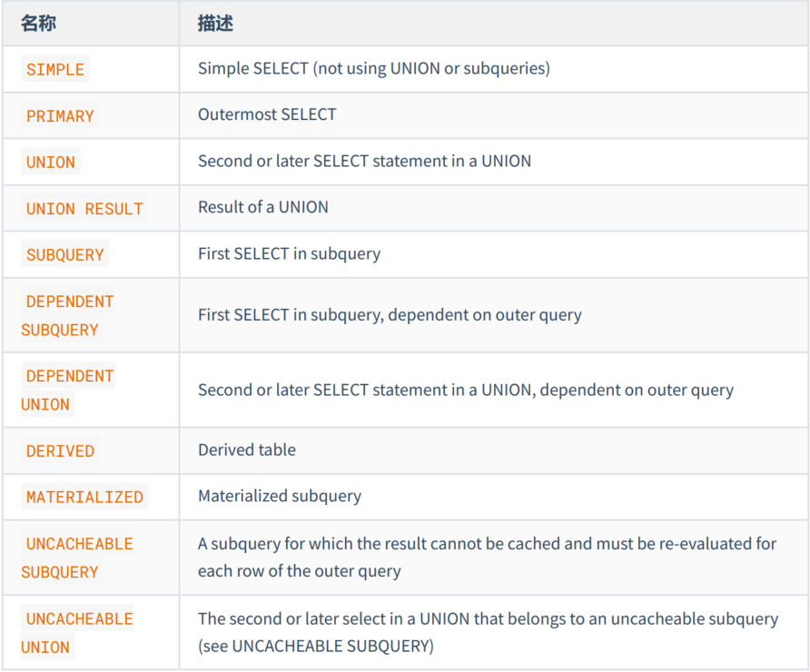

# 第 09 章_性能分析工具的使用


## 1. 数据库服务器的优化步骤

当我们遇到数据库调优问题的时候，该如何思考呢？这里把思考的流程整理成下面这张图。

整个流程划分成了`观察（Show status）`和`行动（Action）`两个部分。字母 S 的部分代表观察（会使用相应的分析工具），字母 A 代表的部分是行动（对应分析可以采取的行动）。



**小结：**


## 2. 查看系统性能参数

在MySQL中，可以使用`SHOW STATUS`语句查询一些MySQL数据库服务器的`性能参数、执行频率`。

SHOW STATUS语句语法如下：

```mysql
SHOW [GLOBAL|SESSION] STATUS LIKE '参数';
```

一些常用的性能参数如下： 

- Connections：连接MySQL服务器的次数。 
- Uptime：MySQL服务器的上线时间。 
- Slow_queries：慢查询的次数。
- Innodb_rows_read：Select查询返回的行数 
- Innodb_rows_inserted：执行INSERT操作插入的行数 
- Innodb_rows_updated：执行UPDATE操作更新的行数  
- Innodb_rows_deleted：执行DELETE操作删除的行数 
- Com_select：查询操作的次数。 
- Com_insert：插入操作的次数。对于批量插入的 INSERT 操作，只累加一次。 
- Com_update：更新操作的次数。 • Com_delete：删除操作的次数。

## 3. 统计SQL的查询成本：last_query_cost

我们依然使用第 8 章的 student_info 表为例：

```mysql
CREATE TABLE `student_info` (
    `id` INT( 11 ) NOT NULL AUTO_INCREMENT,
    `student_id` INT NOT NULL ,
    `name` VARCHAR( 20 ) DEFAULT NULL,
    `course_id` INT NOT NULL ,
    `class_id` INT( 11 ) DEFAULT NULL,
    `create_time` DATETIME DEFAULT CURRENT_TIMESTAMP ON UPDATE CURRENT_TIMESTAMP,
    PRIMARY KEY (`id`)
) ENGINE=INNODB AUTO_INCREMENT= 1 DEFAULT CHARSET=utf8;
```

如果我们想要查询 id= 900001 的记录，然后看下查询成本，我们可以直接在聚簇索引上进行查找：

```mysql
SELECT student_id, class_id, NAME, create_time FROM student_info
WHERE id = 900001 ;
```

运行结果（ 1 条记录，运行时间为 `0.042s`）

然后再看下查询优化器的成本，实际上我们只需要检索一个页即可：

```mysql
mysql> SHOW STATUS LIKE 'last_query_cost';
+-----------------+----------+
| Variable_name | Value |
+-----------------+----------+
| Last_query_cost | 1.000000 |
+-----------------+----------+
```

如果我们想要查询 id 在 900001 到 9000100 之间的学生记录呢？

```mysql
SELECT student_id, class_id, NAME, create_time FROM student_info
WHERE id BETWEEN 900001 AND 900100 ;
```

运行结果（ 100 条记录，运行时间为 `0.046s`）：

然后再看下查询优化器的成本，这时我们大概需要进行 20 个页的查询。

```mysql
mysql> SHOW STATUS LIKE 'last_query_cost';
+-----------------+-----------+
| Variable_name | Value |
+-----------------+-----------+
| Last_query_cost | 21.134453 |
+-----------------+-----------+
```

你能看到页的数量是刚才的 20 倍，但是查询的效率并没有明显的变化，实际上这两个 SQL 查询的时间基本上一样，就是因为采用了顺序读取的方式将页面一次性加载到缓冲池中，然后再进行查找。虽然`页数量（last_query_cost）增加了不少`，但是通过缓冲池的机制，并`没有增加多少查询时间`。

**使用场景：** 它对于比较开销是非常有用的，特别是我们有好几种查询方式可选的时候。

## 4. 定位执行慢的 SQL：慢查询日志

### 4. 1 开启慢查询日志参数

**1. 开启slow_query_log**

```mysql
mysql > set global slow_query_log='ON';
```

然后我们再来查看下慢查询日志是否开启，以及慢查询日志文件的位置：


你能看到这时慢查询分析已经开启，同时文件保存在 `/var/lib/mysql/atguigu02-slow.log`文件中。

**2. 修改long_query_time阈值**

接下来我们来看下慢查询的时间阈值设置，使用如下命令：

```mysql
mysql > show variables like '%long_query_time%';
```


这里如果我们想把时间缩短，比如设置为 1 秒，可以这样设置：

```mysql
#测试发现：设置global的方式对当前session的long_query_time失效。对新连接的客户端有效。所以可以一并
执行下述语句
mysql > set global long_query_time = 1 ;
mysql> show global variables like '%long_query_time%';

mysql> set long_query_time= 1 ;
mysql> show variables like '%long_query_time%';
```


### 4. 2 查看慢查询数目

查询当前系统中有多少条慢查询记录

```mysql
SHOW GLOBAL STATUS LIKE '%Slow_queries%';
```


### 4. 3 案例演示

**步骤1. 建表**

```mysql
CREATE TABLE `student` (
    `id` INT( 11 ) NOT NULL AUTO_INCREMENT,
    `stuno` INT NOT NULL ,
    `name` VARCHAR( 20 ) DEFAULT NULL,
    `age` INT( 3 ) DEFAULT NULL,
    `classId` INT( 11 ) DEFAULT NULL,
    PRIMARY KEY (`id`)
) ENGINE=INNODB AUTO_INCREMENT= 1 DEFAULT CHARSET=utf8;
```

**步骤 2 ：设置参数 log_bin_trust_function_creators**

创建函数，假如报错：

```
This function has none of DETERMINISTIC......
```

- 命令开启：允许创建函数设置：

  ```mysql
  set global log_bin_trust_function_creators= 1 ;  # 不加global只是当前窗口有效。
  ```

  

**步骤 3 ：创建函数**

随机产生字符串：（同上一章）

```mysql
DELIMITER //
CREATE FUNCTION rand_string(n INT) RETURNS VARCHAR( 255 ) #该函数会返回一个字符串
BEGIN
	DECLARE chars_str VARCHAR( 100 ) DEFAULT 'abcdefghijklmnopqrstuvwxyzABCDEFJHIJKLMNOPQRSTUVWXYZ';
	DECLARE return_str VARCHAR( 255 ) DEFAULT '';
	DECLARE i INT DEFAULT 0 ;
	WHILE i < n DO
		SET return_str =CONCAT(return_str,SUBSTRING(chars_str,FLOOR( 1 +RAND()* 52 ), 1 ));
		SET i = i + 1 ;
	END WHILE;
	RETURN return_str;
END //
DELIMITER ;

#测试
SELECT rand_string( 10 );
```

产生随机数值：（同上一章）

```mysql
DELIMITER //
CREATE FUNCTION rand_num (from_num INT ,to_num INT) RETURNS INT( 11 )
BEGIN
    DECLARE i INT DEFAULT 0 ;
    SET i = FLOOR(from_num +RAND()*(to_num - from_num+ 1 )) ;
    RETURN i;
END //
DELIMITER ;

#测试：
SELECT rand_num( 10 , 100 );
```

**步骤 4 ：创建存储过程**

```mysql
DELIMITER //
CREATE PROCEDURE insert_stu1(  START INT , max_num INT )
BEGIN
    DECLARE i INT DEFAULT 0 ;
    SET autocommit = 0 ;  #设置手动提交事务
    REPEAT #循环
    	SET i = i + 1 ;  #赋值
    	INSERT INTO student (stuno, NAME ,age ,classId ) VALUES ((START+i),rand_string( 6 ),rand_num( 10 , 100 ),rand_num( 10 , 1000 ));
    UNTIL i = max_num
    END REPEAT;
COMMIT;  #提交事务
END //
DELIMITER ;
```

**步骤 5 ：调用存储过程**

```mysql
#调用刚刚写好的函数, 4000000条记录,从 100001 号开始
CALL insert_stu1( 100001 , 4000000 );
```

### 4. 4 测试及分析

**1. 测试**

```mysql
mysql> SELECT * FROM student WHERE stuno = 3455655 ;
+---------+---------+--------+------+---------+
| id | stuno | name | age | classId |
+---------+---------+--------+------+---------+
| 3523633 | 3455655 | oQmLUr | 19 | 39 |
+---------+---------+--------+------+---------+
1 row in set (2.09 sec)
mysql> SELECT * FROM student WHERE name = 'oQmLUr';
+---------+---------+--------+------+---------+
| id | stuno | name | age | classId |
+---------+---------+--------+------+---------+
| 1154002 | 1243200 | OQMlUR | 266 | 28 |
| 1405708 | 1437740 | OQMlUR | 245 | 439 |
| 1748070 | 1680092 | OQMlUR | 240 | 414 |
| 2119892 | 2051914 | oQmLUr | 17 | 32 |
| 2893154 | 2825176 | OQMlUR | 245 | 435 |
| 3523633 | 3455655 | oQmLUr | 19 | 39 |
+---------+---------+--------+------+---------+
6 rows in set (2.39 sec)
```

从上面的结果可以看出来，查询学生编号为“ 3455655 ”的学生信息花费时间为 2. 09 秒。查询学生姓名为“oQmLUr”的学生信息花费时间为 2. 39 秒。已经达到了秒的数量级，说明目前查询效率是比较低的，下面的小节我们分析一下原因。

**2. 分析**

```mysql
show status like 'slow_queries';
```


### 4. 5 慢查询日志分析工具：mysqldumpslow

在生产环境中，如果要手工分析日志，查找、分析SQL，显然是个体力活，MySQL提供了日志分析工具`mysqldumpslow`。

查看mysqldumpslow的帮助信息

```mysql
mysqldumpslow --help
```

****

mysqldumpslow 命令的具体参数如下：

- -a: 不将数字抽象成N，字符串抽象成S
- **-s: 是表示按照何种方式排序：**

  - c: 访问次数
  - l: 锁定时间
  - r: 返回记录
  - **t: 查询时间**
  - al:平均锁定时间
  - ar:平均返回记录数
  - at:平均查询时间 （默认方式）
  - ac:平均查询次数

- **-t: 即为返回前面多少条的数据；**

- **-g: 后边搭配一个正则匹配模式，大小写不敏感的；**

举例：我们想要按照查询时间排序，查看前五条 SQL 语句，这样写即可：

```mysql
mysqldumpslow -s t -t 5 /var/lib/mysql/atguigu01-slow.log
```

```mysql
[root@bogon ~]# mysqldumpslow -s t -t 5 /var/lib/mysql/atguigu01-slow.log
Reading mysql slow query log from /var/lib/mysql/atguigu01-slow.log
Count: 1 Time=2.39s ( 2 s)  Lock=0.00s ( 0 s) Rows=13.0 ( 13 ), root[root]@localhost
SELECT * FROM student WHERE name = 'S'

Count: 1 Time=2.09s ( 2 s)  Lock=0.00s ( 0 s) Rows=2.0 ( 2 ), root[root]@localhost
SELECT * FROM student WHERE stuno = N

Died at /usr/bin/mysqldumpslow line 162 , <> chunk 2.
```

**工作常用参考：**

```sh
#得到返回记录集最多的 10 个SQL
mysqldumpslow -s r -t 10 /var/lib/mysql/atguigu-slow.log

#得到访问次数最多的 10 个SQL
mysqldumpslow -s c -t 10 /var/lib/mysql/atguigu-slow.log

#得到按照时间排序的前 10 条里面含有左连接的查询语句
mysqldumpslow -s t -t 10 -g "left join" /var/lib/mysql/atguigu-slow.log

#另外建议在使用这些命令时结合 | 和more 使用 ，否则有可能出现爆屏情况
mysqldumpslow -s r -t 10 /var/lib/mysql/atguigu-slow.log | more
```


### 4. 6 关闭慢查询日志

MySQL服务器停止慢查询日志功能有两种方法：

**方式 1 ：永久性方式**

```properties
[mysqld]
slow_query_log=OFF
```

或者，把slow_query_log一项注释掉 或 删除

```properties
[mysqld]
#slow_query_log =OFF
```

重启MySQL服务，执行如下语句查询慢日志功能。

```mysql
SHOW VARIABLES LIKE '%slow%';  #查询慢查询日志所在目录
SHOW VARIABLES LIKE '%long_query_time%';  #查询超时时长
```

**方式 2 ：临时性方式**

使用SET语句来设置。 

（ 1 ）停止MySQL慢查询日志功能，具体SQL语句如下。

```mysql
SET GLOBAL slow_query_log=off;
```

（ 2 ）**重启MySQL服务**，使用SHOW语句查询慢查询日志功能信息，具体SQL语句如下

```mysql
SHOW VARIABLES LIKE '%slow%';
#以及
SHOW VARIABLES LIKE '%long_query_time%';
```


### 4. 7 删除慢查询日志

## 5. 查看 SQL 执行成本：SHOW PROFILE

```mysql
mysql > show variables like 'profiling';
```



通过设置 `profiling='ON’`来开启 show profile：

```mysql
mysql > set profiling = 'ON';
```



然后执行相关的查询语句。接着看下当前会话都有哪些 profiles，使用下面这条命令：

```mysql
mysql > show profiles;
```


你能看到当前会话一共有 2 个查询。如果我们想要查看最近一次查询的开销，可以使用：

```mysql
mysql > show profile;
```


```mysql
mysql> show profile cpu,block io for query 2 ;
```


**show profile的常用查询参数：**

① ALL：显示所有的开销信息。 

② BLOCK IO：显示块IO开销。

③ CONTEXT SWITCHES：上下文切换开销。 

④ CPU：显示CPU开销信息。 

⑤ IPC：显示发送和接收开销信息。 

⑥ MEMORY：显示内存开销信息。 

⑦ PAGE FAULTS：显示页面错误开销信息。 

⑧ SOURCE：显示和Source_function，Source_file，Source_line相关的开销信息。 

⑨ SWAPS：显示交换次数开销信息。

## 6. 分析查询语句：EXPLAIN

### 6. 1 概述

**官网介绍**

https://dev.mysql.com/doc/refman/5.7/en/explain-output.html

https://dev.mysql.com/doc/refman/8.0/en/explain-output.html


**版本情况**

- MySQL 5.6.3以前只能`EXPLAIN SELECT`；MYSQL 5.6.3以后就可以`EXPLAIN SELECT，UPDATE，DELETE`

- 在5.7以前的版本中，想要显示`partitions`需要使用`explain partitions`命令；想要显示`filtered`需要使用`explain extended`命令。在5.7版本后，默认explain直接显示partitions和filtered中的信息。

  

  

### 6. 2 基本语法

EXPLAIN 或 DESCRIBE语句的语法形式如下：

```mysql
EXPLAIN SELECT select_options
或者
DESCRIBE SELECT select_options
```

如果我们想看看某个查询的执行计划的话，可以在具体的查询语句前边加一个`EXPLAIN`，就像这样：

```mysql
mysql> EXPLAIN SELECT 1 ;
```

`EXPLAIN`语句输出的各个列的作用如下：


### 6. 3 数据准备

**1. 建表**

```mysql
CREATE TABLE s1 (
    id INT AUTO_INCREMENT,
    key1 VARCHAR( 100 ),
    key2 INT,
    key3 VARCHAR( 100 ),
    key_part1 VARCHAR( 100 ),
    key_part2 VARCHAR( 100 ),
    key_part3 VARCHAR( 100 ),
    common_field VARCHAR( 100 ),
    PRIMARY KEY (id),
    INDEX idx_key1 (key1),
    UNIQUE INDEX idx_key2 (key2),
    INDEX idx_key3 (key3),
    INDEX idx_key_part(key_part1, key_part2, key_part3)
) ENGINE=INNODB CHARSET=utf8;
```
```mysql
CREATE TABLE s2 (
    id INT AUTO_INCREMENT,
    key1 VARCHAR( 100 ),
    key2 INT,
    key3 VARCHAR( 100 ),
    key_part1 VARCHAR( 100 ),
    key_part2 VARCHAR( 100 ),
    key_part3 VARCHAR( 100 ),
    common_field VARCHAR( 100 ),
    PRIMARY KEY (id),
    INDEX idx_key1 (key1),
    UNIQUE INDEX idx_key2 (key2),
    INDEX idx_key3 (key3),
    INDEX idx_key_part(key_part1, key_part2, key_part3)
) ENGINE=INNODB CHARSET=utf8;
```

**2. 设置参数 log_bin_trust_function_creators**

创建函数，假如报错，需开启如下命令：允许创建函数设置：

```mysql
set global log_bin_trust_function_creators= 1 ;  # 不加global只是当前窗口有效。
```

**3. 创建函数**

```mysql
DELIMITER //
CREATE FUNCTION rand_string1(n INT)
RETURNS VARCHAR( 255 ) #该函数会返回一个字符串
BEGIN
    DECLARE chars_str VARCHAR( 100 ) DEFAULT 'abcdefghijklmnopqrstuvwxyzABCDEFJHIJKLMNOPQRSTUVWXYZ';
    DECLARE return_str VARCHAR( 255 ) DEFAULT '';
    DECLARE i INT DEFAULT 0 ;
    WHILE i < n DO
        SET return_str =CONCAT(return_str,SUBSTRING(chars_str,FLOOR( 1 +RAND()* 52 ), 1 ));
        SET i = i + 1 ;
    END WHILE;
    RETURN return_str;
END //
DELIMITER ;
```

**4. 创建存储过程**

创建往s1 表中插入数据的存储过程：

```mysql
DELIMITER //
CREATE PROCEDURE insert_s1 (IN min_num INT ( 10 ),IN max_num INT ( 10 ))
BEGIN
    DECLARE i INT DEFAULT 0 ;
    SET autocommit = 0 ;
    REPEAT
    SET i = i + 1 ;
    INSERT INTO s1 VALUES(
    (min_num + i),
    rand_string1( 6 ),
    (min_num + 30 * i + 5 ),
    rand_string1( 6 ),
    rand_string1( 10 ),
    rand_string1( 5 ),
    rand_string1( 10 ),
    rand_string1( 10 ));
    UNTIL i = max_num
    END REPEAT;
    COMMIT;
END //
DELIMITER ;
```

创建往s2 表中插入数据的存储过程：

```mysql
DELIMITER //
CREATE PROCEDURE insert_s2 (IN min_num INT ( 10 ),IN max_num INT ( 10 ))
BEGIN
    DECLARE i INT DEFAULT 0 ;
    SET autocommit = 0 ;
    REPEAT
    SET i = i + 1 ;
    INSERT INTO s2 VALUES(
    (min_num + i),
    rand_string1( 6 ),
    (min_num + 30 * i + 5 ),
    rand_string1( 6 ),
    rand_string1( 10 ),
    rand_string1( 5 ),
    rand_string1( 10 ),
    rand_string1( 10 ));
    UNTIL i = max_num
    END REPEAT;
    COMMIT;
END //
DELIMITER ;
```

**5. 调用存储过程**

s1表数据的添加：加入 1 万条记录：

```mysql
CALL insert_s1( 10001 , 10000 );
```

s2表数据的添加：加入 1 万条记录：

```mysql
CALL insert_s2( 10001 , 10000 );
```


### 6. 4 EXPLAIN各列作用

为了让大家有比较好的体验，我们调整了下`EXPLAIN`输出列的顺序。

#### 1. table

不论我们的查询语句有多复杂，里边儿`包含了多少个表`，到最后也是需要对每个表进行`单表访问`的，所以MySQL规定 **EXPLAIN语句输出的每条记录都对应着某个单表的访问方法** ，该条记录的table列代表着该表的表名（有时不是真实的表名字，可能是简称）。

#### 2. id

我们写的查询语句一般都以`SELECT`关键字开头，比较简单的查询语句里只有一个`SELECT`关键字，比如下边这个查询语句：

```mysql
SELECT * FROM s1 WHERE key1 = 'a';
```

稍微复杂一点的连接查询中也只有一个SELECT关键字，比如：

```mysql
SELECT * FROM s1 INNER JOIN s
ON s1.key 1 = s2.key 1
WHERE s1.common_field = 'a';
```
```
mysql> EXPLAIN SELECT * FROM s1 WHERE key1 = 'a';
```


```mysql
mysql> EXPLAIN SELECT * FROM s1 INNER JOIN s2;
```


```mysql
mysql> EXPLAIN SELECT * FROM s1 WHERE key1 IN (SELECT key1 FROM s2) OR key3 = 'a';
```


```mysql
mysql> EXPLAIN SELECT * FROM s1 WHERE key1 IN (SELECT key2 FROM s2 WHERE common_field= 'a');
```


```mysql
mysql> EXPLAIN SELECT * FROM s1 UNION SELECT * FROM s2;
```


```mysql
mysql> EXPLAIN SELECT * FROM s1  UNION ALL SELECT * FROM s2;
```


**小结:**

- **id如果相同，可以认为是一组，从上往下顺序执行**

- **在所有组中，id值越大，优先级越高，越先执行**

- **关注点：id号每个号码，表示一趟独立的查询, 一个sql的查询趟数越少越好**

#### 3. select_type



具体分析如下：

```mysql
mysql> EXPLAIN SELECT * FROM s1;
```


当然，连接查询也算是`SIMPLE`类型，比如：

```mysql
mysql> EXPLAIN SELECT * FROM s1 INNER JOIN s2;
```


- `PRIMARY`

  ```mysql
  mysql> EXPLAIN SELECT * FROM s1 UNION SELECT * FROM s2;
  ```

  

  

- `UNION`

- `UNION RESULT`

- `SUBQUERY`

  ```mysql
  mysql> EXPLAIN SELECT * FROM s1 WHERE key1 IN (SELECT key1 FROM s2) OR key3 = 'a';
  ```

  

- `DEPENDENT SUBQUERY`

  ```mysql
  mysql> EXPLAIN SELECT * FROM s1 WHERE key1 IN (SELECT key1 FROM s2 WHERE s1.key 2 =s2.key 2 ) OR key3 = 'a';
  ```

  

- `DEPENDENT UNION`

  ```mysql
  mysql> EXPLAIN SELECT * FROM s1 WHERE key1 IN (SELECT key1 FROM s2 WHERE key1 ='a' UNION SELECT key1 FROM s1 WHERE key1 = 'b');
  ```

  

- `DERIVED`

  ```mysql
  mysql> EXPLAIN SELECT * FROM (SELECT key1, count(*) as c FROM s1 GROUP BY key1) AS derived_s1 where c > 1 ;
  ```

  

- `MATERIALIZED`

  ```mysql
  mysql> EXPLAIN SELECT * FROM s1 WHERE key1 IN (SELECT key1 FROM s2);
  ```

  

- `UNCACHEABLE SUBQUERY`

  不常用，就不多说了。

- `UNCACHEABLE UNION`

  不常用，就不多说了。

#### 4. partitions (可略)

- 如果想详细了解，可以如下方式测试。创建分区表：

  ```mysql
  -- 创建分区表，
  -- 按照id分区，id<100 p0分区，其他p1分区
  CREATE TABLE user_partitions (id INT auto_increment,
      NAME VARCHAR( 12 ),PRIMARY KEY(id))
      PARTITION BY RANGE(id)(
      PARTITION p0 VALUES less than( 100 ),
      PARTITION p1 VALUES less than MAXVALUE
  );
  ```

  

  ```mysql
  DESC SELECT * FROM user_partitions WHERE id> 200 ;
  ```

  查询id大于 200 （ 200 > 100 ，p 1 分区）的记录，查看执行计划，partitions是p 1 ，符合我们的分区规则

  

#### 5. type ☆

完整的访问方法如下：`system`，`const`，`eq_ref`，`ref`，`fulltext`，`ref_or_null`，`index_merge`，`unique_subquery`，`index_subquery`，`range`，`index`，`ALL`。

我们详细解释一下：

- `system`

  ```mysql
  mysql> CREATE TABLE t(i int) Engine=MyISAM;
  Query OK, 0 rows affected (0.05 sec)
  
  mysql> INSERT INTO t VALUES( 1 );
  Query OK, 1 row affected (0.01 sec)
  ```

  然后我们看一下查询这个表的执行计划：

  ```mysql
  mysql> EXPLAIN SELECT * FROM t;
  ```

  

- `const`

  ```mysql
  mysql> EXPLAIN SELECT * FROM s1 WHERE id = 10005 ;
  ```

  

- `eq_ref`

  ```mysql
  mysql> EXPLAIN SELECT * FROM s1 INNER JOIN s2 ON s1.id = s2.id;
  ```

  

  从执行计划的结果中可以看出，MySQL打算将s2 作为驱动表，s1 作为被驱动表，重点关注s 1 的访问方法是`eq_ref`，表明在访问s1 表的时候可以`通过主键的等值匹配`来进行访问。

- `ref`

  ```mysql
  mysql> EXPLAIN SELECT * FROM s1 WHERE key1 = 'a';
  ```

  

- `fulltext`

  全文索引

- `ref_or_null`

  ```mysql
  mysql> EXPLAIN SELECT * FROM s1 WHERE key1 = 'a' OR key1 IS NULL;
  ```

  

- `index_merge`

  ```mysql
  mysql> EXPLAIN SELECT * FROM s1 WHERE key1 = 'a' OR key3 = 'a';
  ```

  

  从执行计划的`type`列的值是`index_merge`就可以看出，MySQL 打算使用索引合并的方式来执行对`s1`表的查询。

- `unique_subquery`

  ```mysql
  mysql> EXPLAIN SELECT * FROM s1 WHERE key2 IN (SELECT id FROM s2 where s1.key 1 =s2.key 1 ) OR key3 = 'a';
  ```

  

- `index_subquery`

  ```mysql
  mysql> EXPLAIN SELECT * FROM s1 WHERE common_field IN (SELECT key3 FROM s2 wheres1.key 1 = s2.key 1 ) OR key3 = 'a';
  ```

  

- `range`

  ```mysql
  mysql> EXPLAIN SELECT * FROM s1 WHERE key1 IN ('a', 'b', 'c');
  ```

  

  或者：

  ```mysql
  mysql> EXPLAIN SELECT * FROM s1 WHERE key1 > 'a' AND key1 < 'b';
  ```

  

- `index`

  ```mysql
  mysql> EXPLAIN SELECT key_part2 FROM s1 WHERE key_part3 = 'a';
  ```

  

- `ALL`

  ```mysql
  mysql> EXPLAIN SELECT * FROM s1;
  ```

  

**小结**：

**结果值从最好到最坏依次是： `system > const > eq_ref > ref` > fulltext > ref_or_null > index_merge >unique_subquery > index_subquery > `range > index > ALL` 其中比较重要的几个提取出来（见上图中的蓝色）。SQL 性能优化的目标：至少要达到 range 级别，要求是 ref 级别，最好是 consts级别。（阿里巴巴开发手册要求）**

#### 6. possible_keys和key

```mysql
mysql> EXPLAIN SELECT * FROM s1 WHERE key1 > 'z' AND key3 = 'a';
```


#### 7. key_len ☆

```mysql
mysql> EXPLAIN SELECT * FROM s1 WHERE id = 10005 ;
```


```mysql
mysql> EXPLAIN SELECT * FROM s1 WHERE key2 = 10126 ;
```


```mysql
mysql> EXPLAIN SELECT * FROM s1 WHERE key1 = 'a';
```


```mysql
mysql> EXPLAIN SELECT * FROM s1 WHERE key_part1 = 'a';
```


```mysql
mysql> EXPLAIN SELECT * FROM s1 WHERE key_part1 = 'a' AND key_part2 = 'b';
```


**练习：**

**key_len的长度计算公式：**

```mysql
varchar(10)变长字段且允许NULL = 10 * ( character set：
utf8=3,gbk=2,latin1=1)+1(NULL)+2(变长字段)

varchar(10)变长字段且不允许NULL = 10 * ( character set：utf8=3,gbk=2,latin1=1)+2(变长字段)

char(10)固定字段且允许NULL = 10 * ( character set：utf8=3,gbk=2,latin1=1)+1(NULL)

char(10)固定字段且不允许NULL = 10 * ( character set：utf8=3,gbk=2,latin1=1)
```

#### 8. ref

```mysql
mysql> EXPLAIN SELECT * FROM s1 WHERE key1 = 'a';
```


```mysql
mysql> EXPLAIN SELECT * FROM s1 INNER JOIN s2 ON s1.id = s2.id;
```


```mysql
mysql> EXPLAIN SELECT * FROM s1 INNER JOIN s2 ON s2.key 1 = UPPER(s1.key 1 );
```


#### 9. rows ☆

```mysql
mysql> EXPLAIN SELECT * FROM s1 WHERE key1 > 'z';
```


#### 10. filtered

```mysql
mysql> EXPLAIN SELECT * FROM s1 WHERE key1 > 'z' AND common_field = 'a';
```


```mysql
mysql> EXPLAIN SELECT * FROM s1 INNER JOIN s2 ON s1.key 1 = s2.key 1 WHERE s1.common_field = 'a';
```


#### 11. Extra ☆

```mysql
mysql> EXPLAIN SELECT 1 ;
```


- `Impossible WHERE`

  ```mysql
  mysql> EXPLAIN SELECT * FROM s1 WHERE 1 != 1 ;
  ```

  

- `Using where`

  ```mysql
  mysql> EXPLAIN SELECT * FROM s1 WHERE common_field = 'a';
  ```

  

  

```
mysql> EXPLAIN SELECT * FROM s1 WHERE key1 = 'a' AND common_field = 'a';
```


- `No matching min/max row`

  ```mysql
  mysql> EXPLAIN SELECT MIN(key1) FROM s1 WHERE key1 = 'abcdefg';
  ```

  

- `Using index`

  ```mysql
  mysql> EXPLAIN SELECT key1 FROM s1 WHERE key1 = 'a';
  ```

  

- `Using index condition`

  ```mysql
  SELECT * FROM s1 WHERE key1 > 'z' AND key1 LIKE '%a';
  ```

  ```mysql
  mysql> EXPLAIN SELECT * FROM s1 WHERE key1 > 'z' AND key1 LIKE '%b';
  ```

  

- `Using join buffer (Block Nested Loop)`

  ```mysql
  mysql> EXPLAIN SELECT * FROM s1 INNER JOIN s2 ON s1.common_field =s2.common_field;
  ```

  

- `Not exists`

  ```mysql
  mysql> EXPLAIN SELECT * FROM s1 LEFT JOIN s2 ON s1.key 1 = s2.key 1 WHERE s2.id IS NULL;
  ```

  

- `Using intersect(...)、Using union(...)和Using sort_union(...)`

  ```mysql
  mysql> EXPLAIN SELECT * FROM s1 WHERE key1 = 'a' OR key3 = 'a';
  ```

  

- `Zero limit`

  ```mysql
  mysql> EXPLAIN SELECT * FROM s1 LIMIT 0 ;
  ```

  

- `Using filesort`

  ```mysql
  mysql> EXPLAIN SELECT * FROM s1 ORDER BY key1 LIMIT 10 ;
  ```

  

  ```mysql
  mysql> EXPLAIN SELECT * FROM s1 ORDER BY common_field LIMIT 10 ;
  ```

  

- `Using temporary`

  ```mysql
  mysql> EXPLAIN SELECT DISTINCT common_field FROM s1;
  ```

  

  再比如：

  ```mysql
  mysql> EXPLAIN SELECT common_field, COUNT(*) AS amount FROM s1 GROUP BY common_field;
  ```

  

  ```mysql
  mysql> EXPLAIN SELECT key1, COUNT(*) AS amount FROM s1 GROUP BY key1;
  ```

  

  从`Extra`的`Using index`的提示里我们可以看出，上述查询只需要扫描`idx_key1`索引就可以搞定了，不再需要临时表了。

- `其它`

  其它特殊情况这里省略。

#### 12. 小结

- EXPLAIN不考虑各种Cache

- EXPLAIN不能显示MySQL在执行查询时所作的优化工作

- EXPLAIN不会告诉你关于触发器、存储过程的信息或用户自定义函数对查询的影响情况

- 部分统计信息是估算的，并非精确值

## 7. EXPLAIN的进一步使用

### 7. 1 EXPLAIN四种输出格式

这里谈谈EXPLAIN的输出格式。EXPLAIN可以输出四种格式：`传统格式`，`JSON格式`，`TREE格式`以及`可视化输出`。用户可以根据需要选择适用于自己的格式。

#### 1. 传统格式

传统格式简单明了，输出是一个表格形式，概要说明查询计划。

```mysql
mysql> EXPLAIN SELECT s1.key 1 , s2.key 1 FROM s1 LEFT JOIN s2 ON s1.key 1 = s2.key 1 WHERE s2.common_field IS NOT NULL;
```


#### 2. JSON格式

- JSON格式：在EXPLAIN单词和真正的查询语句中间加上`FORMAT=JSON`。

  ```mysql
  EXPLAIN FORMAT=JSON SELECT ....
  ```

  我们使用`#`后边跟随注释的形式为大家解释了`EXPLAIN FORMAT=JSON`语句的输出内容，但是大家可能有疑问`"cost_info"`里边的成本看着怪怪的，它们是怎么计算出来的？先看`s1`表的"`cost_info`"部分：

  ```json
  "cost_info": {
  "read_cost": "1840.84",
  "eval_cost": "193.76",
  "prefix_cost": "2034.60",
  "data_read_per_join": "1M"
  }
  ```

  

- `read_cost`是由下边这两部分组成的：

  - `IO`成本
  - 检测`rows × (1 - filter)`条记录的`CPU`成本

  > 小贴士： rows和filter都是我们前边介绍执行计划的输出列，在JSON格式的执行计划中，rows相当于rows_examined_per_scan，filtered名称不变。

- `eval_cost`是这样计算的：

  检测 rows × filter条记录的成本。

- `prefix_cost`就是单独查询`s1`表的成本，也就是：

  `read_cost + eval_cost`

- `data_read_per_join`表示在此次查询中需要读取的数据量。

对于`s2`表的`"cost_info"`部分是这样的：

```json
"cost_info": {
    "read_cost": "968.80",
    "eval_cost": "193.76",
    "prefix_cost": "3197.16",
    "data_read_per_join": "1M"
}
```

由于`s2`表是被驱动表，所以可能被读取多次，这里的`read_cost`和`eval_cost`是访问多次`s2`表后累加起来的值，大家主要关注里边儿的`prefix_cost`的值代表的是整个连接查询预计的成本，也就是单次查询`s1`表和多次查询`s2`表后的成本的和，也就是：

```
968.80 + 193.76 + 2034.60 = 3197.16
```

#### 3. TREE格式

TREE格式是8.0.16版本之后引入的新格式，主要根据查询的各个部分之间的关系和`各部分的执行顺序`来描述如何查询。

```mysql
mysql> EXPLAIN FORMAT=tree SELECT * FROM s1 INNER JOIN s2 ON s1.key 1 = s2.key 2 WHERE
s1.common_field = 'a'\G
*************************** 1. row ***************************
EXPLAIN: -> Nested loop inner join (cost=1360.08 rows= 990 )
-> Filter: ((s1.common_field = 'a') and (s1.key 1 is not null)) (cost=1013.75
rows= 990 )
-> Table scan on s1 (cost=1013.75 rows= 9895 )
-> Single-row index lookup on s2 using idx_key2 (key2=s1.key 1 ), with index
condition: (cast(s1.key 1 as double) = cast(s2.key 2 as double)) (cost=0.25 rows= 1 )

1 row in set, 1 warning (0.00 sec)
```
#### 4. 可视化输出

可视化输出，可以通过MySQL Workbench可视化查看MySQL的执行计划。通过点击Workbench的放大镜图标，即可生成可视化的查询计划。

上图按从左到右的连接顺序显示表。红色框表示`全表扫描`，而绿色框表示使用`索引查找`。对于每个表，显示使用的索引。还要注意的是，每个表格的框上方是每个表访问所发现的行数的估计值以及访问该表的成本。

### 7. 2 SHOW WARNINGS的使用

```mysql
mysql> EXPLAIN SELECT s1.key 1 , s2.key 1 FROM s1 LEFT JOIN s2 ON s1.key 1 = s2.key 1 WHERE
s2.common_field IS NOT NULL;
```


```mysql
mysql> SHOW WARNINGS\G
*************************** 1. row ***************************
Level: Note
Code: 1003
Message: /* select#1 */ select `atguigu`.`s1`.`key1` AS `key1`,`atguigu`.`s2`.`key1`
AS `key1` from `atguigu`.`s1` join `atguigu`.`s2` where ((`atguigu`.`s1`.`key1` =
`atguigu`.`s2`.`key1`) and (`atguigu`.`s2`.`common_field` is not null))
1 row in set (0.00 sec)
```


## 8. 分析优化器执行计划：trace

```mysql
SET optimizer_trace="enabled=on",end_markers_in_json=on;

set optimizer_trace_max_mem_size= 1000000 ;
```

开启后，可分析如下语句：

- SELECT

- INSERT

- REPLACE

- UPDATE

- DELETE

- EXPLAIN

- SET

- DECLARE

- CASE

- IF

- RETURN

- CALL

测试：执行如下SQL语句

```mysql
select * from student where id < 10 ;
```

最后， 查询 information_schema.optimizer_trace 就可以知道MySQL是如何执行SQL的 ：

```mysql
select * from information_schema.optimizer_trace\G
```
```json
*************************** 1. row ***************************
//第1部分：查询语句
QUERY: select * from student where id < 10
//第2部分：QUERY字段对应语句的跟踪信息
TRACE: {
"steps": [
{
"join_preparation": { //预备工作
"select#": 1,
"steps": [
{
"expanded_query": "/* select#1 */ select `student`.`id` AS
`id`,`student`.`stuno` AS `stuno`,`student`.`name` AS `name`,`student`.`age` AS
`age`,`student`.`classId` AS `classId` from `student` where (`student`.`id` < 10)"
}
] /* steps */
} /* join_preparation */
},
{
"join_optimization": { //进行优化
"select#": 1,
"steps": [
{
"condition_processing": { //条件处理
"condition": "WHERE",
"original_condition": "(`student`.`id` < 10)",
"steps": [
{
"transformation": "equality_propagation",
"resulting_condition": "(`student`.`id` < 10)"
},
{
"transformation": "constant_propagation",
"resulting_condition": "(`student`.`id` < 10)"
},
{
"transformation": "trivial_condition_removal",
"resulting_condition": "(`student`.`id` < 10)"
}
] /* steps */
} /* condition_processing */
},
{
"substitute_generated_columns": { //替换生成的列
} /* substitute_generated_columns */
},
{
"table_dependencies": [ //表的依赖关系
{
"table": "`student`",
"row_may_be_null": false,
"map_bit": 0,
"depends_on_map_bits": [
] /* depends_on_map_bits */
}
] /* table_dependencies */
},
{
"ref_optimizer_key_uses": [ //使用键
] /* ref_optimizer_key_uses */
},
{
"rows_estimation": [ //行判断
{
"table": "`student`",
"range_analysis": {
"table_scan": {
"rows": 3973767,
"cost": 408558
} /* table_scan */, //扫描表
"potential_range_indexes": [ //潜在的范围索引
{
"index": "PRIMARY",
"usable": true,
"key_parts": [
"id"
] /* key_parts */
}
] /* potential_range_indexes */,
"setup_range_conditions": [ //设置范围条件
] /* setup_range_conditions */,
"group_index_range": {
"chosen": false,
"cause": "not_group_by_or_distinct"
} /* group_index_range */,
"skip_scan_range": {
"potential_skip_scan_indexes": [
{
"index": "PRIMARY",
"usable": false,
"cause": "query_references_nonkey_column"
}
] /* potential_skip_scan_indexes */
} /* skip_scan_range */,
"analyzing_range_alternatives": { //分析范围选项
"range_scan_alternatives": [
{
index": "PRIMARY",
"ranges": [
"id < 10"
] /* ranges */,
"index_dives_for_eq_ranges": true,
"rowid_ordered": true,
"using_mrr": false,
"index_only": false,
"rows": 9,
"cost": 1.91986,
"chosen": true
}
] /* range_scan_alternatives */,
"analyzing_roworder_intersect": {
"usable": false,
"cause": "too_few_roworder_scans"
} /* analyzing_roworder_intersect */
} /* analyzing_range_alternatives */,
"chosen_range_access_summary": { //选择范围访问摘要
"range_access_plan": {
"type": "range_scan",
"index": "PRIMARY",
"rows": 9,
"ranges": [
"id < 10"
] /* ranges */
} /* range_access_plan */,
"rows_for_plan": 9,
"cost_for_plan": 1.91986,
"chosen": true
} /* chosen_range_access_summary */
} /* range_analysis */
}
] /* rows_estimation */
},
{
"considered_execution_plans": [ //考虑执行计划
{
"plan_prefix": [
] /* plan_prefix */,
"table": "`student`",
"best_access_path": { //最佳访问路径
"considered_access_paths": [
{
"rows_to_scan": 9,
"access_type": "range",
"range_details": {
"used_index": "PRIMARY"
} /* range_details */,
"resulting_rows": 9,
"cost": 2.81986,
"chosen": true
}
] /* considered_access_paths */
} /* best_access_path */,
"condition_filtering_pct": 100, //行过滤百分比
"rows_for_plan": 9,
"cost_for_plan": 2.81986,
"chosen": true
}
] /* considered_execution_plans */
},
{
"attaching_conditions_to_tables": { //将条件附加到表上
"original_condition": "(`student`.`id` < 10)",
"attached_conditions_computation": [
] /* attached_conditions_computation */,
"attached_conditions_summary": [ //附加条件概要
{
"table": "`student`",
"attached": "(`student`.`id` < 10)"
}
] /* attached_conditions_summary */
} /* attaching_conditions_to_tables */
},
{
"finalizing_table_conditions": [
{
"table": "`student`",
"original_table_condition": "(`student`.`id` < 10)",
"final_table_condition ": "(`student`.`id` < 10)"
}
] /* finalizing_table_conditions */
},
{
"refine_plan": [ //精简计划
{
"table": "`student`"
}
] /* refine_plan */
}
] /* steps */
} /* join_optimization */
},
{
"join_execution": { //执行
"select#": 1,
"steps": [
] /* steps */
} /* join_execution */
}
] /* steps */
} 
//第3部分：跟踪信息过长时，被截断的跟踪信息的字节数。
MISSING_BYTES_BEYOND_MAX_MEM_SIZE: 0 //丢失的超出最大容量的字节
//第4部分：执行跟踪语句的用户是否有查看对象的权限。当不具有权限时，该列信息为1且TRACE字段为空，一般在调用带有SQL SECURITY DEFINER的视图或者是存储过程的情况下，会出现此问题。
INSUFFICIENT_PRIVILEGES: 0 //缺失权限
1 row in set (0.00 sec)
```


## 9. MySQL监控分析视图-sys schema

### 9.1 Sys schema视图摘要

**1. 主机相关**： 以host_summary开头，主要汇总了IO延迟的信息。

**2. Innodb相关**： 以innodb开头，汇总了innodb buffer信息和事务等待innodb锁的信息。

**3. I/o相关**： 以io开头，汇总了等待I/O、I/O使用量情况。

**4. 内存使用情况**： 以memory开头，从主机、线程、事件等角度展示内存的使用情况

**5. 连接与会话信息**： processlist和session相关视图，总结了会话相关信息。

**6. 表相关**： 以schema_table开头的视图，展示了表的统计信息。

**7. 索引信息**： 统计了索引的使用情况，包含冗余索引和未使用的索引情况。

**8. 语句相关**： 以statement开头，包含执行全表扫描、使用临时表、排序等的语句信息。

**9. 用户相关**： 以user开头的视图，统计了用户使用的文件I/O、执行语句统计信息。

**10. 等待事件相关信息**： 以wait开头，展示等待事件的延迟情况。

### 9.2 Sys schema视图使用场景

**索引情况**

```mysql
#1. 查询冗余索引
select * from sys.schema_redundant_indexes;
#2. 查询未使用过的索引
select * from sys.schema_unused_indexes;
#3. 查询索引的使用情况
select index_name,rows_selected,rows_inserted,rows_updated,rows_deleted
from sys.schema_index_statistics where table_schema='dbname' ;
```

**表相关**

```mysql
# 1. 查询表的访问量
select table_schema,table_name,sum(io_read_requests+io_write_requests) as io from
sys.schema_table_statistics group by table_schema,table_name order by io desc;
# 2. 查询占用bufferpool较多的表
select object_schema,object_name,allocated,data
from sys.innodb_buffer_stats_by_table order by allocated limit 10 ;
# 3. 查看表的全表扫描情况
select * from sys.statements_with_full_table_scans where db='dbname';
```

**语句相关**

```mysql
#1. 监控SQL执行的频率
select db,exec_count,query from sys.statement_analysis
order by exec_count desc;

#2. 监控使用了排序的SQL
select db,exec_count,first_seen,last_seen,query
from sys.statements_with_sorting limit 1 ;

#3. 监控使用了临时表或者磁盘临时表的SQL
select db,exec_count,tmp_tables,tmp_disk_tables,query
from sys.statement_analysis where tmp_tables> 0 or tmp_disk_tables > 0
order by (tmp_tables+tmp_disk_tables) desc;
```

**IO相关**

```mysql
#1. 查看消耗磁盘IO的文件
select file,avg_read,avg_write,avg_read+avg_write as avg_io
from sys.io_global_by_file_by_bytes order by avg_read  limit 10 ;
```


##### Innodb 相关

```mysql
#1. 行锁阻塞情况
select * from sys.innodb_lock_waits;
```