# 第 10 章_索引优化与查询优化

都有哪些维度可以进行数据库调优？简言之：

- 索引失效、没有充分利用到索引——索引建立
- 关联查询太多JOIN（设计缺陷或不得已的需求）—-SQL优化
- 服务器调优及各个参数设置（缓冲、线程数等）——调整my.cnf
- 数据过多——分库分表

关于数据库调优的知识点非常分散。不同的DBMS，不同的公司，不同的职位，不同的项目遇到的问题都不尽相同。这里我们分为三个章节进行细致讲解。

虽然SQL查询优化的技术有很多，但是大方向上完全可以分成`物理查询优化`和`逻辑查询优化`两大块。

- 物理查询优化是通过`索引`和`表连接方式`等技术来进行优化，这里重点需要掌握索引的使用。
- 逻辑查询优化就是通过SQL`等价变换`提升查询效率，直白一点就是说，换一种查询写法执行效率可能更高。


## 1. 数据准备

`学员表`插 `50 万`条，`班级表`插 `1 万`条。

**步骤 1 ：建表**

```mysql
CREATE TABLE `class` (
`id` INT( 11 ) NOT NULL AUTO_INCREMENT,
`className` VARCHAR( 30 ) DEFAULT NULL,
`address` VARCHAR( 40 ) DEFAULT NULL,
`monitor` INT NULL ,
PRIMARY KEY (`id`)
) ENGINE=INNODB AUTO_INCREMENT= 1 DEFAULT CHARSET=utf8;

CREATE TABLE `student` (
`id` INT( 11 ) NOT NULL AUTO_INCREMENT,
`stuno` INT NOT NULL ,
`name` VARCHAR( 20 ) DEFAULT NULL,
`age` INT( 3 ) DEFAULT NULL,
`classId` INT( 11 ) DEFAULT NULL,
PRIMARY KEY (`id`)
#CONSTRAINT `fk_class_id` FOREIGN KEY (`classId`) REFERENCES `t_class` (`id`)
) ENGINE=INNODB AUTO_INCREMENT= 1 DEFAULT CHARSET=utf8;
```

**步骤 2 ：设置参数**

- 命令开启：允许创建函数设置：

  ```mysql
  set global log_bin_trust_function_creators= 1;  # 不加global只是当前窗口有效。
  ```

**步骤 3 ：创建函数**

保证每条数据都不同。

```mysql
#随机产生字符串

DELIMITER //
CREATE FUNCTION rand_string(n INT) RETURNS VARCHAR( 255 )
BEGIN
    DECLARE chars_str VARCHAR( 100 ) DEFAULT 'abcdefghijklmnopqrstuvwxyzABCDEFJHIJKLMNOPQRSTUVWXYZ';
    DECLARE return_str VARCHAR( 255 ) DEFAULT '';
    DECLARE i INT DEFAULT 0 ;
    WHILE i < n DO
        SET return_str =CONCAT(return_str,SUBSTRING(chars_str,FLOOR( 1 +RAND()* 52 ), 1 ));
        SET i = i + 1 ;
    END WHILE;
    RETURN return_str;
END //
DELIMITER ;

#假如要删除
#drop function rand_string;
```

随机产生班级编号

```mysql
#用于随机产生多少到多少的编号
DELIMITER //
CREATE FUNCTION rand_num (from_num INT ,to_num INT) RETURNS INT( 11 )
BEGIN
DECLARE i INT DEFAULT 0 ;
SET i = FLOOR(from_num +RAND()*(to_num - from_num+ 1 )) ;
RETURN i;
END //
DELIMITER ;

#假如要删除
#drop function rand_num;
```

**步骤 4 ：创建存储过程**

```mysql
#创建往stu表中插入数据的存储过程
DELIMITER //
CREATE PROCEDURE insert_stu(  START INT , max_num INT )
BEGIN
    DECLARE i INT DEFAULT 0 ;
    SET autocommit = 0 ;  #设置手动提交事务
    REPEAT #循环
        SET i = i + 1 ;  #赋值
        INSERT INTO student (stuno, name ,age ,classId ) VALUES ((START+i),rand_string( 6 ),rand_num( 1 , 50 ),rand_num( 1 , 1000 ));
        UNTIL i = max_num
    END REPEAT;
    COMMIT;  #提交事务
END //
DELIMITER ;

#假如要删除
#drop PROCEDURE insert_stu;
```

创建往class表中插入数据的存储过程

```mysql
#执行存储过程，往class表添加随机数据
DELIMITER //
CREATE PROCEDURE `insert_class`( max_num INT )
BEGIN
    DECLARE i INT DEFAULT 0 ;
    SET autocommit = 0 ;
    REPEAT
        SET i = i + 1 ;
        INSERT INTO class ( classname,address,monitor ) VALUES (rand_string( 8 ),rand_string( 10 ),rand_num( 1 , 100000 ));
        UNTIL i = max_num
    END REPEAT;
    COMMIT;
END //
DELIMITER ;

#假如要删除
#drop PROCEDURE insert_class;
```

**步骤 5 ：调用存储过程**

class

```mysql
#执行存储过程，往class表添加 1 万条数据
CALL insert_class( 10000 );
```

stu

```mysql
#执行存储过程，往stu表添加 50 万条数据
CALL insert_stu( 100000 , 500000 );
```

**步骤 6 ：删除某表上的索引**

创建存储过程

```mysql
DELIMITER //
CREATE PROCEDURE `proc_drop_index`(dbname VARCHAR( 200 ),tablename VARCHAR( 200 ))
BEGIN
    DECLARE done INT DEFAULT 0 ;
    DECLARE ct INT DEFAULT 0 ;
    DECLARE _index VARCHAR( 200 ) DEFAULT '';
    DECLARE _cur CURSOR FOR SELECT index_name FROM information_schema.STATISTICS WHERE table_schema=dbname AND table_name=tablename AND seq_in_index= 1 AND index_name <>'PRIMARY' ;
	#每个游标必须使用不同的declare continue handler for not found set done=1来控制游标的结束
	DECLARE CONTINUE HANDLER FOR NOT FOUND set done= 2 ;
    #若没有数据返回,程序继续,并将变量done设为 2
    OPEN _cur;
    FETCH _cur INTO _index;
    WHILE _index<>'' DO
        SET @str = CONCAT("drop index " , _index , " on " , tablename );
        PREPARE sql_str FROM @str ;
        EXECUTE sql_str;
        DEALLOCATE PREPARE sql_str;
        SET _index='';
        FETCH _cur INTO _index;
    END WHILE;
    CLOSE _cur;
END //
DELIMITER ;
```

执行存储过程

```mysql
CALL proc_drop_index("dbname","tablename");
```


## 2. 索引失效案例

MySQL中`提高性能`的一个最有效的方式是对数据表`设计合理的索引`。索引提供了高效访问数据的方法，并且加快查询的速度，因此索引对查询的速度有着至关重要的影响。

- 使用索引可以`快速地定位`表中的某条记录，从而提高数据库查询的速度，提高数据库的性能。
- 如果查询时没有使用索引，查询语句就会`扫描表中的所有记录`。在数据量大的情况下，这样查询的速度会很慢。

大多数情况下都（默认）采用`B+树`来构建索引。只是空间列类型的索引使用`R-树`，并且MEMORY表还支持`hash索引`。

其实，用不用索引，最终都是优化器说了算。优化器是基于什么的优化器？基于`cost开销（CostBaseOptimizer）`，它不是基于`规则（Rule-Basedoptimizer）`，也不是基于`语义`。怎么样开销小就怎么来。另外，**SQL语句是否使用索引，跟数据库版本、数据量、数据选择度都有关系。**

### 2. 1 全值匹配我最爱

```mysql
EXPLAIN SELECT SQL_NO_CACHE * FROM student WHERE age=30;
EXPLAIN SELECT SQL_NO_CACHE * FROM student WHERE age=30 AND classId=4;
EXPLAIN SELECT SQL_NO_CACHE * FROM student WHERE age=30 AND classId=4 AND NAME = 'abcd';
```

```mysql
CREATE INDEX idx_age ON student(age);

CREATE INDEX idx_age_classid ON student(age,classId);

CREATE INDEX idx_age_classid_name ON student(age,classId,NAME);
```

### 2. 2 最佳左前缀法则

```mysql
EXPLAIN SELECT SQL_NO_CACHE * FROM student WHERE student.age=30 AND student.name = 'abcd' ;

EXPLAIN SELECT SQL_NO_CACHE * FROM student WHERE student.classid=1 AND student.name = 'abcd';
 
EXPLAIN SELECT SQL_NO_CACHE * FROM student WHERE classid=4 AND student.age=30 AND student.name = 'abcd'; 
```


>  **拓展：Alibaba《Java开发手册》**
>
> 索引文件具有 B-Tree 的最左前缀匹配特性，如果左边的值未确定，那么无法使用此索引。

### 2. 3 主键插入顺序

对于一个使用`InnoDB`存储引擎的表来说，在我们没有显式的创建索引时，表中的数据实际上都是存储在`聚簇索引`的叶子节点的。而记录又是存储在数据页中的，数据页和记录又是按照记录`主键值从小到大`的顺序进行排序，所以如果我们`插入`的记录的`主键值是依次增大`的话，那我们每插满一个数据页就换到下一个数据页继续插，而如果我们插入的`主键值忽大忽小`的话，就比较麻烦了，假设某个数据页存储的记录已经满了，它存储的主键值在`1~100`之间：

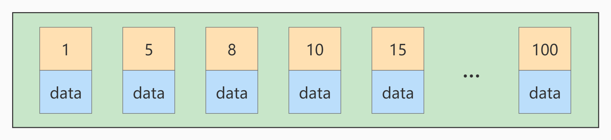

如果此时再插入一条主键值为 9 的记录，那它插入的位置就如下图：

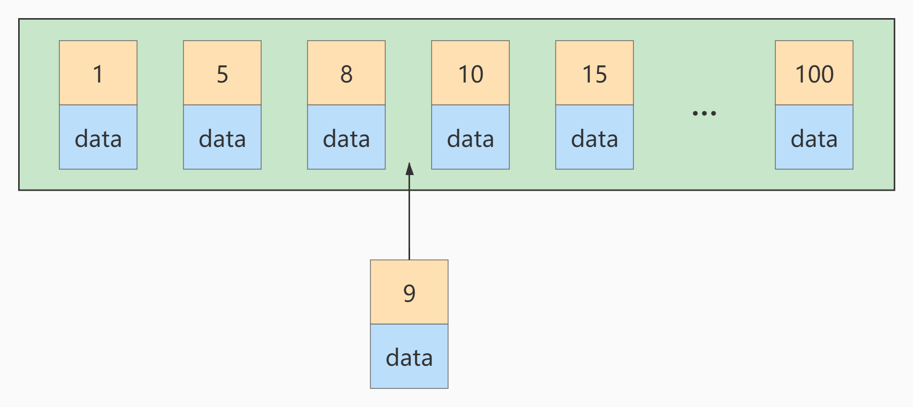

可这个数据页已经满了，再插进来咋办呢？我们需要把当前`页面分裂`成两个页面，把本页中的一些记录移动到新创建的这个页中。页面分裂和记录移位意味着什么？意味着：`性能损耗`！所以如果我们想尽量避免这样无谓的性能损耗，最好让插入的记录的`主键值依次递增`，这样就不会发生这样的性能损耗了。所以我们建议：让主键具有`AUTO_INCREMENT`，让存储引擎自己为表生成主键，而不是我们手动插入 ，比如：`person_info`表：

```mysql
CREATE TABLE person_info(
    id INT UNSIGNED NOT NULL AUTO_INCREMENT,
    name VARCHAR( 100 ) NOT NULL,
    birthday DATE NOT NULL,
    phone_number CHAR( 11 ) NOT NULL,
    country varchar( 100 ) NOT NULL,
    PRIMARY KEY (id),
    KEY idx_name_birthday_phone_number (name( 10 ), birthday, phone_number)
);
```

我们自定义的主键列`id`拥有`AUTO_INCREMENT`属性，在插入记录时存储引擎会自动为我们填入自增的主键值。这样的主键占用空间小，顺序写入，减少页分裂。

### 2. 4 计算、函数、类型转换(自动或手动)导致索引失效

1.这两条sql哪种写法更好

```mysql
#好
EXPLAIN SELECT SQL_NO_CACHE * FROM student WHERE student.name LIKE 'abc%';
```

```mysql
EXPLAIN SELECT SQL_NO_CACHE * FROM student WHERE LEFT(student.name, 3 ) = 'abc';
```

2.创建索引

```mysql
CREATE INDEX idx_name ON student(NAME);
```

第一种：索引优化生效

```mysql
mysql> EXPLAIN SELECT SQL_NO_CACHE * FROM student WHERE student.name LIKE 'abc%';
```


```mysql
mysql>  SELECT SQL_NO_CACHE * FROM student WHERE student.name LIKE 'abc%';
+---------+---------+--------+------+---------+
| id | stuno | name | age | classId |
+---------+---------+--------+------+---------+
| 5301379 | 1233401 | AbCHEa | 164 | 259 |
| 7170042 | 3102064 | ABcHeB | 199 | 161 |
| 1901614 | 1833636 | ABcHeC | 226 | 275 |
| 5195021 | 1127043 | abchEC | 486 | 72 |
| 4047089 | 3810031 | AbCHFd | 268 | 210 |
| 4917074 | 849096 | ABcHfD | 264 | 442 |
| 1540859 | 141979 | abchFF | 119 | 140 |
| 5121801 | 1053823 | AbCHFg | 412 | 327 |
| 2441254 | 2373276 | abchFJ | 170 | 362 |
| 7039146 | 2971168 | ABcHgI | 502 | 465 |
| 1636826 | 1580286 | ABcHgK | 71 | 262 |
| 374344 | 474345 | abchHL | 367 | 212 |
| 1596534 | 169191 | AbCHHl | 102 | 146 |
...
| 5266837 | 1198859 | abclXe | 292 | 298 |
| 8126968 | 4058990 | aBClxE | 316 | 150 |
| 4298305 | 399962 | AbCLXF | 72 | 423 |
| 5813628 | 1745650 | aBClxF | 356 | 323 |
| 6980448 | 2912470 | AbCLXF | 107 | 78 |
| 7881979 | 3814001 | AbCLXF | 89 | 497 |
| 4955576 | 887598 | ABcLxg | 121 | 385 |
| 3653460 | 3585482 | AbCLXJ | 130 | 174 |
| 1231990 | 1283439 | AbCLYH | 189 | 429 |
| 6110615 | 2042637 | ABcLyh | 157 | 40 |
+---------+---------+--------+------+---------+
401 rows in set, 1 warning (0.01 sec)
```
第二种：索引优化失效

```mysql
mysql> EXPLAIN SELECT SQL_NO_CACHE * FROM student WHERE LEFT(student.name, 3 ) = 'abc';
```


```mysql
mysql> SELECT SQL_NO_CACHE * FROM student WHERE LEFT(student.name, 3 ) = 'abc';
+---------+---------+--------+------+---------+
| id | stuno | name | age | classId |
| 5301379 | 1233401 | AbCHEa | 164 | 259 |
| 7170042 | 3102064 | ABcHeB | 199 | 161 |
| 1901614 | 1833636 | ABcHeC | 226 | 275 |
| 5195021 | 1127043 | abchEC | 486 | 72 |
| 4047089 | 3810031 | AbCHFd | 268 | 210 |
| 4917074 | 849096 | ABcHfD | 264 | 442 |
| 1540859 | 141979 | abchFF | 119 | 140 |
| 5121801 | 1053823 | AbCHFg | 412 | 327 |
| 2441254 | 2373276 | abchFJ | 170 | 362 |
| 7039146 | 2971168 | ABcHgI | 502 | 465 |
| 1636826 | 1580286 | ABcHgK | 71 | 262 |
| 374344 | 474345 | abchHL | 367 | 212 |
| 1596534 | 169191 | AbCHHl | 102 | 146 |
...
| 5266837 | 1198859 | abclXe | 292 | 298 |
| 8126968 | 4058990 | aBClxE | 316 | 150 |
| 4298305 | 399962 | AbCLXF | 72 | 423 |
| 5813628 | 1745650 | aBClxF | 356 | 323 |
| 6980448 | 2912470 | AbCLXF | 107 | 78 |
| 7881979 | 3814001 | AbCLXF | 89 | 497 |
| 4955576 | 887598 | ABcLxg | 121 | 385 |
| 3653460 | 3585482 | AbCLXJ | 130 | 174 |
| 1231990 | 1283439 | AbCLYH | 189 | 429 |
| 6110615 | 2042637 | ABcLyh | 157 | 40 |
+---------+---------+--------+------+---------+
401 rows in set, 1 warning (3.62 sec)
```

type为“ALL”，表示没有使用到索引，查询时间为`3.62`秒，查询效率较之前低很多。

**再举例：**

- student表的字段stuno上设置有索引

  ```mysql
  CREATE INDEX idx_sno ON student(stuno);
  ```

  ```mysql
  EXPLAIN SELECT SQL_NO_CACHE id, stuno, NAME FROM student WHERE stuno+ 1 = 900001;
  ```

  运行结果：

  

  

- 索引优化生效：

  ```mysql
  EXPLAIN SELECT SQL_NO_CACHE id, stuno, NAME FROM student WHERE stuno = 900000 ;
  ```

  **再举例：**

- student表的字段name上设置有索引

```mysql
CREATE INDEX idx_name ON student(NAME);
```
```mysql
EXPLAIN SELECT id, stuno, name FROM student WHERE SUBSTRING(name, 1 , 3 )='abc';
```


```mysql
EXPLAIN SELECT id, stuno, NAME FROM student WHERE NAME LIKE 'abc%';
```

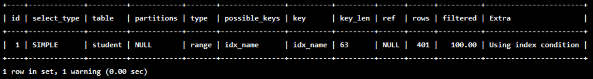


### 2. 5 类型转换导致索引失效

下列哪个sql语句可以用到索引。（假设name字段上设置有索引）

```mysql
# 未使用到索引
EXPLAIN SELECT SQL_NO_CACHE * FROM student WHERE name= 123;
```


```mysql
# 使用到索引
EXPLAIN SELECT SQL_NO_CACHE * FROM student WHERE name='123';
```


- name=123发生类型转换，索引失效。

### 2. 6 范围条件右边的列索引失效

```mysql
ALTER TABLE student DROP INDEX idx_name;
ALTER TABLE student DROP INDEX idx_age;
ALTER TABLE student DROP INDEX idx_age_classid;

EXPLAIN SELECT SQL_NO_CACHE * FROM student WHERE student.age= 30 AND student.classId> 20 AND student.name = 'abc';
```


```mysql
create index idx_age_name_classid on student(age,name,classid);
```
- 将范围查询条件放置语句最后：

```mysql
EXPLAIN SELECT SQL_NO_CACHE * FROM student WHERE student.age= 30 AND student.name ='abc' AND student.classId> 20 ;
```


### 2.7 不等于(!= 或者<>)索引失效

```mysql
CREATE INDEX idx_name ON student(NAME);

EXPLAIN SELECT SQL_NO_CACHE * FROM student WHERE student.name <> 'abc' ;

EXPLAIN SELECT SQL_NO_CACHE * FROM student WHERE student.name != 'abc' ;
```


### 2.8 is null可以使用索引，is not null无法使用索引

```mysql
EXPLAIN SELECT SQL_NO_CACHE * FROM student WHERE age IS NULL;
```

```mysql
EXPLAIN SELECT SQL_NO_CACHE * FROM student WHERE age IS NOT NULL;
```

> 结论：最好在设计数据表的时候就将`字段设置为NOT NULL约束`，比如你可以将INT类型的字段，默认值设置为0。将字符类型的默认值设置为空字符串（“”）。
>
> 拓展：同理，在查询中使用not like也无法使用索引，导致全表扫描。


### 2.9 like以通配符%开头索引失效

```mysql
EXPLAIN SELECT SQL_NO_CACHE * FROM student WHERE NAME LIKE 'ab%'; 

EXPLAIN SELECT SQL_NO_CACHE * FROM student WHERE NAME LIKE '%ab%';
```


>  **拓展：Alibaba《Java开发手册》**
>
> 【强制】页面搜索严禁左模糊或者全模糊，如果需要请走搜索引擎来解决。

### 2.10 OR 前后存在非索引的列，索引失效

```mysql
# 未使用到索引
EXPLAIN SELECT SQL_NO_CACHE * FROM student WHERE age = 10 OR classid = 100 ;
```


```mysql
#使用到索引
EXPLAIN SELECT SQL_NO_CACHE * FROM student WHERE age = 10 OR name = 'Abel';
```


### 2.11 数据库和表的字符集统一使用utf8mb4

统一使用utf8mb4 ( 5. 5. 3 版本以上支持)兼容性更好，统一字符集可以避免由于字符集转换产生的乱码。不同的`字符集`进行比较前需要进行`转换`会造成索引失效。


### 2.12 一般建议

index(a,b,c)

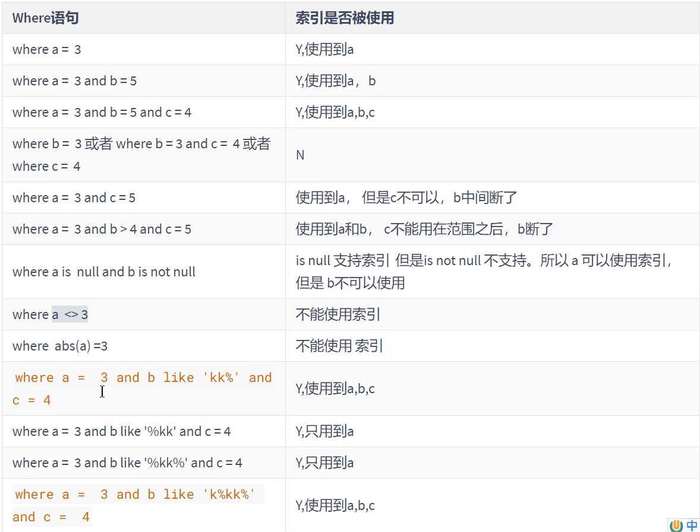

**一般性建议：**

- 对于单列索引，尽量选择针对当前query过滤性更好的索引
- 在选择组合索引的时候，当前query中过滤性最好的字段在索引字段顺序中，位置越靠前越好。
- 在选择组合索引的时候，尽量选择能够包含当前query中的where子句中更多字段的索引。
- 在选择组合索引的时候，如果某个字段可能出现范围查询时，尽量把这个字段放在索引次序的最后面。

**总之，书写SQL语句时，尽量避免造成索引失效的情况。**

## 3. 关联查询优化

### 3. 1 数据准备

```mysql
#分类
CREATE TABLE IF NOT EXISTS `type` (
`id` INT(10) UNSIGNED NOT NULL AUTO_INCREMENT,
`card` INT(10) UNSIGNED NOT NULL,
PRIMARY KEY (`id`)
);
#图书
CREATE TABLE IF NOT EXISTS `book` (
`bookid` INT(10) UNSIGNED NOT NULL AUTO_INCREMENT,
`card` INT(10) UNSIGNED NOT NULL,
PRIMARY KEY (`bookid`)
);

#向分类表中添加20条记录
INSERT INTO `type`(card) VALUES(FLOOR(1 + (RAND() * 20)));
INSERT INTO `type`(card) VALUES(FLOOR(1 + (RAND() * 20)));
INSERT INTO `type`(card) VALUES(FLOOR(1 + (RAND() * 20)));
INSERT INTO `type`(card) VALUES(FLOOR(1 + (RAND() * 20)));
INSERT INTO `type`(card) VALUES(FLOOR(1 + (RAND() * 20)));
INSERT INTO `type`(card) VALUES(FLOOR(1 + (RAND() * 20)));
INSERT INTO `type`(card) VALUES(FLOOR(1 + (RAND() * 20)));
INSERT INTO `type`(card) VALUES(FLOOR(1 + (RAND() * 20)));
INSERT INTO `type`(card) VALUES(FLOOR(1 + (RAND() * 20)));
INSERT INTO `type`(card) VALUES(FLOOR(1 + (RAND() * 20)));
INSERT INTO `type`(card) VALUES(FLOOR(1 + (RAND() * 20)));
INSERT INTO `type`(card) VALUES(FLOOR(1 + (RAND() * 20)));
INSERT INTO `type`(card) VALUES(FLOOR(1 + (RAND() * 20)));
INSERT INTO `type`(card) VALUES(FLOOR(1 + (RAND() * 20)));
INSERT INTO `type`(card) VALUES(FLOOR(1 + (RAND() * 20)));
INSERT INTO `type`(card) VALUES(FLOOR(1 + (RAND() * 20)));
INSERT INTO `type`(card) VALUES(FLOOR(1 + (RAND() * 20)));
INSERT INTO `type`(card) VALUES(FLOOR(1 + (RAND() * 20)));
INSERT INTO `type`(card) VALUES(FLOOR(1 + (RAND() * 20)));
INSERT INTO `type`(card) VALUES(FLOOR(1 + (RAND() * 20)));

#向图书表中添加20条记录
INSERT INTO book(card) VALUES(FLOOR(1 + (RAND() * 20)));
INSERT INTO book(card) VALUES(FLOOR(1 + (RAND() * 20)));
INSERT INTO book(card) VALUES(FLOOR(1 + (RAND() * 20)));
INSERT INTO book(card) VALUES(FLOOR(1 + (RAND() * 20)));
INSERT INTO book(card) VALUES(FLOOR(1 + (RAND() * 20)));
INSERT INTO book(card) VALUES(FLOOR(1 + (RAND() * 20)));
INSERT INTO book(card) VALUES(FLOOR(1 + (RAND() * 20)));
INSERT INTO book(card) VALUES(FLOOR(1 + (RAND() * 20)));
INSERT INTO book(card) VALUES(FLOOR(1 + (RAND() * 20)));
INSERT INTO book(card) VALUES(FLOOR(1 + (RAND() * 20)));
INSERT INTO book(card) VALUES(FLOOR(1 + (RAND() * 20)));
INSERT INTO book(card) VALUES(FLOOR(1 + (RAND() * 20)));
INSERT INTO book(card) VALUES(FLOOR(1 + (RAND() * 20)));
INSERT INTO book(card) VALUES(FLOOR(1 + (RAND() * 20)));
INSERT INTO book(card) VALUES(FLOOR(1 + (RAND() * 20)));
INSERT INTO book(card) VALUES(FLOOR(1 + (RAND() * 20)));
INSERT INTO book(card) VALUES(FLOOR(1 + (RAND() * 20)));
INSERT INTO book(card) VALUES(FLOOR(1 + (RAND() * 20)));
INSERT INTO book(card) VALUES(FLOOR(1 + (RAND() * 20)));
INSERT INTO book(card) VALUES(FLOOR(1 + (RAND() * 20)));
```


### 3. 2 采用左外连接

下面开始 EXPLAIN 分析

```mysql
EXPLAIN SELECT SQL_NO_CACHE * FROM `type` LEFT JOIN book ON type.card = book.card;
```

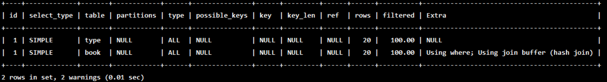

结论：type 有All

添加索引优化

```mysql
ALTER TABLE book ADD INDEX Y(card); #【被驱动表】，可以避免全表扫描

EXPLAIN SELECT SQL_NO_CACHE * FROM `type` LEFT JOIN book ON type.card = book.card;
```

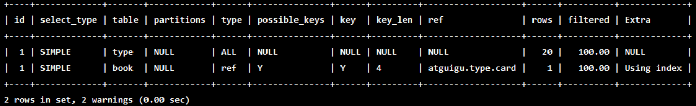

可以看到第二行的 type 变为了 ref，rows 也变成了优化比较明显。这是由左连接特性决定的。LEFT JOIN条件用于确定如何从右表搜索行，左边一定都有，所以`右边是我们的关键点,一定需要建立索引`。

```mysql
ALTER TABLE `type` ADD INDEX X (card); #【驱动表】，无法避免全表扫描

EXPLAIN SELECT SQL_NO_CACHE * FROM `type` LEFT JOIN book ON type.card = book.card;
```

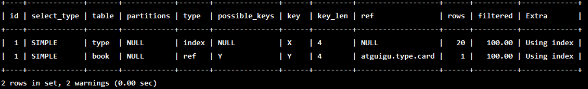

接着：

```mysql
DROP INDEX Y ON book;

EXPLAIN SELECT SQL_NO_CACHE * FROM `type` LEFT JOIN book ON type.card = book.card;
```

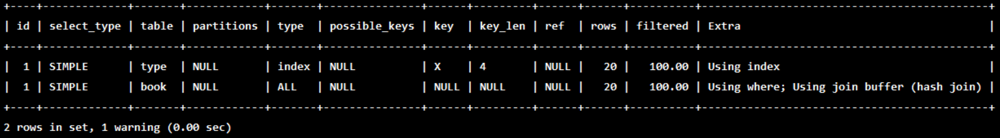


### 3. 3 采用内连接

```mysql
drop index X on type;
drop index Y on book;（如果已经删除了可以不用再执行该操作）
```

换成 inner join（MySQL自动选择驱动表）

```mysql
EXPLAIN SELECT SQL_NO_CACHE * FROM type INNER JOIN book ON type.card=book.card;
```


添加索引优化

```mysql
ALTER TABLE book ADD INDEX Y(card);

EXPLAIN SELECT SQL_NO_CACHE * FROM type INNER JOIN book ON type.card=book.card;
```


```mysql
ALTER TABLE type ADD INDEX X(card);

EXPLAIN SELECT SQL_NO_CACHE * FROM type INNER JOIN book ON type.card=book.card;
```


接着：

```mysql
DROP INDEX X ON `type`;

EXPLAIN SELECT SQL_NO_CACHE * FROM TYPE INNER JOIN book ON type.card=book.card;
```

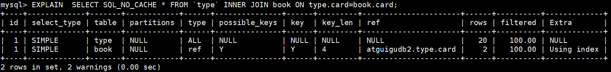

接着：

```mysql
ALTER TABLE `type` ADD INDEX X (card);

EXPLAIN SELECT SQL_NO_CACHE * FROM `type` INNER JOIN book ON type.card=book.card;
```


### 3. 4 join语句原理

```mysql
CREATE TABLE `t2` (
  `id` INT(11) NOT NULL,
  `a` INT(11) DEFAULT NULL,
  `b` INT(11) DEFAULT NULL,
  PRIMARY KEY (`id`),
  INDEX `a` (`a`)
) ENGINE=INNODB;


DELIMITER //
CREATE PROCEDURE idata()
BEGIN
  DECLARE i INT;
  SET i=1;
  WHILE(i<=1000)DO
    INSERT INTO t2 VALUES(i, i, i);
    SET i=i+1;
  END WHILE;
END //
DELIMITER ;
CALL idata();

#创建t1表并复制t1表中前100条数据
CREATE TABLE t1 
AS
SELECT * FROM t2
WHERE id <= 100;
```


- Index Nested-Loop Join

  我们来看一下这个语句：

  ```mysql
  EXPLAIN SELECT * FROM t1 STRAIGHT_JOIN t2 ON (t1.a=t2.a);
  ```

如果直接使用join语句，MySQL优化器可能会选择表t1或t2作为驱动表，这样会影响我们分析SQL语句的执行过程。所以，为了便于分析执行过程中的性能问题，我改用`straight_join`让MySQL使用固定的连接方式执行查询，这样优化器只会按照我们指定的方式去join。在这个语句里，t1 是驱动表，t2是被驱动表。

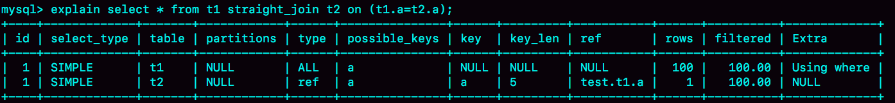

可以看到，在这条语句里，被驱动表t2的字段a上有索引，join过程用上了这个索引，因此这个语句的执行流程是这样的：

1. 从表t1中读入一行数据 R；

2. 从数据行R中，取出a字段到表t2里去查找；

3. 取出表t2中满足条件的行，跟R组成一行，作为结果集的一部分；

4. 重复执行步骤 1 到 3 ，直到表t1的末尾循环结束。

这个过程是先遍历表t1，然后根据从表t1中取出的每行数据中的a值，去表t2中查找满足条件的记录。在形式上，这个过程就跟我们写程序时的嵌套查询类似，并且可以用上被驱动表的索引，所以我们称之为“Index Nested-Loop Join”，简称NLJ。

它对应的流程图如下所示：

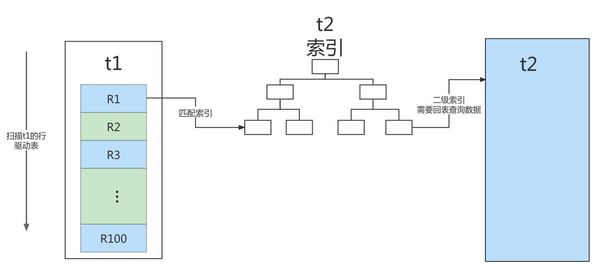

在这个流程里：

1. 对驱动表t1做了全表扫描，这个过程需要扫描 100 行；

2. 而对于每一行R，根据a字段去表t2查找，走的是树搜索过程。由于我们构造的数据都是一一对应的，因此每次的搜索过程都只扫描一行，也是总共扫描 100 行；

3. 所以，整个执行流程，总扫描行数是 200 。

**引申问题 1 ：能不能使用join?**

假设不使用join，那我们就只能用单表查询。我们看看上面这条语句的需求，用单表查询怎么实现。

1. 执行`select * from t1`，查出表t1的所有数据，这里有100行；

2. 循环遍历这100行数据：
   1. 从每一行R取出字段a的值$R.a；
   2. 执行`select * from t2 where a=SR.a；`
   3. 把返回的结果和R构成结果集的一行。

可以看到，在这个查询过程，也是扫描了200行，但是总共执行了101条语句，比直接join多了100次交互。除此之外，客户端还要自己拼接SQL语句和结果。显然，这么做还不如直接join好。

**引申问题 2 ：怎么选择驱动表？**

假设驱动表是走`全表扫描`，而被驱动表是`走树搜索`。

假设被驱动表的行数是`M`。每次在被驱动表查一行数据，要先搜索`索引a`，再搜索主键索引。每次搜索一棵树近似复杂度是以2为底的M的对数，记为log2M，所以在被驱动表上查一行的时间复杂度是`2*log2M`。

假设驱动表的行数是`N`，执行过程就要扫描驱动表N行，然后对于每一行，到被驱动表上匹配一次。

因此整个执行过程，近似复杂度是`N+N*2*log2M`。

显然，N对扫描行数的影响更大，因此应该让`小表来做驱动表`。

>  比如：N扩大 1000 倍的话，扫描行数就会扩大 1000 倍；而M扩大 1000 倍，扫描行数扩大不到 10 倍。
>
> 两个结论：
>
> 1. 使用join语句，性能比强行拆成多个单表执行SQL语句的性能要好；
> 2. 如果使用join语句的话，需要让小表做驱动表。

- **Simple Nested-Loop Join**

  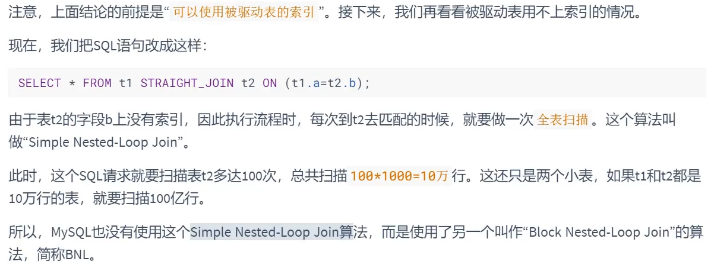

- **Block Nested-Loop Join**

  这时候，被驱动表上没有可用的索引，算法的流程是这样的：

  1. 把表t1的数据读入`线程内存join_buffer`中，由于我们这个语句中写的是select *，因此是把整个表1放入了内存；
  2. 扫描表t2，把表t2中的`每一行取出来`，跟join_buffer中的数据做对比，满足join条件的，作为结果集的一部分返回。

这个过程的流程图如下：

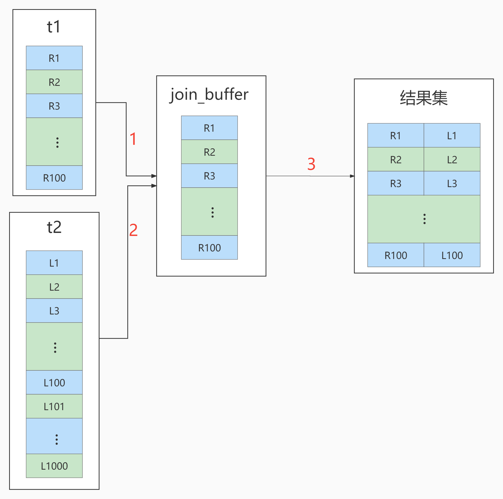


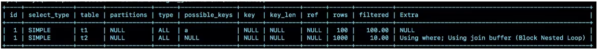

可以看到，在这个过程中，对表t1和t2都做了一次全表扫描，因此总的扫描行数是1100。由于join_buffer是以无序数组的方式组织的，因此对表t2中的每一行，都要做100次判断，总共需要在内存中做的判断次数是：
100*1000=10万次。

前面我们说过，如果使用Simple Nested-Loop Join算法进行查询，扫描行数也是10万行。因此，从时间复杂度上来说，这两个算法是一样的。但是，Block Nested-Loop Join算法的这`10万次判断是内存操作`，速度上会快很多，性能也更好。

接下来，我们来看一下，在这种情况下，应该选择哪个表做驱动表。

假设小表的行数是N，大表的行数是M，那么在这个算法里：

1. 两个表都做一次全表扫描，所以总的扫描行数是M+N；
2. 内存中的判断次数是M*N。

可以看到，调换这两个算式中的M和N没差别，因此这时候选择大表还是小表做驱动表，执行耗时是一样的。但是，这个例子里表t1才100行，要是表1是一个大表，`join_buffer放不下怎么办呢`？

join_buffer的大小是由参数`join_buffer_size`设定的，默认值是`256k`。**如果放不下表t1的所有数据话，策略很简单，就是分段放，再执行**：

```mysql
SELECT * FROM t1 STRAIGHT_JOIN t2 ON(t1.a=t2.b);
```

执行过程就变成了：

1. 扫描表t1，顺序读取数据行放入join_buffer中，放完第88行join_buffer满了，继续第2步；
2. 扫描表t2，把t2中的每一行取出来，跟join_buffer中的数据做对比，满足join条件的，作为结果集的一部分返回；
3. 清空join_buffer；
4. 继续扫描表t1，顺序读取最后的12行数据放入join_buffer中，继续执行第2步。

执行流程图也就变成这样：

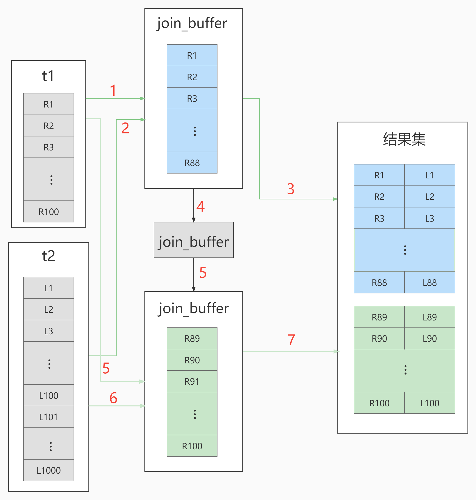

这个流程才体现出了这个算法名字中`“B1ock”的由来`，表示“分块去join”。

可以看到，这时候由于表t1被分成了两次放入join_bufer中，导致表t2会被扫描两次。虽然分成两次放入join_buffer，但是判断等值条件的次数还是不变的，依然是（88+12）*1000=10万次。

我们再来看下，在这种情况下驱动表的选择问题。

假设，驱动表的数据行数是N，需要分K段才能完成算法流程，被驱动表的数据行数是M。

注意，这里的K不是常数，N越大K就会越大，因此把表示为`入*N`，显然》的取值范围是（0，1）。

所以，在这个算法的执行过程中：

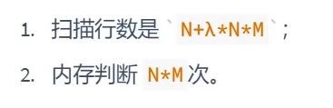

显然，内存判断次数是不受选择哪个表作为驱动表影响的。而考虑到扫描行数，在M和N大小确定的情况下，N小一些，整个算式的结果会更小。

所以结论是，应该让小表当驱动表。

当然，在`N+入NM`这个式子里，`入`才是影响扫描行数的关键因素，这个值`越小越好`。

刚刚我们说了N越大，分段数K越大。那么，N固定的时候，什么参数会影响K的大小呢？（也就是入的大小）答案是`join_buffer_size`。join_buffer_size越大，一次可以放入的行越多，分成的段数也就越少，对被驱动表的全表扫描次数就越少。

这就是为什么，你可能会看到一些建议告诉你，如果你的join语句很慢，就把`join_buffer_size`改大。

**总结 1 ：能不能使用xxx join语句？**

1. 如果可以使用Index Nested-Loop Join算法，也就是说可以用上被驱动表上的索引，是没问题的；
2. 如果使用Block Nested-LoopJoin算法，扫描行数就会过多。尤其是在大表上的join操作，这样可能要扫描被驱动表很多次，会占用大量的系统资源。所以这种join尽量不要用。

所以你在判断要不要使用join语句时，就是看explain结果里面，Extra字段里面有没有出现“`Block Nested Loop`”字样。

**总结 2 ：如果要使用join，应该选择大表做驱动表还是选择小表做驱动表？**

1. 如果是Index Nested-Loop Join算法，应该选择小表做驱动表；

2. 如果是Block Nested-Loop Join算法：

   - 在join_buffer_size足够大的时候，是一样的；

   - 在join_buffer_size不够大的时候《这种情况更常见），应该选择小表做驱动表。

所以，这个问题的结论就是，总是应该使用小表做驱动表。

**总结 3 ：什么叫作“小表”？**

 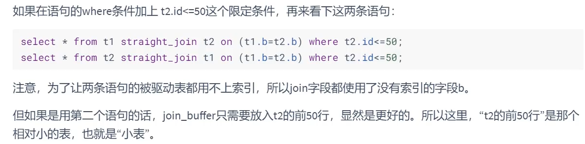

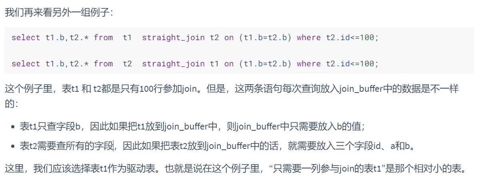

**在决定哪个表做驱动表的时候，应该是两个表按照各自的条件过滤，过滤完成之后，计算参与join的各个字段的总数据量，数据量小的那个表，就是“小表”，应该作为驱动表。**

### 3. 5 小结

- 保证被驱动表的JOIN字段已经创建了索引

- 需要JOIN 的字段，数据类型保持绝对一致。

- LEFT JOIN 时，选择小表作为驱动表，`大表作为被驱动表`。减少外层循环的次数。

- INNER JOIN 时，MySQL会自动将`小结果集的表选为驱动表`。选择相信MySQL优化策略。

- 能够直接多表关联的尽量直接关联，不用子查询。(减少查询的趟数)

- 不建议使用子查询，建议将子查询SQL拆开结合程序多次查询，或使用 JOIN 来代替子查询。

- 衍生表建不了索引


## 4. 子查询优化

MySQL从4.1版本开始支持子查询，使用子查询可以进行SELECT语句的嵌套查询，即一个SELECT查询的结果作为另一个SELECT语句的条件。`子查询可以一次性完成很多逻辑上需要多个步骤才能完成的SQL操作`。

**子查询是 MySQL 的一项重要的功能，可以帮助我们通过一个 SQL 语句实现比较复杂的查询。但是，子查询的执行效率不高**。 原因：

① 执行子查询时，MySQL需要为内层查询语句的查询结果`建立一个临时表`，然后外层查询语句从临时表中查询记录。查询完毕后，再`撤销这些临时表`。这样会消耗过多的CPU和IO资源，产生大量的慢查询。

② 子查询的结果集存储的临时表，不论是内存临时表还是磁盘临时表都`不会存在索引`，所以查询性能会受到一定的影响。

③ 对于返回结果集比较大的子查询，其对查询性能的影响也就越大。

**在MySQL中，可以使用连接（JOIN）查询来替代子查询**。 连接查询`不需要建立临时表`，其`速度比子查询要快`，如果查询中使用索引的话，性能就会更好。

>  结论：尽量不要使用NOT IN 或者 NOT EXISTS，用LEFT JOIN xxx ON xx WHERE xx IS NULL替代

## 5. 排序优化

### 5.1 排序优化

**问题： 在 WHERE 条件字段上加索引，但是为什么在 ORDER BY 字段上还要加索引呢？**

在MySQL中，支持两种排序方式，分别是FileSort和Index排序。

- Index排序中，索引可以保证数据的有序性，不需要再进行排序，`效率更高`。
- FileSort 排序则一般在`内存中`进行排序，占用`CPU较多`。如果待排结果较大，会产生临时文件IO到磁盘进行排序的情况，效率较低。

**优化建议：**

​	1. SQL 中，可以在 WHERE 子句和 ORDER BY 子句中使用索引，目的是在 WHERE 子句中`避免全表扫描`，在 ORDER BY 子句`避免使用 FileSort 排序`。当然，某些情况下全表扫描，或者 FileSort 排序不一定比索引慢。但总的来说，我们还是要避免，以提高查询效率。

2. 尽量使用 Index 完成 ORDER BY 排序。如果 WHERE 和 ORDER BY 后面是相同的列就使用单索引列；如果不同就使用联合索引。

3. 无法使用 Index 时，需要对 FileSort 方式进行调优。

### 5.2 测试

```mysql
#删除student和class表中的非主键索引
CALL proc_drop_index('db2','student');
CALL proc_drop_index('db2','class');

SHOW INDEX FROM student;
SHOW INDEX FROM class;

#过程一：
EXPLAIN SELECT SQL_NO_CACHE * FROM student ORDER BY age,classid; 

EXPLAIN SELECT SQL_NO_CACHE * FROM student ORDER BY age,classid LIMIT 10; 

#过程二：order by时不limit，索引失效
#创建索引  
CREATE  INDEX idx_age_classid_name ON student(age,classid,NAME);


#不限制,索引失效
EXPLAIN  SELECT SQL_NO_CACHE * FROM student ORDER BY age,classid; 

#EXPLAIN  SELECT SQL_NO_CACHE age,classid,name,id FROM student ORDER BY age,classid; 

#增加limit过滤条件，使用上索引了。
EXPLAIN  SELECT SQL_NO_CACHE * FROM student ORDER BY age,classid LIMIT 10;  


#过程三：order by时顺序错误，索引失效

#创建索引age,classid,stuno
CREATE  INDEX idx_age_classid_stuno ON student (age,classid,stuno); 

#以下哪些索引失效?
EXPLAIN  SELECT * FROM student ORDER BY classid LIMIT 10;

EXPLAIN  SELECT * FROM student ORDER BY classid,NAME LIMIT 10;  

EXPLAIN  SELECT * FROM student ORDER BY age,classid,stuno LIMIT 10; 

EXPLAIN  SELECT * FROM student ORDER BY age,classid LIMIT 10;

EXPLAIN  SELECT * FROM student ORDER BY age LIMIT 10;

#过程四：order by时规则不一致, 索引失效 （顺序错，不索引；方向反，不索引）

EXPLAIN  SELECT * FROM student ORDER BY age DESC, classid ASC LIMIT 10;

EXPLAIN  SELECT * FROM student ORDER BY classid DESC, NAME DESC LIMIT 10;

EXPLAIN  SELECT * FROM student ORDER BY age ASC,classid DESC LIMIT 10; 

EXPLAIN  SELECT * FROM student ORDER BY age DESC, classid DESC LIMIT 10;

#过程五：无过滤，不索引

EXPLAIN  SELECT * FROM student WHERE age=45 ORDER BY classid;

EXPLAIN  SELECT * FROM student WHERE  age=45 ORDER BY classid,NAME; 

EXPLAIN  SELECT * FROM student WHERE  classid=45 ORDER BY age;

EXPLAIN  SELECT * FROM student WHERE  classid=45 ORDER BY age LIMIT 10;

CREATE INDEX idx_cid ON student(classid);
EXPLAIN  SELECT * FROM student WHERE  classid=45 ORDER BY age;

```

**小结：**

```mysql
INDEX a_b_c(a,b,c)

order by 能使用索引最左前缀
- ORDER BY a
- ORDER BY a,b
- ORDER BY a,b,c
- ORDER BY a DESC,b DESC,c DESC

如果WHERE使用索引的最左前缀定义为常量，则order by 能使用索引
- WHERE a = const ORDER BY b,c
- WHERE a = const AND b = const ORDER BY c
- WHERE a = const ORDER BY b,c
- WHERE a = const AND b > const ORDER BY b,c

不能使用索引进行排序
- ORDER BY a ASC,b DESC,c DESC /* 排序不一致 */
- WHERE g = const ORDER BY b,c  /*丢失a索引*/
- WHERE a = const ORDER BY c  /*丢失b索引*/
- WHERE a = const ORDER BY a,d  /*d不是索引的一部分*/
- WHERE a in (...) ORDER BY b,c /*对于排序来说，多个相等条件也是范围查询*/
```


### 5.3 案例实战

ORDER BY子句，尽量使用Index方式排序，避免使用FileSort方式排序。

执行案例前先清除student上的索引，只留主键：

```mysql
DROP INDEX idx_age ON student;
DROP INDEX idx_age_classid_stuno ON student;
DROP INDEX idx_age_classid_name ON student;

#或者
call proc_drop_index('db2','student');
```

**场景:查询年龄为 30 岁的，且学生编号小于 101000 的学生，按用户名称排序**

```mysql
EXPLAIN SELECT SQL_NO_CACHE * FROM student WHERE age = 30 AND stuno < 101000 ORDER BY NAME ;
```

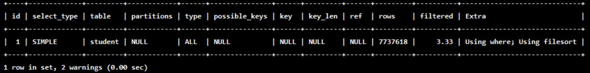

查询结果如下：

```mysql
mysql>  SELECT SQL_NO_CACHE * FROM student WHERE age = 30 AND stuno < 101000 ORDER BY NAME ;
+---------+--------+--------+------+---------+
| id | stuno | name | age | classId |
+---------+--------+--------+------+---------+
| 922 | 100923 | elTLXD | 30 | 249 |
| 3723263 | 100412 | hKcjLb | 30 | 59 |
| 3724152 | 100827 | iHLJmh | 30 | 387 |
| 3724030 | 100776 | LgxWoD | 30 | 253 |
| 30 | 100031 | LZMOIa | 30 | 97 |
| 3722887 | 100237 | QzbJdx | 30 | 440 |
| 609 | 100610 | vbRimN | 30 | 481 |
| 139 | 100140 | ZqFbuR | 30 | 351 |
+---------+--------+--------+------+---------+
8 rows in set, 1 warning (3.16 sec)
```

>  结论：type 是 ALL，即最坏的情况。Extra 里还出现了 Using filesort,也是最坏的情况。优化是必须的。

优化思路：

**方案一: 为了去掉filesort我们可以把索引建成**

```mysql
#创建新索引
CREATE INDEX idx_age_name ON student(age,NAME);
```

**方案二: 尽量让where的过滤条件和排序使用上索引**

建一个三个字段的组合索引：

```mysql
DROP INDEX idx_age_name ON student;

CREATE INDEX idx_age_stuno_name ON student (age,stuno,NAME);

EXPLAIN SELECT SQL_NO_CACHE * FROM student WHERE age = 30 AND stuno < 101000 ORDER BY NAME ;
```

```mysql
mysql> SELECT SQL_NO_CACHE * FROM student
-> WHERE age = 30 AND stuno < 101000 ORDER BY NAME ;
+-----+--------+--------+------+---------+
| id | stuno | name | age | classId |
+-----+--------+--------+------+---------+
| 167 | 100168 | AClxEF | 30 | 319 |
| 323 | 100324 | bwbTpQ | 30 | 654 |
| 651 | 100652 | DRwIac | 30 | 997 |
| 517 | 100518 | HNSYqJ | 30 | 256 |
| 344 | 100345 | JuepiX | 30 | 329 |
| 905 | 100906 | JuWALd | 30 | 892 |
| 574 | 100575 | kbyqjX | 30 | 260 |
| 703 | 100704 | KJbprS | 30 | 594 |
| 723 | 100724 | OTdJkY | 30 | 236 |
| 656 | 100657 | Pfgqmj | 30 | 600 |
| 982 | 100983 | qywLqw | 30 | 837 |
| 468 | 100469 | sLEKQW | 30 | 346 |
| 988 | 100989 | UBYqJl | 30 | 457 |
| 173 | 100174 | UltkTN | 30 | 830 |
| 332 | 100333 | YjWiZw | 30 | 824 |
+-----+--------+--------+------+---------+
15 rows in set, 1 warning (0.00 sec)
```

结果竟然有 filesort的 sql 运行速度，`超过了已经优化掉 filesort的 sql`，而且快了很多，几乎一瞬间就出现了结果。

> 结论：
>
> 1. 两个索引同时存在，mysql自动选择最优的方案。（对于这个例子，mysql选择idx_age_stuno_name）。但是，`随着数据量的变化，选择的索引也会随之变化的`。
>
> 2. **当【范围条件】和【group by 或者 order by】的字段出现二选一时，优先观察条件字段的过滤数量，如果过滤的数据足够多，而需要排序的数据并不多时，优先把索引放在范围字段上。反之，亦然。**

**思考：这里我们使用如下索引，是否可行？**可以

```mysql
DROP INDEX idx_age_stuno_name ON student;

CREATE INDEX idx_age_stuno ON student(age,stuno);
```
### 5.4 filesort算法：双路排序和单路排序

**双路排序 （慢）**

- `MySQL 4.1之前是使用双路排序`，字面意思就是两次扫描磁盘，最终得到数据， 读取行指针和`order by列`，对他们进行排序，然后扫描已经排序好的列表，按照列表中的值重新从列表中读取对应的数据输出

- 从磁盘取排序字段，在buffer进行排序，再从`磁盘取其他字段`。

取一批数据，要对磁盘进行两次扫描，众所周知，IO是很耗时的，所以在mysql4.1之后，出现了第二种改进的算法，就是单路排序。

**单路排序 （快）**

从磁盘读取查询需要的`所有列`，按照order by列在buffer对它们进行排序，然后扫描排序后的列表进行输出， 它的效率更快一些，避免了第二次读取数据。并且把随机IO变成了顺序IO，但是它会使用更多的空间， 因为它把每一行都保存在内存中了。

**结论及引申出的问题**

- 由于单路是后出的，总体而言好过双路
- 但是用单路有问题
  - 在sort_buffer中，单路比多路要多`占用很多空间`，因为单路是把所有字段都取出，所以有可能取出的数据的总大小超出了sort_buffer的容量，导致每次只能取`sort_buffer`容量大小的数据，进行排序（创建tmp文件，多路合并），排完再取sort_buffer容量大小，再排……从而多次IO。
  - 单路本来想省一次IO操作，`反而导致了大量的I/O操作`，反而得不偿失。

**优化策略**

1. **尝试提高 sort_buffer_size**

2. **尝试提高 max_length_for_sort_data**

3. **Order by 时select * 是一个大忌。最好只Query需要的字段。**

## 6. GROUP BY优化

- group by 使用索引的原则几乎跟order by一致 ，group by 即使没有过滤条件用到索引，也可以直接使用索引。

- group by 先排序再分组，遵照索引建的最佳左前缀法则

- 当无法使用索引列，增大`max_length_for_sort_data`和`sort_buffer_size`参数的设置

- where效率高于having，能写在where限定的条件就不要写在having中了

- 减少使用order by，和业务沟通能不排序就不排序，或将排序放到程序端去做。Order by、group by、distinct这些语句较为耗费CPU，数据库的CPU资源是极其宝贵的。

- 包含了order by、group by、distinct这些查询的语句，where条件过滤出来的结果集请保持在 1000 行以内，否则SQL会很慢。

## 7. 优化分页查询

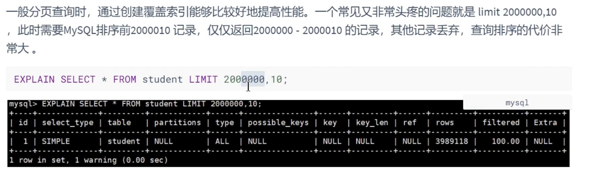

**优化思路一**

在索引上完成排序分页操作，最后根据主键关联回原表查询所需要的其他列内容。

```mysql
EXPLAIN SELECT * FROM student t,(SELECT id FROM student ORDER BY id LIMIT 2000000, 10 ) a WHERE t.id = a.id;
```

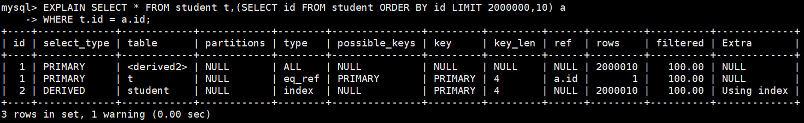

**优化思路二**

该方案适用于主键自增的表，可以把Limit 查询转换成某个位置的查询 。

```mysql
EXPLAIN SELECT * FROM student WHERE id > 2000000 LIMIT 10 ;
```

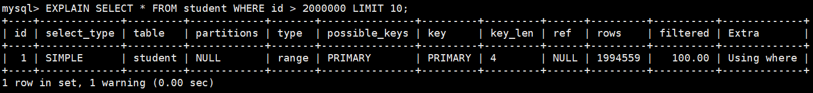

## 8. 优先考虑覆盖索引

### 8. 1 什么是覆盖索引？

**理解方式一** ：索引是高效找到行的一个方法，但是一般数据库也能使用索引找到一个列的数据，因此它不必读取整个行。毕竟索引叶子节点存储了它们索引的数据；当能通过读取索引就可以得到想要的数据，那就不需要读取行了。 **一个索引包含了满足查询结果的数据就叫做覆盖索引**。

**理解方式二** ：非聚簇复合索引的一种形式，它包括在查询里的SELECT、JOIN和WHERE子句用到的所有列（即建索引的字段正好是覆盖查询条件中所涉及的字段）。

简单说就是，`索引列+主键` 包含 `SELECT 到 FROM之间查询的列`。

### 8. 2 覆盖索引的利弊

**好处：**

**1. 避免Innodb表进行索引的二次查询（回表）**

Innodb是以聚集索引的顺序来存储的，对于Innodb来说，二级索引在叶子节点中所保存的是行的主键信息，如果是用二级索引查询数据，在查找到相应的键值后，还需通过主键进行二次查询才能获取我们真实所需要的数据。

在覆盖索引中，二级索引的键值中可以获取所要的数据，`避免了对主键的二次查询，减少了IO操作`，提升了查询效率。

**2. 可以把随机IO变成顺序IO加快查询效率**

由于覆盖索引是按键值的顺序存储的，对于I0密集型的范围查找来说，对比随机从磁盘读取每一行的数据10要少的多，因此利用覆盖索引在访问时也可以把磁盘的`随机读取的IO`转变成索引查找的`顺序IO`。

**由于覆盖索引可以减少树的搜索次数，显著提升查询性能，所以使用覆盖索引是一个常用的性能优化手段。**

**弊端：**

`索引字段的维护`总是有代价的。因此，在建立冗余索引来支持覆盖索引时就需要权衡考虑了。这是业务DBA，或者称为业务数据架构师的工作。

## 9. 如何给字符串添加索引

有一张教师表，表定义如下：

```mysql
create table teacher(
ID bigint unsigned primary key,
email varchar( 64 ),
...
)engine=innodb;
```

讲师要使用邮箱登录，所以业务代码中一定会出现类似于这样的语句：

```mysql
mysql> select col1, col2 from teacher where email='xxx';
```

如果email这个字段上没有索引，那么这个语句就只能做`全表扫描`。

### 9. 1 前缀索引

MySQL是支持前缀索引的。默认地，如果你创建索引的语句不指定前缀长度，那么索引就会包含整个字符串。

```mysql
mysql> alter table teacher add index index1(email);
#或
mysql> alter table teacher add index index2(email(6));
```

这两种不同的定义在数据结构和存储上有什么区别呢？下图就是这两个索引的示意图。


以及


由于email（6）这个索引结构中每个邮箱字段都只取前6个字节（即：zhangs），所以`占用的空间会更小`，这就是使用前缀索引的优势。但，这同时带来的损失是，可能会`增加额外的记录扫描次数`。

```mysql
select id, name, email from teacher where email=' zhangssxyz@xxx.com';
```

**如果使用的是index1** （即email整个字符串的索引结构），执行顺序是这样的：

1. 从index1索引树找到满足索引值是’ zhangssxyz@xxx.com ’的这条记录，取得ID2的值；

2. 到主键上查到主键值是ID2的行，判断email的值是正确的，将这行记录加入结果集；

3. 取index1索引树上刚刚查到的位置的下一条记录，发现已经不满足email=' zhangssxyz@xxx.com ’的条件了，循环结束。

这个过程中，只需要回主键索引取一次数据，所以系统认为只扫描了一行。

**如果使用的是index2** （即email(6)索引结构），执行顺序是这样的：

1. 从index2索引树找到满足索引值是’zhangs’的记录，找到的第一个是ID1；

2. 到主键上查到主键值是ID1的行，判断出email的值不是’ zhangssxyz@xxx.com ’，这行记录丢弃；

3. 取index2上刚刚查到的位置的下一条记录，发现仍然是’zhangs’，取出ID2，再到ID索引上取整行然后判断，这次值对了，将这行记录加入结果集；

4. 重复上一步，直到在idxe2上取到的值不是’zhangs’时，循环结束。

也就是说**使用前缀索引，定义好长度，就可以做到既节省空间，又不用额外增加太多的查询成本**。 前面已经讲过区分度，区分度越高越好。因为区分度越高，意味着重复的键值越少。

> count（distinct left（列名，索引长度））/count（*）

### 9. 2 前缀索引对覆盖索引的影响

前面我们说了使用前缀索引可能会增加扫描行数，这会影响到性能。其实，前缀索引的影响不止如此，我们再看一下另外一个场景：

```mysql
select id，email from teacher where email='songhongkang@xxx.com'；
```

如果使用index1（即email整个字符串的索引结构）的话，可以利用覆盖索引，从index1查到结果后直接就返回了，不需要回到D索引再去查一次。而如果使用index2（即email（6）索引结构）的话，就不得不回到ID索引再去判断email字段的值。

即使你将index2的定义修改为email（18）的前缀索引，这时候虽然index2已经包含了所有的信息，但lnnoDB还是要回到id索引再查一下，因为系统并不确定前缀索引的定义是否截断了完整信息。

> 结论：
>
> 使用前缀索引就用不上覆盖索引对查询性能的优化了，这也是你在选择是否使用前缀索引时需要考虑的一个因素。

### 9.3 拓展内容

对于类似于邮箱这样的字段来说，使用前缀索引的效果可能还不错。但是，遇到前缀的区分度不够好的情况时，我们要怎么办呢？

比如，我们国家的身份证号，一共18位，其中前6位是地址码，所以同一个县的人的身份证号前6位一般会是相同的。

假设你维护的数据库是一个市的`公民信息系统`，这时候如果对身份证号做长度为`6`的前缀索引的话，这个索引的区分度就非常低了。按照我们前面说的方法，可能你需要创建长度为`12`以上的前缀索引，才能够满足区分度要求。

但是，索引选取的越长，占用的磁盘空间就越大，相同的数据页能放下的索引值就越少，搜索的效率也就会越低。

那么，如果我们能够确定业务需求里面只有按照身份证进行等值查询的需求，还有没有别的处理方法呢？这种方法，既可以占用更小的空间，也能达到相同的查询效率。有！

**第一种方式是使用倒序存储**。如果你存储身份证号的时候把它倒过来存，每次查询的时候：


由于身份证号的最后6位没有地址码这样的重复逻辑，所以最后这6位很可能就提供了足够的区分度。当然，实践中你还要使用count（distinct）方法去做验证。

**第二种方式是使用hash字段**。你可以在表上再创建一个整数字段，来保存身份证的校验码，同时在这个字段上创建索引。


然后每次插入新记录的时候，都同时用`crc32()`这个函数得到校验码填到这个新字段。由于校验码可能存在冲突，也就是说两个不同的身份证号通过crc32()函数得到的结果可能是相同的，所以你的查询语句where部分要判断id_card的值是否精确相同。

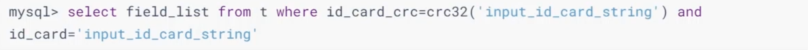

这样，索引的长度变成了4个字节，比原来小了很多。

> 从查询效率上看，使用hash字段方式的查询性能相对更稳定一些。因为crc32算出来的值虽然有冲突的概率，但是概率非常小，可以认为每次查询的平均扫描行数接近1。而倒序存储方式毕竟还是用的前缀索引的方式，也就是说还是会增加扫描行数。

## 10. 索引下推

Index Condition Pushdown(ICP)是MySQL 5.6中新特性，是一种在存储引擎层使用索引过滤数据的一种优化方式。ICP可以减少存储引擎访问基表的次数以及MySQL服务器访问存储引擎的次数。

### 10. 1 使用前后的扫描过程

**在不使用ICP索引扫描的过程：**

storage层：只将满足index key条件的索引记录对应的整行记录取出，返回给server层

server 层：对返回的数据，使用后面的where条件过滤，直至返回最后一行。

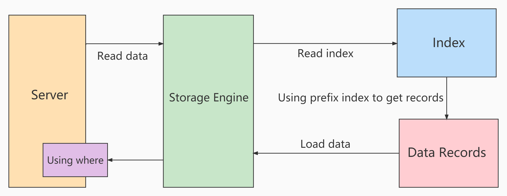


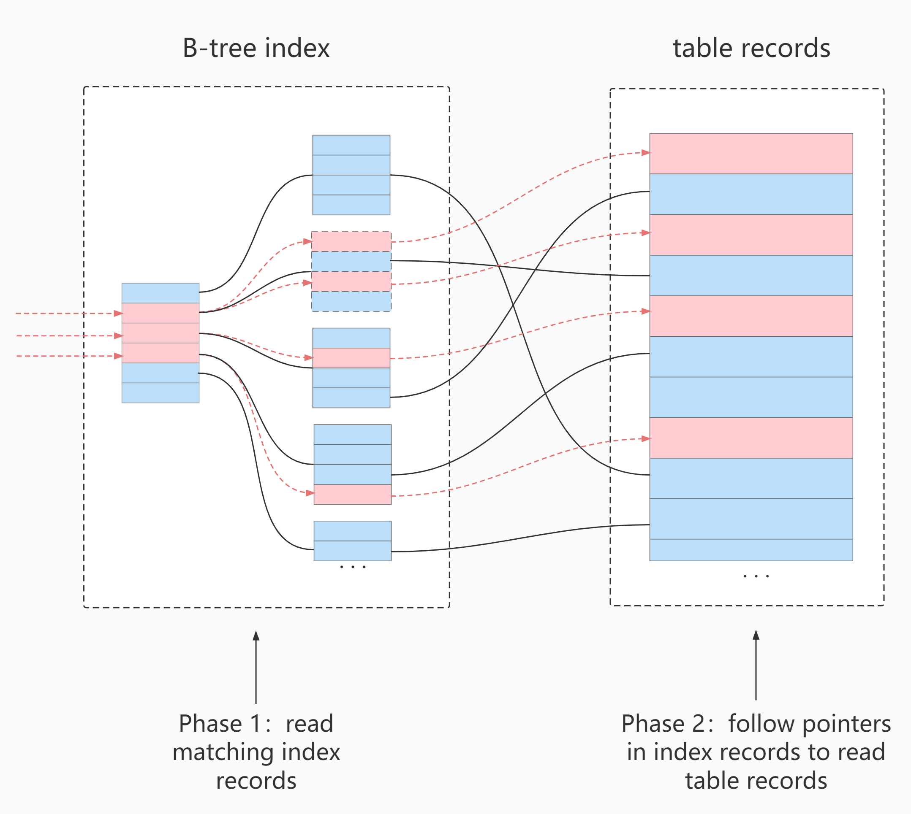

**使用ICP扫描的过程：**

- storage层：

  首先将index key条件满足的索引记录区间确定，然后在索引上使用index filter进行过滤。将满足的index filter条件的索引记录才去回表取出整行记录返回server层。不满足index filter条件的索引记录丢弃，不回表、也不会返回server层。

- server 层：

  对返回的数据，使用table filter条件做最后的过滤。

  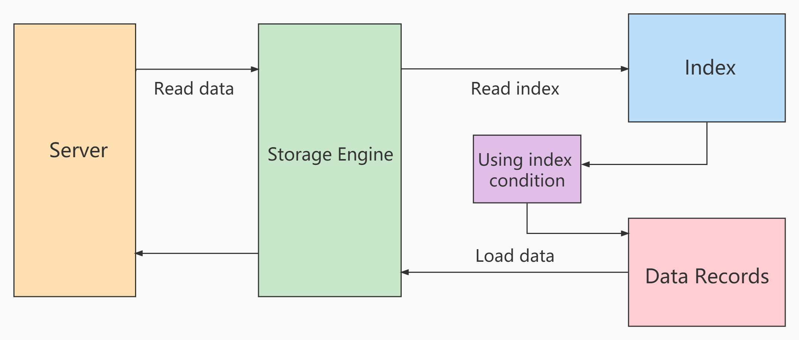

  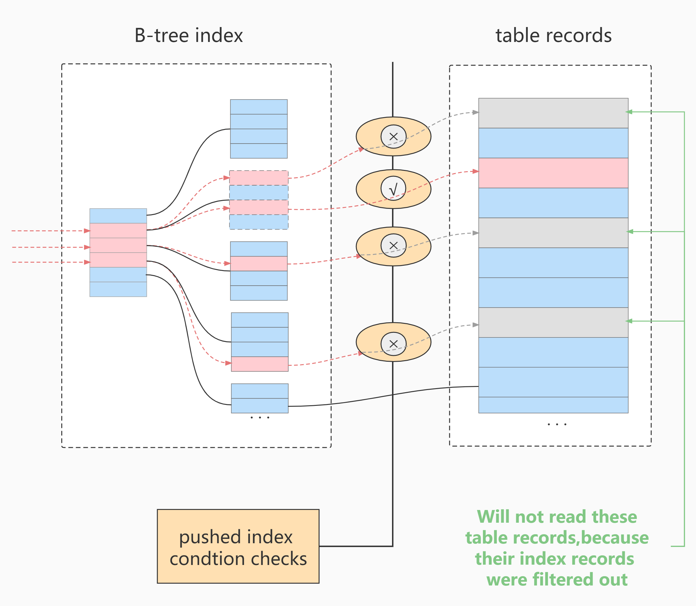

**使用前后的成本差别**

使用前，存储层多返回了需要被index filter过滤掉的整行记录

使用ICP后，直接就去掉了不满足index filter条件的记录，省去了他们回表和传递到server层的成本。

ICP的`加速效果`取决于在存储引擎内通过`ICP筛选`掉的数据的比例。

### 10. 2 ICP的使用条件

**ICP的使用条件：**

① 只能用于二级索引(secondary index)

对于InnnoDB表，ICP仅用于二级索引。对于innodb聚集索引，完整的记录已被读入到innodb缓冲区，在这种情况下，ICP不会减少io。

②explain显示的执行计划中type值（join 类型）为`range`、 `ref`、 `eq_ref`或者`ref_or_null`。

③ 并非全部where条件都可以用ICP筛选，如果where条件的字段不在索引列中，还是要读取整表的记录到server端做where过滤。

④ ICP可以用于MyISAM和InnnoDB存储引擎

⑤ MySQL 5.6版本的不支持分区表的ICP功能，5.7版本的开始支持。

⑥ 当SQL使用覆盖索引时，不支持ICP优化方法。


### 10. 3 ICP使用案例

**案例 1**

```mysql
SELECT * FROM tuser
WHERE NAME LIKE '张%'
AND age = 10
AND ismale = 1 ;
```

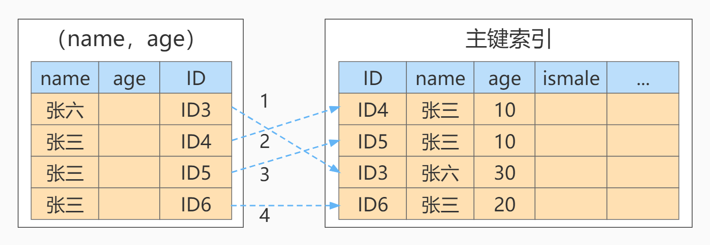

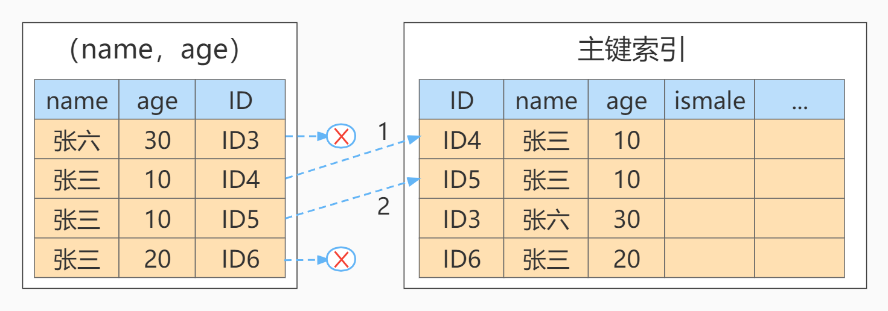

**案例 2**

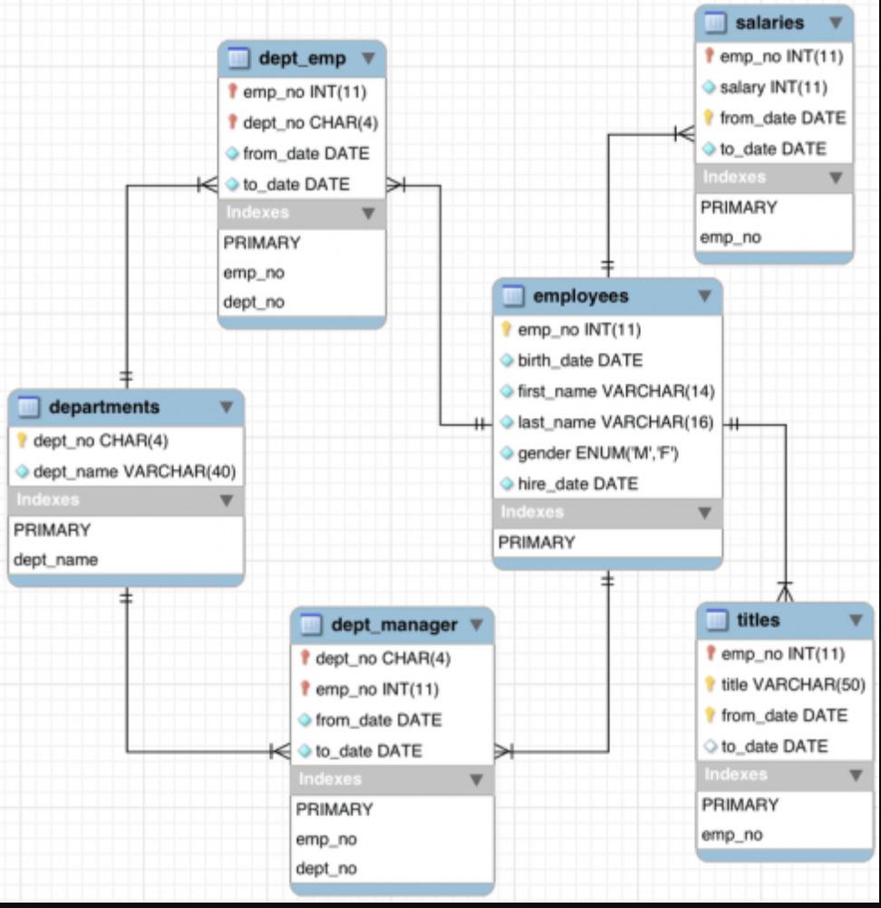


## 11. 普通索引 vs 唯一索引

在不同的业务场景下，应该选择普通索引，还是唯一索引？

假设你在维护一个居民系统，每个人都有一个唯一的身份证号，而且`业务代码`已经保证了`不会写入两个重复的身份证号`。如果居民系统需要按照身份证号查姓名：

```mysql
select name from CUser where id_card="xxxxxxxyyyyyyzzzzz';
```

所以，你一定会考虑在id_card字段上建索引。

由于身份证号字段比较大，不建议把身份证号当做主键。现在有两个选择，要么给id_card字段创建`唯一索引`，要么创建一个`普通索引`。如果业务代码已经保证了不会写入重复的身份证号，那么这两个选择逻辑上都是正确的。

**从性能的角度考虑，你选择唯一索引还是普通索引呢？选择的依据是什么呢？**

假设，我们有一个主键列为ID的表，表中有字段k，并且在k上有索引，假设字段 k 上的值都不重复。

这个表的建表语句是：

```mysql
mysql> create table test(
id int primary key,
k int not null,
name varchar( 16 ),
index (k)
)engine=InnoDB;
```

表中R 1 ~R 5 的(ID,k)值分别为( 100 , 1 )、( 200 , 2 )、( 300 , 3 )、( 500 , 5 )和( 600 , 6 )。


### 11.1 查询过程

假设，执行查询的语句是 select id from test where k=5。

- 对于普通索引来说，查找到满足条件的第一个记录(5,500)后，需要查找下一个记录，直到碰到第一个不满足k=5条件的记录。

- 对于唯一索引来说，由于索引定义了唯一性，查找到第一个满足条件的记录后，就会停止继续检索。

那么，这个不同带来的性能差距会有多少呢？答案是，`微乎其微`。


### 11.2 更新过程

为了说明普通索引和唯一索引对更新语句性能的影响这个问题，介绍一下change buffer。

当需要更新一个数据页时，如果数据页在内存中就直接更新，而如果这个数据页还没有在内存中的话，在不影响数据一致性的前提下，`InooDB会将这些更新操作缓存在change buffer中`，这样就不需要从磁盘中读入这个数据页了。在下次查询需要访问这个数据页的时候，将数据页读入内存，然后执行change buffer中与这个页有关的操作。通过这种方式就能保证这个数据逻辑的正确性。

将change buffer中的操作应用到原数据页，得到最新结果的过程称为`merge`。除了`访问这个数据页会`触发merge外，系统有`后台线程会定期`merge。在`数据库正常关闭（shutdown）`的过程中，也会执行merge操作。

如果能够将更新操作先记录在change buffer，`减少读磁盘`，语句的执行速度会得到明显的提升。而且，数据读入内存是需要占用 buffer pool 的，所以这种方式还能够`避免占用内存`，提高内存利用率。

那么，什么条件下可以使用change buffer呢？

对于唯一索引来说，所有的更新操作都要先判断这个操作是否违反唯一性约束。比如，要插入（4，400）这个记录，就要先判断现在表中是否已经存在k=4的记录，而这必须要将数据页读入内存才能判断。如果都已经读入到内存了，那直接更新内存会更快，就没必要使用change buffer了。

`唯一索引的更新就不能使用change buffer，实际上也只有普通索引可以使用。`

change buffer用的是buffer pool里的内存，因此不能无限增大。change buffer的大小，可以通过参数`innodb_change_buffer_max_size`来动态设置。这个参数设置为`50`的时候，表示change bufer的大小最多只能占用buffer pool的50%。

**如果要在这张表中插入一个新记录( 4 , 400 )的话，InnoDB的处理流程是怎样的？**

第一种情况是，这个记录要更新的目标页在内存中。这时：

- 对于唯一索引来说，找到3和5之间的位置，判断为没有冲突，插入这个值，语句执行结束；
- 对于普通索引来说，找到3和5之间的位置，插入这个值，语句执行结束。

这样看来，普通索引和唯一索引对更新语句性能影响的差别，只是一个判断，只会耗费微小的CPU时间。

第二种情况是，**这个记录要更新的目标页不在内存中**。这时：

- 对于唯一索引来说，需要将数据页读入内存，判断到没有冲突，插入这个值，语句执行结束；
- 对于普通索引来说，则是将更新记录在change buffer，语句执行就结束了。

将数据从磁盘读入内存涉及随机IO的访问，是数据库里面成本最高的操作之一。change buffer因为减少了随机磁盘访问，所以对更新性能的提升是会很明显的。

> 案例：
> 某个业务的库内存命中率突然从99%降低到了75%，整个系统处于阻塞状态，更新语句全部堵住。而探究其原因后，发现这个业务有大量插入数据的操作，而他在前一天把其中的某个普通索引改成了唯一索引。

### 11.3 change buffer的使用场景

**change buffer只限于用在普通索引的场景下，而不适用于唯一索引**。那么，现在有一个问题就是：普通索引的所有场景，使用change buffer都可以起到加速作用吗？

因为merge的时候是真正进行数据更新的时刻，而change buffer的主要目的就是将记录的变更动作缓存下来，所以在一个数据页做merge之前，change buffer记录的变更越多（也就是这个页面上要更新的次数越多），收益就越大。

因此，对于`写多读少`的业务来说，页面在写完以后马上被访问到的概率比较小，此时change buffer的使用效果最好。这种业务模型常见的就是`账单类`、`日志类`的系统。

反过来，假设一个业务的更新模式是`写入之后马上会做查询`，那么即使满足了条件，将更新先记录在change buffer，但之后由于马上要访问这个数据页，会立即触发merge过程。这样随机访问IO的次数不会减少，反而增加了change bufer的维护代价。所以，对于这种业务模式来说，change buffer反而起到了`副作用`。

**结论：**

1. 普通索引和唯一索引应该怎么选择？其实，这两类索引在查询能力上是没差别的，主要考虑的是对`更新性能`的影响。所以，建议你`尽量选择普通索引`。

2. 在实际使用中会发现，`普通索引`和`change buffer`的配合使用，对于`数据量大`的表的更新优化还是很明显的。

3. 如果所有的更新后面，都马上`伴随着对这个记录的查询`，那么你应该`关闭change buffer`。而在其他情况下，change buffer都能提升更新性能。

4. 由于唯一索引用不上change buffer的优化机制，因此如果`业务可以接受`，从性能角度出发建议优先考虑非唯一索引。但是如果"业务可能无法确保"的情况下，怎么处理呢？

- 首先，`业务正确性优先`。我们的前提是“业务代码已经保证不会写入重复数据”的情况下，讨论性能问题。如果业务不能保证，或者业务就是要求数据库来做约束，那么没得选，必须创建唯一索引。这种情况下，本节的意义在于，如果碰上了大量插入数据慢、内存命中率低的时候，给你多提供一个排查思路。

- 然后，在一些“`归档库`”的场景，你是可以考虑使用唯一索引的。比如，线上数据只需要保留半年，然后历史数据保存在归档库。这时候，归档数据已经是确保没有唯一键冲突了。要提高归档效率，可以考虑把表里面的唯一索引改成普通索引。

## 12. 其它查询优化策略


### 12.1 EXISTS 和 IN 的区分

**问题：**

不太理解哪种情况下应该使用 EXISTS，哪种情况应该用 IN。选择的标准是看能否使用表的索引吗？

**回答：**

索引是个前提，其实选择与否还是要看表的大小。你可以将选择的标准理解为`小表驱动大表`。在这种方式下效率是最高的。

比如下面这样：

```mysql
# A大表
SELECT * FROM A WHERE cc IN(SELECT cc FROM B)
# A小表
SELECT * FROM A WHERE EXISTS(SELECT cc FROM B WHERE B. CC=A. cc) 
```

当A小于B时，用EXISTS。因为EXISTS的实现，相当于外表循环，实现的逻辑类似于：


当B小于A时用IN，因为实现的逻辑类似于：


哪个表小就用哪个表来驱动，A表小就用EXISTS，B表小就用IN。


### 12.2 COUNT(*)与COUNT(具体字段)效率

问：在 MySQL 中统计数据表的行数，可以使用三种方式：`SELECT COUNT(*)`、`SELECT COUNT(1)`和`SELECT COUNT(具体字段)`，使用这三者之间的查询效率是怎样的？

前提：如果你要统计的是某个字段的非空数据行数，则另当别论，毕竟比较执行效率的前提是结果一样才可以。

**环节1**：`COUNT（*）`和`COUNT（1）`都是对所有结果进行`COUNT`，`COUNT（*）`和`COUNT（1）`本质上并没有区别（二者执行时间可能略有差别，不过你还是可以把它俩的执行效率看成是相等的）。如果有WHERE子句，则是对所有符合筛选条件的数据行进行统计；如果没有WHERE子句，则是对数据表的数据行数进行统计。

**环节2**：如果是MyISAM存储引擎，统计数据表的行数只需要`O(1)`的复杂度，这是因为每张MyISAM的数据表都有一个meta信息存储了`row_count`值，而一致性则由表级锁来保证。

如果是InnoDB存储引擎，因为InnoDB支持事务，采用行级锁和MVCC机制，所以无法像MyISAM一样，维护一个row_count变量，因此需要采用`扫描全表`，是`O(n)`的复杂度，进行循环+计数的方式来完成统计。

**环节3**：在InnoDB引擎中，如果采用`COUNT（具体字段）`来统计数据行数，要尽量采用二级索引。因为主键采用的索引是聚簇索引，聚簇索引包含的信息多，明显会大于二级索引（非聚簇索引）。对于`COUNT（*）`和`COUNT（1）`来说，它们不需要查找具体的行，只是统计行数，系统会`自动`采用占用空间更小的二级索引来进行统计。

如果有多个二级索引，会使用key_len小的二级索引进行扫描。当没有二级索引的时候，才会采用主键索引来进行统计。


### 12.3 关于SELECT(*)

在表查询中，建议明确字段，不要使用 * 作为查询的字段列表，推荐使用SELECT <字段列表> 查询。原因：

① MySQL 在解析的过程中，会通过`查询数据字典将`"*"按序转换成所有列名，这会大大的耗费资源和时间。

② 无法使用`覆盖索引`


### 12.4 LIMIT 1 对优化的影响

针对的是会扫描全表的 SQL 语句，如果你可以确定结果集只有一条，那么加上`LIMIT 1`的时候，当找到一条结果的时候就不会继续扫描了，这样会加快查询速度。

如果数据表已经对字段建立了唯一索引，那么可以通过索引进行查询，不会全表扫描的话，就不需要加上`LIMIT 1`了。


### 12.5 多使用COMMIT

只要有可能，在程序中尽量多使用 COMMIT，这样程序的性能得到提高，需求也会因为 COMMIT 所释放的资源而减少。

COMMIT 所释放的资源：

- 回滚段上用于恢复数据的信息

- 被程序语句获得的锁

- redo / undo log buffer 中的空间

- 管理上述 3 种资源中的内部花费


## 13. 淘宝数据库，主键如何设计的？

聊一个实际问题：淘宝的数据库，主键是如何设计的？

某些错的离谱的答案还在网上年复一年的流传着，甚至还成为了所谓的MySQL军规。其中，一个最明显的错误就是关于MySQL的主键设计。

大部分人的回答如此自信：用 8 字节的 BIGINT 做主键，而不要用INT。`错`！

这样的回答，只站在了数据库这一层，而没有`从业务的角度`思考主键。主键就是一个自增ID吗？站在2022 年的新年档口，用自增做主键，架构设计上可能`连及格都拿不到`。

### 13. 1 自增ID的问题

自增ID做主键，简单易懂，几乎所有数据库都支持自增类型，只是实现上各自有所不同而已。自增ID除了简单，其他都是缺点，总体来看存在以下几方面的问题：

**1. 可靠性不高**

存在自增ID回溯的问题，这个问题直到最新版本的MySQL 8.0才修复。

**2. 安全性不高**

对外暴露的接口可以非常容易猜测对应的信息。比如：/User/1/这样的接口，可以非常容易猜测用户ID的值为多少，总用户数量有多少，也可以非常容易地通过接口进行数据的爬取。

**3. 性能差**

自增ID的性能较差，需要在数据库服务器端生成。

**4. 交互多**

业务还需要额外执行一次类似`last_insert_id()`的函数才能知道刚才插入的自增值，这需要多一次的网络交互。在海量并发的系统中，多 1 条SQL，就多一次性能上的开销。

**5. 局部唯一性**

最重要的一点，自增ID是局部唯一，只在当前数据库实例中唯一，而不是全局唯一，在任意服务器间都是唯一的。对于目前分布式系统来说，这简直就是噩梦。

### 13. 2 业务字段做主键

为了能够唯一地标识一个会员的信息，需要为会员信息表设置一个主键。那么，怎么为这个表设置主键，才能达到我们理想的目标呢？ 这里我们考虑业务字段做主键。

表数据如下：

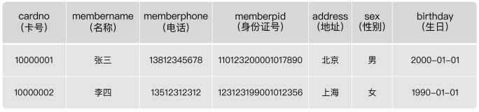

在这个表里，哪个字段比较合适呢？

- **选择卡号（cardno）**

  会员卡号（cardno）看起来比较合适，因为会员卡号不能为空，而且有唯一性，可以用来 标识一条会员记录。

  ```mysql
  mysql> CREATE TABLE demo.membermaster
  -> (
  -> cardno CHAR( 8 ) PRIMARY KEY, -- 会员卡号为主键
  -> membername TEXT,
  -> memberphone TEXT,
  -> memberpid TEXT,
  -> memberaddress TEXT,
  -> sex TEXT,
  -> birthday DATETIME
  -> );
  Query OK, 0 rows affected (0.06 sec)
  ```

  不同的会员卡号对应不同的会员，字段“cardno”唯一地标识某一个会员。如果都是这样，会员卡号与会员一一对应，系统是可以正常运行的。

  但实际情况是，`会员卡号可能存在重复使用`的情况。比如，张三因为工作变动搬离了原来的地址，不再到商家的门店消费了 （退还了会员卡），于是张三就不再是这个商家门店的会员了。但是，商家不想让这个会 员卡空着，就把卡号是“ 10000001 ”的会员卡发给了王五。

  从系统设计的角度看，这个变化只是修改了会员信息表中的卡号是“ 10000001 ”这个会员 信息，并不会影响到数据一致性。也就是说，修改会员卡号是“ 10000001 ”的会员信息， 系统的各个模块，都会获取到修改后的会员信息，不会出现“有的模块获取到修改之前的会员信息，有的模块获取到修改后的会员信息，而导致系统内部数据不一致”的情况。因此，从`信息系统层面`上看是没问题的。

  但是从使用`系统的业务层面`来看，就有很大的问题 了，会对商家造成影响。

  比如，我们有一个销售流水表（trans），记录了所有的销售流水明细。 2020 年 12 月 01 日，张三在门店购买了一本书，消费了 89 元。那么，系统中就有了张三买书的流水记录，如下所示：

  

  接着，我们查询一下 2020 年 12 月 01 日的会员销售记录：

  ```mysql
  mysql> SELECT b.membername,c.goodsname,a.quantity,a.salesvalue,a.transdate
  -> FROM demo.trans AS a
  -> JOIN demo.membermaster AS b
  -> JOIN demo.goodsmaster AS c
  -> ON (a.cardno = b.cardno AND a.itemnumber=c.itemnumber);
  +------------+-----------+----------+------------+---------------------+
  | membername | goodsname | quantity | salesvalue | transdate |
  +------------+-----------+----------+------------+---------------------+
  | 张三 | 书 | 1.000 | 89.00 | 2020 - 12 - 01 00 :00:00 |
  +------------+-----------+----------+------------+---------------------+
  1 row in set (0.00 sec)
  ```

  如果会员卡“ 10000001 ”又发给了王五，我们会更改会员信息表。导致查询时：

  ```mysql
  mysql> SELECT b.membername,c.goodsname,a.quantity,a.salesvalue,a.transdate
  -> FROM demo.trans AS a
  -> JOIN demo.membermaster AS b
  -> JOIN demo.goodsmaster AS c
  -> ON (a.cardno = b.cardno AND a.itemnumber=c.itemnumber);
  +------------+-----------+----------+------------+---------------------+
  | membername | goodsname | quantity | salesvalue | transdate |
  +------------+-----------+----------+------------+---------------------+
  | 王五 | 书 | 1.000 | 89.00 | 2020 - 12 - 01 00 :00:00 |
  +------------+-----------+----------+------------+---------------------+
  1 row in set (0.01 sec)
  ```

  这次得到的结果是：王五在 2020 年 12 月 01 日，买了一本书，消费 89 元。显然是错误的！结论：千万不能把会员卡号当做主键。

  

  选择会员电话 或 身份证号会员电话可以做主键吗？不行的。在实际操作中，手机号也存在`被运营商收回`，重新发给别人用的情况。

  那身份证号行不行呢？好像可以。因为身份证决不会重复，身份证号与一个人存在一一对 应的关系。可问题是，身份证号属于`个人隐私`，顾客不一定愿意给你。要是强制要求会员必须登记身份证号，会把很多客人赶跑的。其实，客户电话也有这个问题，这也是我们在设计会员信息表的时候，允许身份证号和电话都为空的原因。

  **所以，建议尽量不要用跟业务有关的字段做主键。毕竟，作为项目设计的技术人员，我们谁也无法预测在项目的整个生命周期中，哪个业务字段会因为项目的业务需求而有重复，或者重用之类的情况出现。**

  > 经验：
  >
  > 刚开始使用 MySQL 时，很多人都很容易犯的错误是喜欢用业务字段做主键，想当然地认为了解业务需求，但实际情况往往出乎意料，而更改主键设置的成本非常高。

### 13. 3 淘宝的主键设计

在淘宝的电商业务中，订单服务是一个核心业务。请问，订单表的主键淘宝是如何设计的呢？是自增ID吗？

打开淘宝，看一下订单信息：


从上图可以发现，订单号不是自增ID！我们详细看下上述 4 个订单号：

```mysql
1550672064762308113
1481195847180308113
1431156171142308113
1431146631521308113
```

订单号是 19 位的长度，且订单的最后 5 位都是一样的，都是 08113 。且订单号的前面 14 位部分是单调递增的。

大胆猜测，淘宝的订单ID设计应该是：

```
订单ID = 时间 + 去重字段 + 用户ID后 6 位尾号
```

这样的设计能做到全局唯一，且对分布式系统查询及其友好。

### 13. 4 推荐的主键设计

`非核心业务`：对应表的主键自增ID，如告警、日志、监控等信息。

`核心业务`： **主键设计至少应该是全局唯一且是单调递增** 。全局唯一保证在各系统之间都是唯一的，单调递增是希望插入时不影响数据库性能。

这里推荐最简单的一种主键设计：UUID。

**UUID的特点：**

全局唯一，占用 36 字节，数据无序，插入性能差。

**认识UUID：**

- 为什么UUID是全局唯一的？

- 为什么UUID占用 36 个字节？

- 为什么UUID是无序的？

MySQL数据库的UUID组成如下所示：

```
UUID = 时间+UUID版本（ 16 字节）- 时钟序列（ 4 字节） - MAC地址（ 12 字节）
```

我们以UUID值e0ea12d4-6473-11eb-943c-00155dbaa39d举例：


`为什么UUID是全局唯一的？`

在UUID中时间部分占用 60 位，存储的类似TIMESTAMP的时间戳，但表示的是从1582-10-15 00： 00 ：00.00到现在的100ns的计数。可以看到UUID存储的时间精度比TIMESTAMPE更高，时间维度发生重复的概率降低到1/100ns。

时钟序列是为了避免时钟被回拨导致产生时间重复的可能性。MAC地址用于全局唯一。

`为什么UUID占用 36 个字节？`

UUID根据字符串进行存储，设计时还带有无用"-"字符串，因此总共需要 36 个字节。

`为什么UUID是随机无序的呢？`

因为UUID的设计中，将时间低位放在最前面，而这部分的数据是一直在变化的，并且是无序。

**改造UUID**

若将时间高低位互换，则时间就是单调递增的了，也就变得单调递增了。MySQL 8.0可以更换时间低位和时间高位的存储方式，这样UUID就是有序的UUID了。

MySQL 8.0还解决了UUID存在的空间占用的问题，除去了UUID字符串中无意义的"-"字符串，并且将字符串用二进制类型保存，这样存储空间降低为了 16 字节。

可以通过MySQL8.0提供的uuid_to_bin函数实现上述功能，同样的，MySQL也提供了bin_to_uuid函数进行转化：

```mysql
SET @uuid = UUID();

SELECT @uuid,uuid_to_bin(@uuid),uuid_to_bin(@uuid,TRUE);
```


**通过函数uuid_to_bin(@uuid,true)将UUID转化为有序UUID** 了。全局唯一 + 单调递增，这不就是我们想要的主键！

**4 、有序UUID性能测试**

16 字节的有序UUID，相比之前 8 字节的自增ID，性能和存储空间对比究竟如何呢？

我们来做一个测试，插入 1 亿条数据，每条数据占用 500 字节，含有 3 个二级索引，最终的结果如下所示：


从上图可以看到插入 1 亿条数据有序UUID是最快的，而且在实际业务使用中有序UUID在`业务端就可以生成`。还可以进一步减少SQL的交互次数。

另外，虽然有序UUID相比自增ID多了 8 个字节，但实际只增大了 3 G的存储空间，还可以接受。

> 在当今的互联网环境中，非常不推荐自增ID作为主键的数据库设计。更推荐类似有序UUID的全局唯一的实现。
>
> 另外在真实的业务系统中，主键还可以加入业务和系统属性，如用户的尾号，机房的信息等。这样的主键设计就更为考验架构师的水平了。

**如果不是MySQL8.0 肿么办？**

手动赋值字段做主键！

比如，设计各个分店的会员表的主键，因为如果每台机器各自产生的数据需要合并，就可能会出现主键重复的问题。

可以在总部 MySQL 数据库中，有一个管理信息表，在这个表中添加一个字段，专门用来记录当前会员编号的最大值。

门店在添加会员的时候，先到总部 MySQL 数据库中获取这个最大值，在这个基础上加 1 ，然后用这个值作为新会员的“id”，同时，更新总部 MySQL 数据库管理信息表中的当 前会员编号的最大值。

这样一来，各个门店添加会员的时候，都对同一个总部 MySQL 数据库中的数据表字段进 行操作，就解决了各门店添加会员时会员编号冲突的问题。