# 第 11 章_数据库的设计规范


## 1. 为什么需要数据库设计

## 2. 范 式

### 2. 1 范式简介

**在关系型数据库中，关于数据表设计的基本原则、规则就称为范式**。 可以理解为，一张数据表的设计结构需要满足的某种设计标准的`级别`。要想设计一个结构合理的关系型数据库，必须满足一定的范式。

### 2. 2 范式都包括哪些

目前关系型数据库有六种常见范式，按照范式级别，从低到高分别是： **第一范式（ 1 NF）、第二范式（ 2 NF）、第三范式（ 3 NF）、巴斯-科德范式（BCNF）、第四范式( 4 NF）和第五范式（ 5 NF，又称完美范式）** 。


### 2. 3 键和相关属性的概念

**举例：**

这里有两个表：

`球员表(player)`：球员编号 | 姓名 | 身份证号 | 年龄 | 球队编号

`球队表(team)`：球队编号 | 主教练 | 球队所在地

- `超键`：对于球员表来说，超键就是包括球员编号或者身份证号的任意组合，比如（球员编号）（球员编号，姓名）（身份证号，年龄）等。

- `候选键`：就是最小的超键，对于球员表来说，候选键就是（球员编号）或者（身份证号）。

- `主键`：我们自己选定，也就是从候选键中选择一个，比如（球员编号）。

- `外键`：球员表中的球队编号。

- `主属性、非主属性`：在球员表中，主属性是（球员编号）（身份证号），其他的属性（姓名）（年龄）（球队编号）都是非主属性。

### 2. 4 第一范式( 1 st NF)

**举例 1 ：**

假设一家公司要存储员工的姓名和联系方式。它创建一个如下表：


该表不符合 1NF ，因为规则说“表的每个属性必须具有原子（单个）值”，lisi和zhaoliu员工的emp_mobile 值违反了该规则。为了使表符合 1NF ，我们应该有如下表数据：

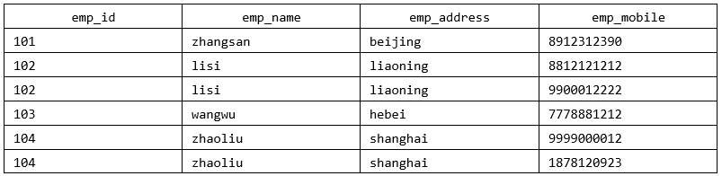

举例 2 ：

user 表的设计不符合第一范式


其中，user_info字段为用户信息，可以进一步拆分成更小粒度的字段，不符合数据库设计对第一范式的要求。将user_info拆分后如下：


**举例 3 ：**

属性的原子性是`主观的`。例如，Employees关系中雇员姓名应当使用 1 个（fullname）、 2 个（firstname和lastname）还是 3 个（firstname、middlename和lastname）属性表示呢？答案取决于应用程序。如果应用程序需要分别处理雇员的姓名部分（如：用于搜索目的），则有必要把它们分开。否则，不需要。

表1 ：


表 2 ：


### 2. 5 第二范式( 2 nd NF)

**举例 1 ：**

`成绩表`（学号，课程号，成绩）关系中，（学号，课程号）可以决定成绩，但是学号不能决定成绩，课程号也不能决定成绩，所以“（学号，课程号）→成绩”就是`完全依赖关系`。

**举例 2 ：**

`比赛表 player_game`，里面包含球员编号、姓名、年龄、比赛编号、比赛时间和比赛场地等属性，这里候选键和主键都为（球员编号，比赛编号），我们可以通过候选键（或主键）来决定如下的关系：

```
(球员编号, 比赛编号) → (姓名, 年龄, 比赛时间, 比赛场地，得分)
```

但是这个数据表不满足第二范式，因为数据表中的字段之间还存在着如下的对应关系：

```
(球员编号) → (姓名，年龄)

(比赛编号) → (比赛时间, 比赛场地)
```

对于非主属性来说，并非完全依赖候选键。这样会产生怎样的问题呢？

1. `数据冗余`：如果一个球员可以参加 m 场比赛，那么球员的姓名和年龄就重复了 m-1 次。一个比赛也可能会有 n 个球员参加，比赛的时间和地点就重复了 n-1 次。
2. `插入异常`：如果我们想要添加一场新的比赛，但是这时还没有确定参加的球员都有谁，那么就没法插入。
3. `删除异常`：如果我要删除某个球员编号，如果没有单独保存比赛表的话，就会同时把比赛信息删除掉。
4. `更新异常`：如果我们调整了某个比赛的时间，那么数据表中所有这个比赛的时间都需要进行调整，否则就会出现一场比赛时间不同的情况。

为了避免出现上述的情况，我们可以把球员比赛表设计为下面的三张表。


这样的话，每张数据表都符合第二范式，也就避免了异常情况的发生。

>  1NF 告诉我们字段属性需要是原子性的，而 2NF 告诉我们一张表就是一个独立的对象，一张表只表达一个意思。

**举例 3 ：**

定义了一个名为 Orders 的关系，表示订单和订单行的信息：

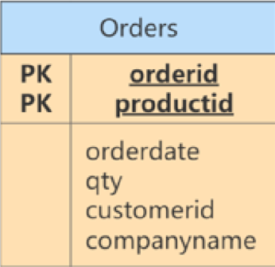

违反了第二范式，因为有非主键属性仅依赖于候选键（或主键）的一部分。例如，可以仅通过orderid找到订单的 orderdate，以及 customerid 和 companyname，而没有必要再去使用productid。

修改：

Orders表和OrderDetails表如下，此时符合第二范式。

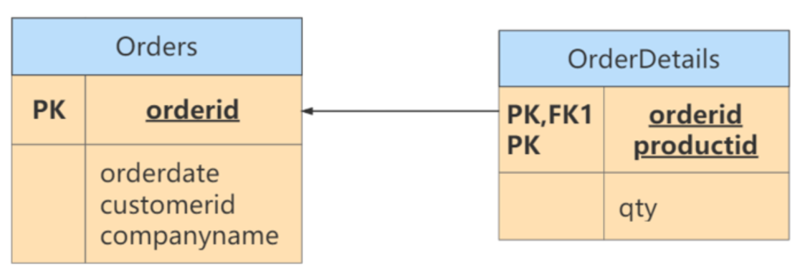


### 2. 6 第三范式( 3 rd NF)

**举例 1 ：**

`部门信息表`：每个部门有部门编号（dept_id）、部门名称、部门简介等信息。

`员工信息表`：每个员工有员工编号、姓名、部门编号。列出部门编号后就不能再将部门名称、部门简介等与部门有关的信息再加入员工信息表中。

如果不存在部门信息表，则根据第三范式（3NF）也应该构建它，否则就会有大量的数据冗余。

**举例 2 ：**


商品类别名称依赖于商品类别编号，不符合第三范式。

修改：

表 1 ：符合第三范式的`商品类别表`的设计


表 2 ：符合第三范式的商品表的设计


商品表goods通过商品类别id字段（category_id）与商品类别表goods_category进行关联。

**举例 3 ：**

`球员player表`：球员编号、姓名、球队名称和球队主教练。现在，我们把属性之间的依赖关系画出来，如下图所示：


你能看到球员编号决定了球队名称，同时球队名称决定了球队主教练，非主属性球队主教练就会传递依赖于球员编号，因此不符合 3NF 的要求。

如果要达到 3NF 的要求，需要把数据表拆成下面这样：


**举例 4 ：**

修改第二范式中的举例 3 。

此时的Orders关系包含 orderid、orderdate、customerid 和 companyname 属性，主键定义为 orderid。customerid 和companyname均依赖于主键——orderid。例如，你需要通过orderid主键来查找代表订单中客户的customerid，同样，你需要通过 orderid 主键查找订单中客户的公司名称（companyname）。然而， customerid和companyname也是互相依靠的。为满足第三范式，可以改写如下：


> 符合3NF后的数据模型通俗地讲，2NF和3NF通常以这句话概括：“每个非键属性依赖于键，依赖于整个键，并且除了键别无他物”。

## 3. 反范式化

### 3. 1 概述

**规范化 vs 性能**

> 1. 为满足某种商业目标 , 数据库性能比规范化数据库更重要
> 2. 在数据规范化的同时 , 要综合考虑数据库的性能
> 3. 通过在给定的表中添加额外的字段，以大量减少需要从中搜索信息所需的时间
> 4. 通过在给定的表中插入计算列，以方便查询

### 3. 2 应用举例

**举例 1 ：**

员工的信息存储在 `employees 表`中，部门信息存储在 `departments 表`中。通过 employees 表中的department_id字段与 departments 表建立关联关系。如果要查询一个员工所在部门的名称：

```mysql
select employee_id,department_name
from employees e join departments d
on e.department_id = d.department_id;
```

如果经常需要进行这个操作，连接查询就会浪费很多时间。可以在 employees 表中增加一个冗余字段department_name，这样就不用每次都进行连接操作了。

**举例 2 ：**

反范式化的`goods商品信息表`设计如下：

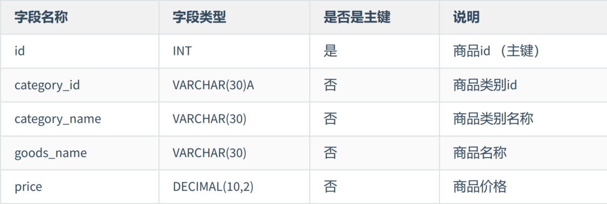

**举例 3 ：** 我们有 2 个表，分别是`商品流水表（atguigu.trans）`和`商品信息表（atguigu.goodsinfo）`。商品流水表里有 400 万条流水记录，商品信息表里有 2000 条商品记录。

商品流水表：


商品信息表：


新的商品流水表如下所示：


**举例 4 ：**

`课程评论表 class_comment`，对应的字段名称及含义如下：


`学生表 student`，对应的字段名称及含义如下：


在实际应用中，我们在显示课程评论的时候，通常会显示这个学生的昵称，而不是学生 ID，因此当我们想要查询某个课程的前 1000 条评论时，需要关联 class_comment 和 student这两张表来进行查询。

**实验数据：模拟两张百万量级的数据表**

为了更好地进行 SQL 优化实验，我们需要给学生表和课程评论表随机模拟出百万量级的数据。我们可以通过存储过程来实现模拟数据。

**反范式优化实验对比**

如果我们想要查询课程 ID 为 10001 的前 1000 条评论，需要写成下面这样：

```mysql
SELECT p.comment_text, p.comment_time, stu.stu_name
FROM class_comment AS p LEFT JOIN student AS stu
ON p.stu_id = stu.stu_id
WHERE p.class_id = 10001
ORDER BY p.comment_id DESC
LIMIT 1000 ;
```

运行结果（ 1000 条数据行）：


运行时长为 `0.395 秒`，对于网站的响应来说，这已经很慢了，用户体验会非常差。

如果我们想要提升查询的效率，可以允许适当的数据冗余，也就是在商品评论表中增加用户昵称字段，在 class_comment 数据表的基础上增加 stu_name 字段，就得到了 class_comment2 数据表。

这样一来，只需单表查询就可以得到数据集结果：

```mysql
SELECT comment_text, comment_time, stu_name
FROM class_comment
WHERE class_id = 10001
ORDER BY class_id DESC LIMIT 1000 ;
```

运行结果（ 1000 条数据）：

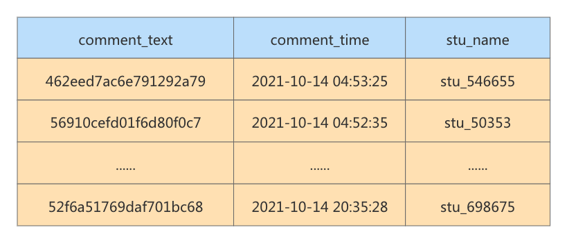

优化之后只需要扫描一次聚集索引即可，运行时间为 `0.039 秒`，查询时间是之前的 1/10。 你能看到，在数据量大的情况下，查询效率会有显著的提升。

### 3. 3 反范式的新问题

- 存储`空间变大`了
- 一个表中字段做了修改，另一个表中冗余的字段也需要做同步修改，否则`数据不一致`
- 若采用存储过程来支持数据的更新、删除等额外操作，如果更新频繁，会非常`消耗系统资源`
- 在`数据量小`的情况下，反范式不能体现性能的优势，可能还会让数据库的设计更加`复杂`

### 3. 4 反范式的适用场景

当冗余信息有价值或者能`大幅度提高查询效率`的时候，我们才会采取反范式的优化。

#### 1. 增加冗余字段的建议

#### 2. 历史快照、历史数据的需要

在现实生活中，我们经常需要一些冗余信息，比如订单中的收货人信息，包括姓名、电话和地址等。每次发生的`订单收货信息`都属于`历史快照`，需要进行保存，但用户可以随时修改自己的信息，这时保存这些冗余信息是非常有必要的。

反范式优化也常用在`数据仓库`的设计中，因为数据仓库通常存储历史数据，对增删改的实时性要求不强，对历史数据的分析需求强。这时适当允许数据的冗余度，更方便进行数据分析。

## 4. BCNF(巴斯范式)

**1. 案例**

我们分析如下表的范式情况：


在这个表中，一个仓库只有一个管理员，同时一个管理员也只管理一个仓库。我们先来梳理下这些属性之间的依赖关系。

仓库名决定了管理员，管理员也决定了仓库名，同时（仓库名，物品名）的属性集合可以决定数量这个属性。这样，我们就可以找到数据表的候选键。

`候选键`：是（管理员，物品名）和（仓库名，物品名），然后我们从候选键中选择一个作为主键，比如（仓库名，物品名）。

`主属性`：包含在任一候选键中的属性，也就是仓库名，管理员和物品名。

`非主属性`：数量这个属性。

**2. 是否符合三范式**

如何判断一张表的范式呢？我们需要根据范式的等级，从低到高来进行判断。

首先，数据表每个属性都是原子性的，符合 1 NF 的要求；

其次，数据表中非主属性”数量“都与候选键全部依赖，（仓库名，物品名）决定数量，（管理员，物品名）决定数量。因此，数据表符合 2 NF 的要求；

最后，数据表中的非主属性，不传递依赖于候选键。因此符合 3 NF 的要求。


##### 3. 存在的问题

既然数据表已经符合了 3NF 的要求，是不是就不存在问题了呢？我们来看下面的情况：

1. 增加一个仓库，但是还没有存放任何物品。根据数据表实体完整性的要求，主键不能有空值，因此会出现`插入异常`；

2. 如果仓库更换了管理员，我们就可能会`修改数据表中的多条记录`；

3. 如果仓库里的商品都卖空了，那么此时仓库名称和相应的管理员名称也会随之被删除。你能看到，即便数据表符合 3NF 的要求，同样可能存在插入，更新和删除数据的异常情况。

**4. 问题解决**

首先我们需要确认造成异常的原因：主属性仓库名对于候选键（管理员，物品名）是部分依赖的关系，这样就有可能导致上面的异常情况。因此引入BCNF， **它在 3NF 的基础上消除了主属性对候选键的部分依赖或者传递依赖关系** 。

如果在关系R中，U为主键，A属性是主键的一个属性，若存在A->Y，Y为主属性，则该关系不属于BCNF。

根据 BCNF 的要求，我们需要把仓库管理关系 warehouse_keeper 表拆分成下面这样：

`仓库表`：（仓库名，管理员）

`库存表`：（仓库名，物品名，数量）

这样就不存在主属性对于候选键的部分依赖或传递依赖，上面数据表的设计就符合 BCNF。

再举例：

有一个`学生导师表`，其中包含字段：学生ID，专业，导师，专业GPA，这其中学生ID和专业是联合主键。


这个表的设计满足三范式，但是这里存在另一个依赖关系，“专业”依赖于“导师”，也就是说每个导师只做一个专业方面的导师，只要知道了是哪个导师，我们自然就知道是哪个专业的了。

所以这个表的部分主键Major依赖于非主键属性Advisor，那么我们可以进行以下的调整，拆分成 2 个表：

学生导师表：


导师表：


## 5. 第四范式

**举例 1** ： 职工表(职工编号，职工孩子姓名，职工选修课程)。

在这个表中，同一个职工可能会有多个职工孩子姓名。同样，同一个职工也可能会有多个职工选修课程，即这里存在着多值事实，不符合第四范式。

如果要符合第四范式，只需要将上表分为两个表，使它们只有一个多值事实，例如：`职工表一`(职工编号，职工孩子姓名)，`职工表二`(职工编号，职工选修课程)，两个表都只有一个多值事实，所以符合第四范式。

**举例 2 ：**

比如我们建立课程、教师、教材的模型。我们规定，每门课程有对应的一组教师，每门课程也有对应的一组教材，一门课程使用的教材和教师没有关系。我们建立的关系表如下：

课程ID，教师ID，教材ID；这三列作为联合主键。

为了表述方便，我们用Name代替ID，这样更容易看懂：


这个表除了主键，就没有其他字段了，所以肯定满足BC范式，但是却存在`多值依赖`导致的异常。

假如我们下学期想采用一本新的英版高数教材，但是还没确定具体哪个老师来教，那么我们就无法在这个表中维护Course高数和Book英版高数教材的的关系。

解决办法是我们把这个多值依赖的表拆解成 2 个表，分别建立关系。这是我们拆分后的表：


以及


## 6. 第五范式、域键范式

除了第四范式外，我们还有更高级的第五范式（又称完美范式）和域键范式（DKNF）。

在满足第四范式（ 4 NF）的基础上，消除不是由候选键所蕴含的连接依赖。 **如果关系模式R中的每一个连接依赖均由R的候选键所隐含** ，则称此关系模式符合第五范式。

函数依赖是多值依赖的一种特殊的情况，而多值依赖实际上是连接依赖的一种特殊情况。但连接依赖不像函数依赖和多值依赖可以由`语义直接导出`，而是在`关系连接运算`时才反映出来。存在连接依赖的关系模式仍可能遇到数据冗余及插入、修改、删除异常等问题。

第五范式处理的是`无损连接问题`，这个范式基本`没有实际意义`，因为无损连接很少出现，而且难以察觉。而域键范式试图定义一个`终极范式`，该范式考虑所有的依赖和约束类型，但是实用价值也是最小的，只存在理论研究中。

## 7. 实战案例

见视频讲解（ **https://www.bilibili.com/video/BV1iq4y1u7vj?from=search&seid=4297501441472622157&spm_id_from=333.337.0.0** ）

## 8. ER模型

**ER 模型中有三个要素，分别是实体、属性和关系 。**

`实体`，可以看做是数据对象，往往对应于现实生活中的真实存在的个体。在 ER 模型中，用`矩形`来表示。实体分为两类，分别是`强实体`和`弱实体`。强实体是指不依赖于其他实体的实体；弱实体是指对另一个实体有很强的依赖关系的实体。

`属性`，则是指实体的特性。比如超市的地址、联系电话、员工数等。在 ER 模型中用`椭圆形`来表示。

`关系`，则是指实体之间的联系。比如超市把商品卖给顾客，就是一种超市与顾客之间的联系。在 ER 模型中用菱形来表示。

注意：实体和属性不容易区分。这里提供一个原则：我们要从系统整体的角度出发去看， **可以独立存在的是实体，不可再分的是属性** 。也就是说，属性不能包含其他属性。


### 8. 2 关系的类型

在 ER 模型的 3 个要素中，关系又可以分为 3 种类型，分别是 一对一、一对多、多对多。

`一对一`：指实体之间的关系是一一对应的，比如个人与身份证信息之间的关系就是一对一的关系。一个人只能有一个身份证信息，一个身份证信息也只属于一个人。

`一对多`：指一边的实体通过关系，可以对应多个另外一边的实体。相反，另外一边的实体通过这个关系，则只能对应唯一的一边的实体。比如说，我们新建一个班级表，而每个班级都有多个学生，每个学生则对应一个班级，班级对学生就是一对多的关系。

`多对多`：指关系两边的实体都可以通过关系对应多个对方的实体。比如在进货模块中，供货商与超市之间的关系就是多对多的关系，一个供货商可以给多个超市供货，一个超市也可以从多个供货商那里采购商品。再比如一个选课表，有许多科目，每个科目有很多学生选，而每个学生又可以选择多个科目，这就是多对多的关系。

### 8. 3 建模分析

ER 模型看起来比较麻烦，但是对我们把控项目整体非常重要。如果你只是开发一个小应用，或许简单设计几个表够用了，一旦要设计有一定规模的应用，在项目的初始阶段，建立完整的 ER 模型就非常关键了。开发应用项目的实质，其实就是建模。

我们设计的案例是`电商业务`，由于电商业务太过庞大且复杂，所以我们做了业务简化，比如针对SKU（StockKeepingUnit，库存量单位）和SPU（Standard Product Unit，标准化产品单元）的含义上，我们直接使用了SKU，并没有提及SPU的概念。本次电商业务设计总共有 8 个实体，如下所示。

- 地址实体
- 用户实体
- 购物车实体
- 评论实体
- 商品实体
- 商品分类实体
- 订单实体
- 订单详情实体

其中，`用户`和`商品分类`是强实体，因为它们不需要依赖其他任何实体。而其他属于弱实体，因为它们虽然都可以独立存在，但是它们都依赖用户这个实体，因此都是弱实体。知道了这些要素，我们就可以给电商业务创建 ER 模型了，如图：


在这个图中，地址和用户之间的添加关系，是一对多的关系，而商品和商品详情示一对 1 的关系，商品和订单是多对多的关系。 这个 ER 模型，包括了 8 个实体之间的 8 种关系。

（ 1 ）用户可以在电商平台添加多个地址；

（ 2 ）用户只能拥有一个购物车；

（ 3 ）用户可以生成多个订单；

（ 4 ）用户可以发表多条评论；

（ 5 ）一件商品可以有多条评论；

（ 6 ）每一个商品分类包含多种商品；

（ 7 ）一个订单可以包含多个商品，一个商品可以在多个订单里。

（ 8 ）订单中又包含多个订单详情，因为一个订单中可能包含不同种类的商品

### 8. 4 ER 模型的细化

有了这个 ER 模型，我们就可以从整体上理解电商的业务了。刚刚的 ER 模型展示了电商业务的框架，但是只包括了订单，地址，用户，购物车，评论，商品，商品分类和订单详情这八个实体，以及它们之间的关系，还不能对应到具体的表，以及表与表之间的关联。我们需要把属性加上，用椭圆来表示，这样我们得到的 ER 模型就更加完整了。

因此，我们需要进一步去设计一下这个 ER 模型的各个局部，也就是细化下电商的具体业务流程，然后把它们综合到一起，形成一个完整的 ER 模型。这样可以帮助我们理清数据库的设计思路。接下来，我们再分析一下各个实体都有哪些属性，如下所示。

（ 1 ）`地址实体`包括用户编号、省、市、地区、收件人、联系电话、是否是默认地址。

（ 2 ）`用户实体`包括用户编号、用户名称、昵称、用户密码、手机号、邮箱、头像、用户级别。

（ 3 ）`购物车实体`包括购物车编号、用户编号、商品编号、商品数量、图片文件url。

（ 4 `）订单实体`包括订单编号、收货人、收件人电话、总金额、用户编号、付款方式、送货地址、下单时间。

（ 5 ）`订单详情实体`包括订单详情编号、订单编号、商品名称、商品编号、商品数量。

（ 6 ）`商品实体`包括商品编号、价格、商品名称、分类编号、是否销售，规格、颜色。

（ 7 ）`评论实体`包括评论id、评论内容、评论时间、用户编号、商品编号

（ 8 ）`商品分类`实体包括类别编号、类别名称、父类别编号

这样细分之后，我们就可以重新设计电商业务了，ER 模型如图：


### 8. 5 ER 模型图转换成数据表

通过绘制 ER 模型，我们已经理清了业务逻辑，现在，我们就要进行非常重要的一步了：把绘制好的 ER模型，转换成具体的数据表，下面介绍下转换的原则：

（ 1 ）一个`实体`通常转换成一个`数据表`；

（ 2 ）一个`多对多的关系`，通常也转换成一个`数据表`；

（ 3 ）一个 `1 对 1` ，或者 `1 对多`的关系，往往通过表的`外键`来表达，而不是设计一个新的数据表；

（ 4 ）`属性`转换成表的`字段`。

下面结合前面的ER模型，具体讲解一下怎么运用这些转换的原则，把 ER 模型转换成具体的数据表，从而把抽象出来的数据模型，落实到具体的数据库设计当中。

详情见视频讲解（ **https://www.bilibili.com/video/BV1iq4y1u7vj?from=search&seid=7&spm_id_from=333.337.0.0** ）

其实，任何一个基于数据库的应用项目，都可以通过这种`先建立 ER 模型`，再`转换成数据表`的方式，完成数据库的设计工作。创建 ER 模型不是目的，目的是把业务逻辑梳理清楚，设计出优秀的数据库。我建议你不是为了建模而建模，要利用创建 ER 模型的过程来整理思路，这样创建 ER 模型才有意义。


## 9. 数据表的设计原则

综合以上内容，总结出数据表设计的一般原则："三少一多"

**1. 数据表的个数越少越好**

**2. 数据表中的字段个数越少越好**

**3. 数据表中联合主键的字段个数越少越好**

**4. 使用主键和外键越多越好**

>  注意：这个原则并不是绝对的，有时候我们需要牺牲数据的冗余度来换取数据处理的效率。

## 10. 数据库对象编写建议

### 10. 1 关于库

1. 【强制】库的名称必须控制在 32 个字符以内，只能使用英文字母、数字和下划线，建议以英文字母开头。

2. 【强制】库名中英文`一律小写`，不同单词采用`下划线`分割。须见名知意。

3. 【强制】库的名称格式：业务系统名称_子系统名。

4. 【强制】库名禁止使用关键字（如type,order等）。
5. 【强制】创建数据库时必须`显式指定字符集`，并且字符集只能是utf8或者utf8mb4。创建数据库SQL举例：CREATE DATABASE crm_fund `DEFAULT CHARACTER SET 'utf8'`;
6. 【建议】对于程序连接数据库账号，遵循`权限最小原则`使用数据库账号只能在一个DB下使用，不准跨库。程序使用的账号原则上不准有drop权限。
7. 【建议】临时库以`tmp_` 为前缀，并以日期为后缀；备份库以 `bak_` 为前缀，并以日期为后缀。

### 10. 2 关于表、列

1. 【强制】表和列的名称必须控制在 32 个字符以内，表名只能使用英文字母、数字和下划线，建议以`英文字母开头`。

2. 【强制】`表名、列名一律小写`，不同单词采用下划线分割。须见名知意。

3. 【强制】表名要求有模块名强相关，同一模块的表名尽量使用`统一前缀`。比如：crm_fund_item

4. 【强制】创建表时必须`显式指定字符集`为utf8或utf8mb4。

5. 【强制】表名、列名禁止使用关键字（如type,order等）。

6. 【强制】创建表时必须`显式指定表存储引擎`类型。如无特殊需求，一律为InnoDB。

7. 【强制】建表必须有comment。

8. 【强制】字段命名应尽可能使用表达实际含义的英文单词或`缩写`。如：公司 ID，不要使用corporation_id, 而用corp_id 即可。

9. 【强制】布尔值类型的字段命名为`is_描述`。如member表上表示是否为enabled的会员的字段命名为 is_enabled。

10. 【强制】禁止在数据库中存储图片、文件等大的二进制数据通常文件很大，短时间内造成数据量快速增长，数据库进行数据库读取时，通常会进行大量的随机IO操作，文件很大时，IO操作很耗时。通常存储于文件服务器，数据库只存储文件地址信息。

11. 【建议】建表时关于主键：`表必须有主键` 

    (1)强制要求主键为id，类型为int或bigint，且为auto_increment 建议使用unsigned无符号型。

    (2)标识表里每一行主体的字段不要设为主键，建议设为其他字段如user_id，order_id等，并建立unique key索引。因为如果设为主键且主键值为随机插入，则会导致innodb内部页分裂和大量随机I/O，性能下降。

12. 【建议】核心表（如用户表）必须有行数据的`创建时间字段`（create_time）和`最后更新时间字段`（update_time），便于查问题。

13. 【建议】表中所有字段尽量都是`NOT NULL`属性，业务可以根据需要定义`DEFAULT值`。 因为使用NULL值会存在每一行都会占用额外存储空间、数据迁移容易出错、聚合函数计算结果偏差等问题。

14. 【建议】所有存储相同数据的`列名和列类型必须一致`（一般作为关联列，如果查询时关联列类型不一致会自动进行数据类型隐式转换，会造成列上的索引失效，导致查询效率降低）。

15. 【建议】中间表（或临时表）用于保留中间结果集，名称以`tmp_` 开头。备份表用于备份或抓取源表快照，名称以bak_开头。中间表和备份表定期清理。

16. 【示范】一个较为规范的建表语句：

```mysql
CREATE TABLE user_info (
    `id` int unsigned NOT NULL AUTO_INCREMENT COMMENT '自增主键',
    `user_id` bigint( 11 ) NOT NULL COMMENT '用户id',
    `username` varchar( 45 ) NOT NULL COMMENT '真实姓名',
    `email` varchar( 30 ) NOT NULL COMMENT '用户邮箱',
    `nickname` varchar( 45 ) NOT NULL COMMENT '昵称',
    `birthday` date NOT NULL COMMENT '生日',
    `sex` tinyint( 4 ) DEFAULT '0' COMMENT '性别',
    `short_introduce` varchar( 150 ) DEFAULT NULL COMMENT '一句话介绍自己，最多 50 个汉字',
    `user_resume` varchar( 300 ) NOT NULL COMMENT '用户提交的简历存放地址',
    `user_register_ip` int NOT NULL COMMENT '用户注册时的源ip',
    `create_time` timestamp NOT NULL DEFAULT CURRENT_TIMESTAMP COMMENT '创建时间',
    `update_time` timestamp NOT NULL DEFAULT CURRENT_TIMESTAMP ON UPDATE
    CURRENT_TIMESTAMP COMMENT '修改时间',
    `user_review_status` tinyint NOT NULL COMMENT '用户资料审核状态， 1 为通过， 2 为审核中， 3 为未通过， 4 为还未提交审核',
    PRIMARY KEY (`id`),
    UNIQUE KEY `uniq_user_id` (`user_id`),
    KEY `idx_username`(`username`),
    KEY `idx_create_time_status`(`create_time`,`user_review_status`)
) ENGINE=InnoDB DEFAULT CHARSET=utf8 COMMENT='网站用户基本信息'
```

17. 【建议】创建表时，可以使用可视化工具。这样可以确保表、字段相关的约定都能设置上。

实际上，我们通常很少自己写 DDL 语句，可以使用一些可视化工具来创建和操作数据库和数据表。可视化工具除了方便，还能直接帮我们将数据库的结构定义转化成 SQL 语言，方便数据库和数据表结构的导出和导入。

### 10. 3 关于索引

1. 【强制】InnoDB表必须主键为id int/bigint auto_increment，且主键值`禁止被更新`。
2. 【强制】InnoDB和MyISAM存储引擎表，索引类型必须为`BTREE`。
3. 【建议】主键的名称以 `pk_` 开头，唯一键以 `uni_` 或 `uk_` 开头，普通索引以 `idx_` 开头，一律
使用小写格式，以字段的名称或缩写作为后缀。
4. 【建议】多单词组成的columnname，取前几个单词首字母，加末单词组成column_name。如:sample 表 member_id 上的索引：idx_sample_mid。
5. 【建议】单个表上的索引个数`不能超过 6 个`。
6. 【建议】在建立索引时，多考虑建立`联合索引`，并把区分度最高的字段放在最前面。
7. 【建议】在多表 JOIN 的SQL里，保证被驱动表的连接列上有索引，这样JOIN 执行效率最高。
8. 【建议】建表或加索引时，保证表里互相不存在`冗余索引`。 比如：如果表里已经存在key(a,b)，则key(a)为冗余索引，需要删除。

### 10. 4 SQL编写

1. 【强制】程序端SELECT语句必须指定具体字段名称，禁止写成 *。

2. 【建议】程序端insert语句指定具体字段名称，不要写成INSERT INTO t1 VALUES(...)。
3. 【建议】除静态表或小表（ 100 行以内），DML语句必须有WHERE条件，且使用索引查找。
4. 【建议】INSERT INTO...VALUES(XX),(XX),(XX).. 这里XX的值不要超过 5000 个。 值过多虽然上线很快，但会引起主从同步延迟。
5. 【建议】SELECT语句不要使用UNION，推荐使用UNION ALL，并且UNION子句个数限制在 5 个以内。
6. 【建议】线上环境，多表 JOIN 不要超过 5 个表。
7. 【建议】减少使用ORDER BY，和业务沟通能不排序就不排序，或将排序放到程序端去做。ORDER BY、GROUP BY、DISTINCT 这些语句较为耗费CPU，数据库的CPU资源是极其宝贵的。
8. 【建议】包含了ORDER BY、GROUP BY、DISTINCT 这些查询的语句，WHERE 条件过滤出来的结果集请保持在 1000 行以内，否则SQL会很慢。
9. 【建议】对单表的多次alter操作必须合并为一次对于超过100W行的大表进行alter table，必须经过DBA审核，并在业务低峰期执行，多个alter需整合在一起。 因为alter table会产生`表锁`，期间阻塞对于该表的所有写入，对于业务可能会产生极大影响。
10. 【建议】批量操作数据时，需要控制事务处理间隔时间，进行必要的sleep。
11. 【建议】事务里包含SQL不超过 5 个。
因为过长的事务会导致锁数据较久，MySQL内部缓存、连接消耗过多等问题。
12. 【建议】事务里更新语句尽量基于主键或UNIQUE KEY，如UPDATE... WHERE id=XX;

    否则会产生间隙锁，内部扩大锁定范围，导致系统性能下降，产生死锁。

## 11. PowerDesigner的使用

PowerDesigner是一款开发人员常用的数据库建模工具，用户利用该软件可以方便地制作`数据流程图`、`概念数据模型`、`物理数据模型`，它几乎包括了数据库模型设计的全过程，是Sybase公司为企业建模和设计提供的一套完整的集成化企业级建模解决方案。

### 11. 1 开始界面

当前使用的PowerDesigner版本是16.5的。打开软件即是此页面，可选择Create Model,也可以选择Do Not Show page Again,自行在打开软件后创建也可以！完全看个人的喜好，在此我在后面的学习中不在显示此页面。


“Create Model”的作用类似于普通的一个文件，该文件可以单独存放也可以归类存放。

“Create Project”的作用类似于文件夹，负责把有关联关系的文件集中归类存放。

### 11. 2 概念数据模型

常用的模型有 4 种，分别是`概念模型(CDM Conceptual Data Model)`，`物理模型（PDM,Physical Data Model）`，`面向对象的模型（OOM Objcet Oriented Model）`和`业务模型（BPM Business Process Model）`，我们先创建概念数据模型。

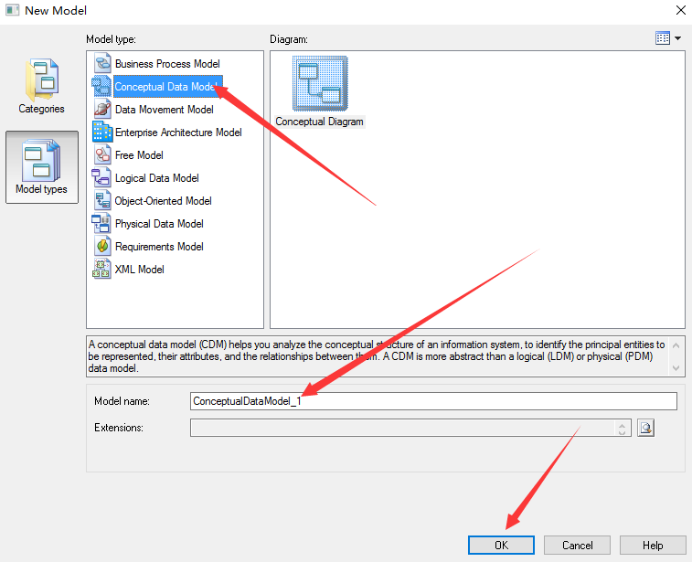

点击上面的ok，即可出现下图左边的概念模型 1 ，可以自定义概念模型的名字，在概念模型中使用最多的就是如图所示的Entity(实体),Relationship(关系)


#### Entity实体

选中右边框中Entity这个功能，即可出现下面这个方框，需要注意的是书写name的时候，code自行补全，name可以是英文的也可以是中文的，但是code必须是英文的。


#### 填充实体字段

General中的name和code填好后，就可以点击Attributes（属性）来设置name（名字），code(在数据库中的字段名)，Data Type(数据类型) ，length(数据类型的长度)

- Name: 实体名字一般为中文，如论坛用户
- Code: 实体代号，一般用英文，如XXXUser
- Comment:注释，对此实体详细说明
- Code属性：代号，一般用英文UID DataType
- Domain域，表示属性取值范围如可以创建 10 个字符的地址域
- M:Mandatory强制属性，表示该属性必填。不能为空
- P:Primary Identifer是否是主标识符，表示实体唯一标识符
- D:Displayed显示出来，默认全部勾选

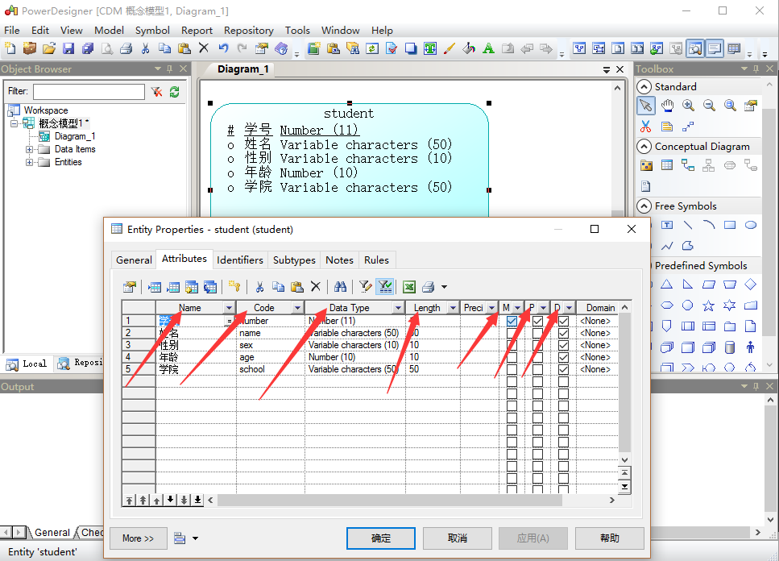

在此上图说明name和code的起名方法


#### 设置主标识符

如果不希望系统自动生成标识符而是手动设置的话，那么切换到Identifiers选项卡，添加一行Identifier，然后单击左上角的“属性”按钮，然后弹出的标识属性设置对话框中单击“添加行”按钮，选择该标识中使用的属性。例如将学号设置为学生实体的标识。

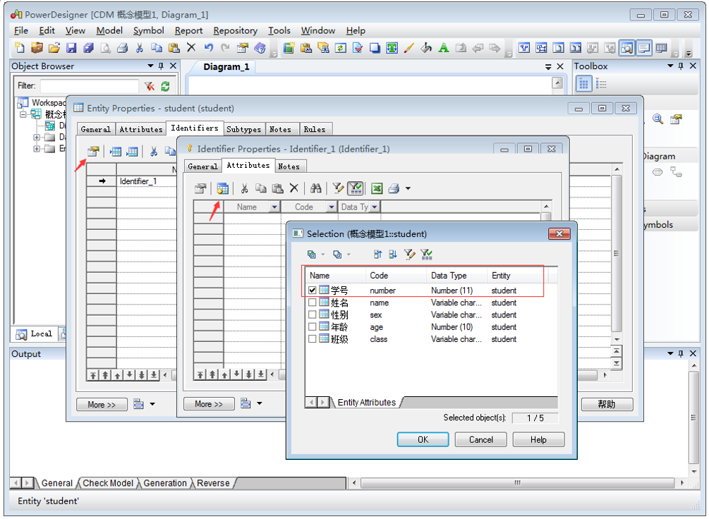


#### 放大模型

创建好概念数据模型如图所示，但是创建好的字体很小，读者可以按着ctrl键同时滑动鼠标的可滑动按钮即可放大缩写字体，同时也可以看到主标识符有一个*号的标志，同时也显示出来了，name,Data type和length这些可见的属性

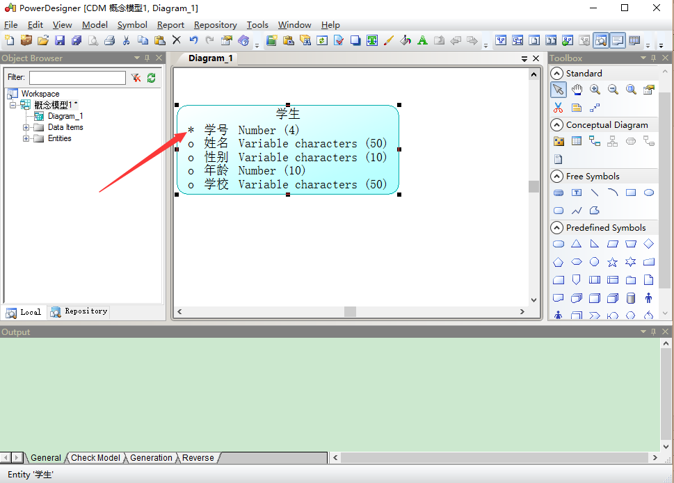


#### 实体关系

同理创建一个班级的实体（需要特别注意的是，点击完右边功能的按钮后需要点击鼠标指针状态的按钮或者右击鼠标即可，不然很容易乱操作，这点注意一下就可以了），然后使用Relationship（关系）这个按钮可以连接学生和班级之间的关系，发生一对多（班级对学生）或者多对一（学生对班级）的关系。
如图所示

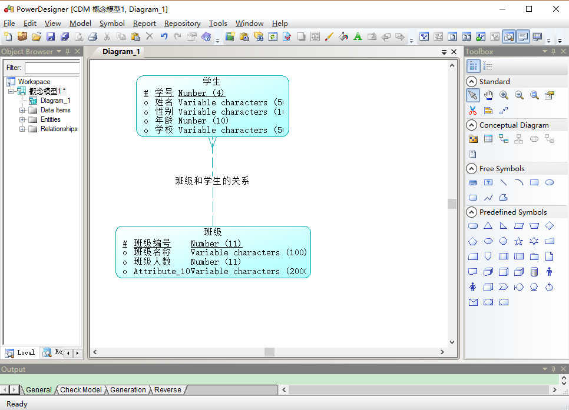

需要注意的是点击Relationship这个按钮，就把班级和学生联系起来了，就是一条线，然后双击这条线进行编辑，在General这块起name和code


上面的name和code起好后就可以在Cardinalities这块查看班级和学生的关系，可以看到班级的一端是一条线，学生的一端是三条，代表班级对学生是一对多的关系即one对many的关系，点击应用，然后确定即可


一对多和多对一练习完还有多对多的练习，如下图操作所示，老师实体和上面介绍的一样，自己将name，data type等等修改成自己需要的即可，满足项目开发需求即可。（comment是解释说明，自己可以写相关的介绍和说明）

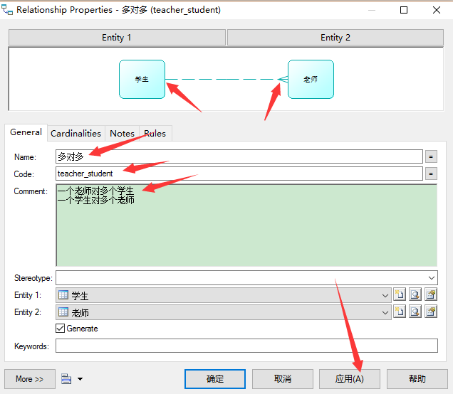

多对多需要注意的是自己可以手动点击按钮将关系调整称为多对多的关系many对many的关系，然后点击应用和确定即可


综上即可完成最简单的学生，班级，教师这种概念数据模型的设计，需要考虑数据的类型和主标识码，是否为空。关系是一对一还是一对多还是多对多的关系，自己需要先规划好再设计，然后就ok了。


### 11. 3 物理数据模型

上面是概念数据模型，下面介绍一下物理数据模型，以后经常使用的就是物理数据模型。打开PowerDesigner，然后点击File-->New Model然后选择如下图所示的物理数据模型，物理数据模型的名字自己起，然后选择自己所使用的数据库即可。

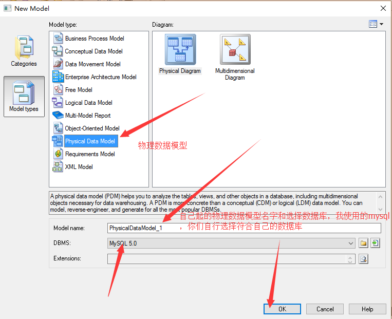

创建好主页面如图所示，但是右边的按钮和概念模型略有差别，物理模型最常用的三个是`table(表)，view(视图)， reference(关系)`；


鼠标先点击右边table这个按钮然后在新建的物理模型点一下，即可新建一个表，然后双击新建如下图所示，在General的name和code填上自己需要的，点击应用即可），如下图：


然后点击Columns,如下图设置，非常简单，需要注意的就是P（primary主键） , F （foreign key外键） ,M（mandatory强制性的，代表不可为空） 这三个。


在此设置学号的自增（MYSQL里面的自增是这个AUTO_INCREMENT），班级编号同理，不多赘述！


在下面的这个点上对号即可，就设置好了自增

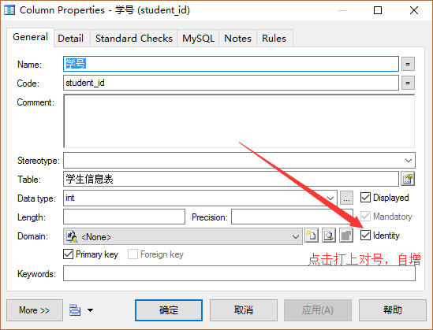

全部完成后如下图所示。

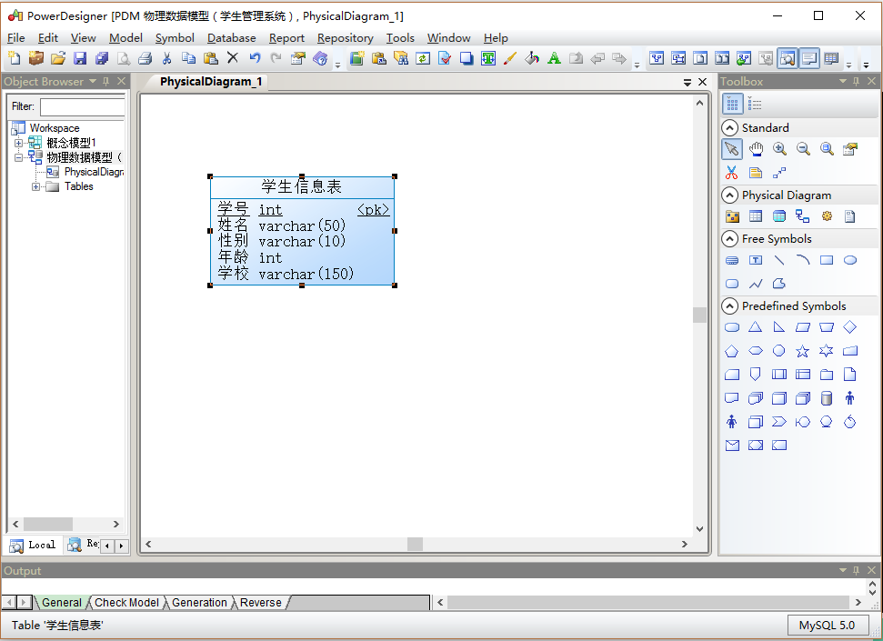

班级物理模型同理如下图所示创建即可


完成后如下图所示


上面的设置好如上图所示，然后下面是关键的地方，点击右边按钮Reference这个按钮，因为是班级对学生是一对多的，所以鼠标从学生拉到班级如下图所示，学生表将发生变化，学生表里面增加了一行，这行是班级表的主键作为学生表的外键，将班级表和学生表联系起来。（仔细观察即可看到区别。）

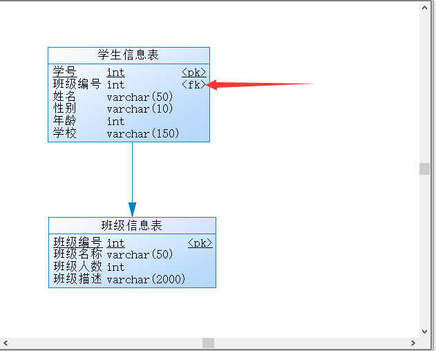

做完上面的操作，就可以双击中间的一条线，显示如下图，修改name和code即可


但是需要注意的是，修改完毕后显示的结果却如下图所示，并没有办法直接像概念模型那样，修改过后显示在中间的那条线上面，自己明白即可。


学习了多对一或者一对多的关系，接下来学习多对对的关系，同理自己建好老师表，这里不在叙述，记得老师编号自增，建好如下图所示


下面是多对多关系的关键，由于物理模型多对多的关系需要一个中间表来连接，如下图，只设置一个字段，主键，自增


点击应用，然后设置Columns，只添加一个字段


这是设置字段递增，前面已经叙述过好几次


设置好后如下图所示，需要注意的是有箭头的一方是一，无箭头的一方是多，即一对多的多对一的关系需要搞清楚，学生也可以有很多老师，老师也可以有很多学生，所以学生和老师都可以是主体；

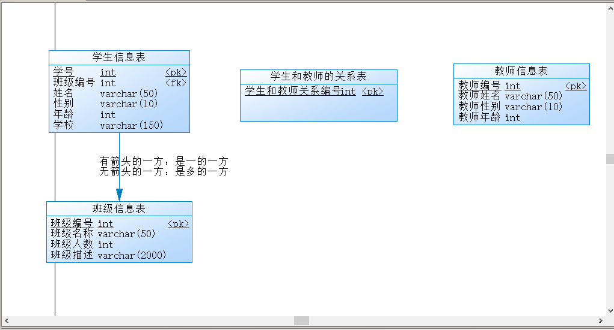

可以看到添加关系以后学生和教师的关系表前后发生的变化


### 11. 4 概念模型转为物理模型

1 ：如下图所示先打开概念模型图，然后点击Tool,如下图所示


点开的页面如下所示，name和code已经从概念模型 1 改成物理模型 1 了

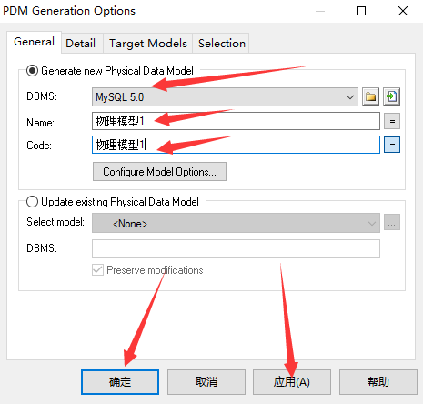

完成后如下图所示，将自行打开修改的物理模型，需要注意的是这些表的数据类型已经自行改变了，而且中间表出现两个主键，即双主键，

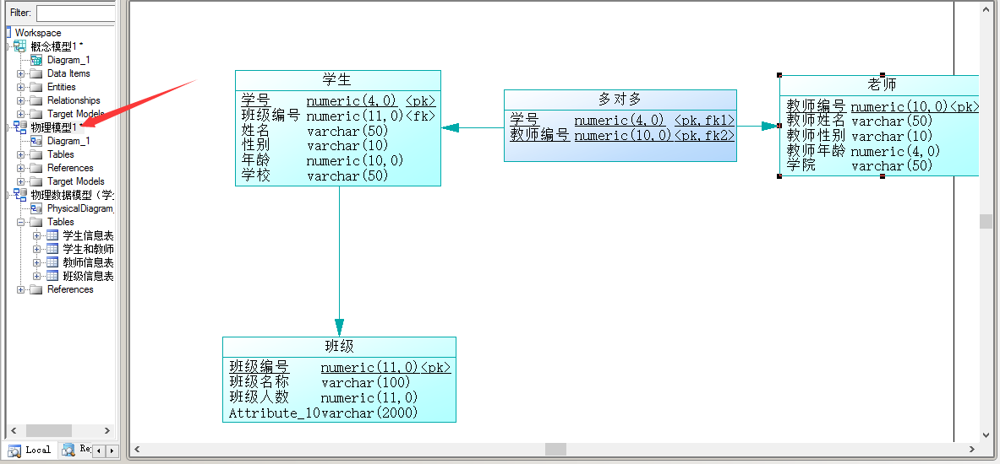

### 11. 5 物理模型转为概念模型

上面介绍了概念模型转物理模型，下面介绍一下物理模型转概念模型（如下图点击操作即可）

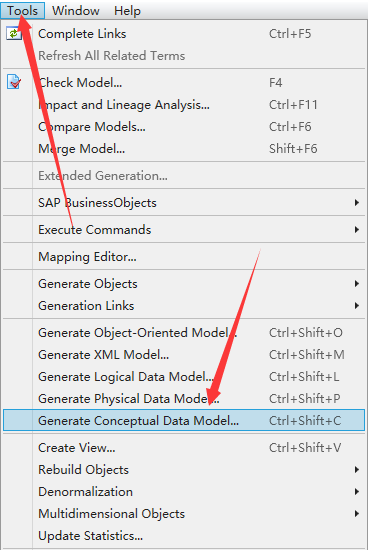

然后出现如下图所示界面，然后将物理修改为概念 ，点击应用确认即可


点击确认后将自行打开如下图所示的页面，自己观察有何变化，如果转换为oracle的，数据类型会发生变化，比如Varchar2等等）；


### 11. 6 物理模型导出SQL语句

下面介绍一下物理模型导出SQL语句（点击Database按钮的Generate Database或者按ctrl+G）

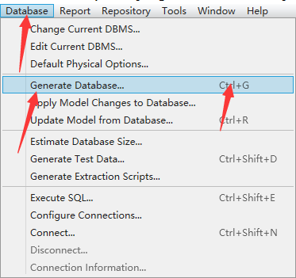

打开之后如图所示，修改好存在sql语句的位置和生成文件的名称即可

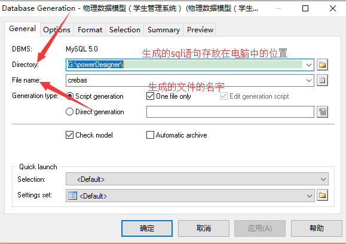

在Selection中选择需要导出的表，然后点击应用和确认即可


完成以后出现如下图所示，可以点击Edit或者close按钮

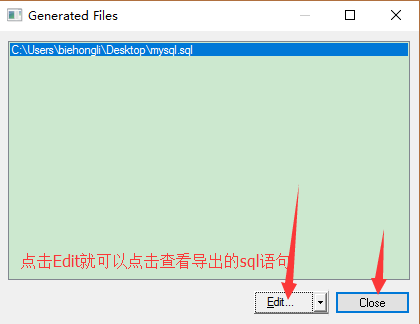


自此，就完成了导出sql语句，就可以到自己指定的位置查看导出的sql语句了；PowerDesigner在以后在项目开发过程中用来做需求分析和数据库的设计非常的方便和快捷。