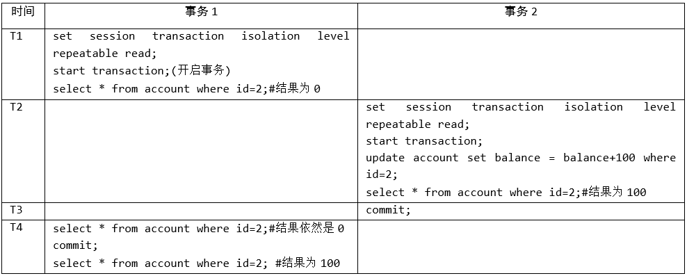
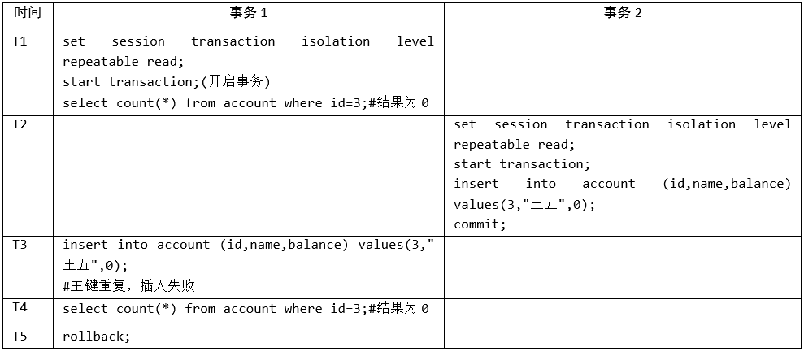

# 第 13 章_事务基础知识


## 1. 数据库事务概述

### 1. 1 存储引擎支持情况

`SHOW ENGINES` 命令来查看当前 MySQL 支持的存储引擎都有哪些，以及这些存储引擎是否支持事务。


能看出在 MySQL 中，只有InnoDB 是支持事务的。

### 1. 2 基本概念

**事务**： 一组逻辑操作单元，使数据从一种状态变换到另一种状态。

**事务处理的原则**： 保证所有事务都作为`一个工作单元`来执行，即使出现了故障，都不能改变这种执行方式。当在一个事务中执行多个操作时，要么所有的事务都被提交(`commit`)，那么这些修改就`永久`地保存下来；要么数据库管理系统将`放弃`所作的所有`修改`，整个事务回滚(`rollback`)到最初状态。

### 1. 3 事务的ACID特性

- **原子性（atomicity）**：

  原子性是指事务是一个不可分割的工作单位，要么全部提交，要么全部失败回滚。

- **一致性（consistency）**：

  （国内很多网站上对一致性的阐述有误，具体你可以参考 Wikipedia 对 **Consistency** 的阐述）

  根据定义，一致性是指事务执行前后，数据从一个`合法性状态`变换到另外一个`合法性状态`。这种状态是`语义上`的而不是语法上的，跟具体的业务有关。

  那什么是合法的数据状态呢？满足`预定的约束`的状态就叫做合法的状态。通俗一点，这状态是由你自己来定义的（比如满足现实世界中的约束）。满足这个状态，数据就是一致的，不满足这个状态，数据就是不一致的！如果事务中的某个操作失败了，系统就会自动撤销当前正在执行的事务，返回到事务操作之前的状态。

- **隔离型（isolation）**：

  事务的隔离性是指一个事务的执行`不能被其他事务干扰`，即一个事务内部的操作及使用的数据对并发的其他事务是隔离的，并发执行的各个事务之间不能互相干扰。

  如果无法保证隔离性会怎么样？假设A账户有 200 元，B账户 0 元。A账户往B账户转账两次，每次金额为 50元，分别在两个事务中执行。如果无法保证隔离性，会出现下面的情形：

  ```mysql
  UPDATE accounts SET money = money - 50 WHERE NAME = 'AA';
  
  UPDATE accounts SET money = money + 50 WHERE NAME = 'BB';
  ```

  

- **持久性（durability）**：

  持久性是指一个事务一旦被提交，它对数据库中数据的改变就是`永久性的`，接下来的其他操作和数据库故障不应该对其有任何影响。

  持久性是通过`事务日志`来保证的。日志包括了`重做日志`和`回滚日志`。当我们通过事务对数据进行修改的时候，首先会将数据库的变化信息记录到重做日志中，然后再对数据库中对应的行进行修改。这样做的好处是，即使数据库系统崩溃，数据库重启后也能找到没有更新到数据库系统中的重做日志，重新执行，从而使事务具有持久性。

### 1. 4 事务的状态

我们现在知道`事务`是一个抽象的概念，它其实对应着一个或多个数据库操作，MySQL根据这些操作所执行的不同阶段把`事务`大致划分成几个状态：

- **活动的（active）**
  事务对应的数据库操作正在执行过程中时，我们就说该事务处在`活动的`状态。

- **部分提交的（partially committed）**
  当事务中的最后一个操作执行完成，但由于操作都在内存中执行，所造成的影响并`没有刷新到磁盘`时，我们就说该事务处在`部分提交`的状态。

- **失败的（failed）**
  当事务处在`活动的`或者`部分提交的`状态时，可能遇到了某些错误（数据库自身的错误、操作系统错误或者直接断电等）而无法继续执行，或者人为的停止当前事务的执行，我们就说该事务处在`失败的`状态。

- **中止的（aborted）**
  如果事务执行了一部分而变为`失败的`状态，那么就需要把已经修改的事务中的操作还原到事务执行前的状态。换句话说，就是要撤销失败事务对当前数据库造成的影响。我们把这个撤销的过程称之为`回滚`。当`回滚`操作执行完毕时，也就是数据库恢复到了执行事务之前的状态，我们就说该事务处在了`中止的`状态。
  举例：

  ```mysql
  UPDATE accounts SET money = money - 50 WHERE NAME = 'AA';
  
  UPDATE accounts SET money = money + 50 WHERE NAME = 'BB';
  ```

- 提交的（committed）
  当一个处在`部分提交的`状态的事务将修改过的数据都`同步到磁盘`上之后，我们就可以说该事务处在了提交的状态。

一个基本的状态转换图如下所示：


## 2. 如何使用事务

使用事务有两种方式，分别为`显式事务`和`隐式事务`。

### 2. 1 显式事务

步骤 1 ： `START` `TRANSACTION` 或者 `BEGIN`，作用是显式开启一个事务

```mysql
mysql> BEGIN;
#或者
mysql> START TRANSACTION;
```

`START` `TRANSACTION`语句相较于`BEGIN`特别之处在于，后边能跟随几个`修饰符`：

① `READ ONLY`：标识当前事务是一个只读事务，也就是属于该事务的数据库操作只能读取数据，而不能修改数据。

② `READ WRITE`：标识当前事务是一个读写事务，也就是属于该事务的数据库操作既可以读取数据，也可以修改数据。

③ `WITH CONSISTENT SNAPSHOT`：启动一致性读。

**步骤 2** ： 一系列事务中的操作（主要是DML，不含DDL）

**步骤 3** ： 提交事务 或 中止事务（即回滚事务）

```mysql
# 提交事务。当提交事务后，对数据库的修改是永久性的。
mysql> COMMIT;
```

```mysql
# 回滚事务。即撤销正在进行的所有没有提交的修改
mysql> ROLLBACK;

# 将事务回滚到某个保存点。
mysql> ROLLBACK TO [SAVEPOINT]
```

### 2. 2 隐式事务

MySQL中有一个系统变量`autocommit`：

```mysql
mysql> SHOW VARIABLES LIKE 'autocommit';
+---------------+-------+
| Variable_name | Value |
+---------------+-------+
| autocommit | ON |
+---------------+-------+
1 row in set (0.01 sec)
```

当然，如果我们想关闭这种`自动提交`的功能，可以使用下边两种方法之一：

- 显式的的使用`START TRANSACTION`或者`BEGIN`语句开启一个事务。这样在本次事务提交或者回滚前会暂时关闭掉自动提交的功能。

- 把系统变量`autocommit`的值设置为`OFF`，就像这样：

  ```mysql
  SET autocommit = OFF;
  #或
  SET autocommit = 0 ;
  ```

### 2. 3 隐式提交数据的情况

- 数据定义语言（Data definition language，缩写为：DDL）

- 隐式使用或修改mysql数据库中的表

- 事务控制或关于锁定的语句
  ① 当我们在一个事务还没提交或者回滚时就又使用`START TRANSACTION`或者`BEGIN`语句开启了另一个事务时，会隐式的提交上一个事务。即：
  ② 当前的`autocommit`系统变量的值为`OFF`，我们手动把它调为`ON`时，也会`隐式的提交`前边语句所属的事务。

  ③ 使用`LOCK TABLES`、`UNLOCK TABLES`等关于锁定的语句也会`隐式的提交`前边语句所属的事务。

- 加载数据的语句

- 关于MySQL复制的一些语句
- 其它的一些语句

### 2. 4 使用举例 1 ：提交与回滚

我们看下在 MySQL 的默认状态下，下面这个事务最后的处理结果是什么。

**情况 1 ：**

```mysql
CREATE TABLE user(name varchar( 20 ), PRIMARY KEY (name)) ENGINE=InnoDB;

BEGIN;
INSERT INTO user SELECT '张三';
COMMIT;

BEGIN;
INSERT INTO user SELECT '李四';
INSERT INTO user SELECT '李四';
ROLLBACK;

SELECT * FROM user;

```

运行结果（ 1 行数据）：

```mysql
mysql> commit;
Query OK, 0 rows affected (0.00 秒)

mysql> BEGIN;
Query OK, 0 rows affected (0.00 秒)

mysql> INSERT INTO user SELECT '李四';
Query OK, 1 rows affected (0.00 秒)

mysql> INSERT INTO user SELECT '李四';
Duplicate entry '李四' for key 'user.PRIMARY'
mysql> ROLLBACK;
Query OK, 0 rows affected (0.01 秒)

mysql> select * from user;
+--------+
| name |
+--------+
| 张三 |
+--------+
1 行于数据集 (0.01 秒)
```
**情况 2** ：

```mysql
CREATE TABLE user (name varchar( 20 ), PRIMARY KEY (name)) ENGINE=InnoDB;

BEGIN;
INSERT INTO user SELECT '张三';
COMMIT;

INSERT INTO user SELECT '李四';
INSERT INTO user SELECT '李四';
ROLLBACK;
```

运行结果（ 2 行数据）：

```mysql
mysql> SELECT * FROM user;
+--------+
| name |
+--------+
| 张三 |
| 李四 |
+--------+
2 行于数据集 (0.01 秒)
```

**情况 3 ：**

```mysql
CREATE TABLE user(name varchar( 255 ), PRIMARY KEY (name)) ENGINE=InnoDB;

SET @@completion_type = 1 ;
BEGIN;
INSERT INTO user SELECT '张三';
COMMIT;

INSERT INTO user SELECT '李四';
INSERT INTO user SELECT '李四';
ROLLBACK;

SELECT * FROM user;
```

运行结果（ 1 行数据）：

```mysql
mysql> SELECT * FROM user;
+--------+
| name |
+--------+
| 张三 |
+--------+
1 行于数据集 (0.01 秒)
```

> 当我们设置 autocommit= 0 时，不论是否采用 START TRANSACTION 或者 BEGIN 的方式来开启事务，都需要用 COMMIT 进行提交，让事务生效，使用 ROLLBACK 对事务进行回滚。
>
> 当我们设置 autocommit= 1 时，每条 SQL 语句都会自动进行提交。 不过这时，如果你采用 STARTTRANSACTION 或者 BEGIN 的方式来显式地开启事务，那么这个事务只有在 COMMIT 时才会生效，在 ROLLBACK 时才会回滚。


### 2.5 使用举例 2 ：测试不支持事务的engine

见视频讲解（ **https://www.bilibili.com/video/BV1iq4y1u7vj?from=search&seid=4297501441472622157&spm_id_from=333.337.0.0** ）

### 2.6 使用举例 3 ：SAVEPOINT

见视频讲解（ **https://www.bilibili.com/video/BV1iq4y1u7vj?from=search&seid=4297501441472622157&spm_id_from=333.337.0.0** ）

## 3. 事务隔离级别

MySQL是一个`客户端／服务器`架构的软件，对于同一个服务器来说，可以有若干个客户端与之连接，每个客户端与服务器连接上之后，就可以称为一个会话（`Session`）。每个客户端都可以在自己的会话中向服务器发出请求语句，一个请求语句可能是某个事务的一部分，也就是对于服务器来说可能同时处理多个事务。事务有`隔离性`的特性，理论上在某个事务`对某个数据进行访问`时，其他事务应该进行`排队`，当该事务提交之后，其他事务才可以继续访问这个数据。但是这样对`性能影响太大`，我们既想保持事务的隔离性，又想让服务器在处理访问同一数据的多个事务时`性能尽量高些`，那就看二者如何权衡取舍了。

### 3.1 数据准备

我们需要创建一个表：

```mysql
CREATE TABLE student (
    studentno INT,
    name VARCHAR( 20 ),
    class varchar( 20 ),
    PRIMARY KEY (studentno)
) Engine=InnoDB CHARSET=utf8;
```

然后向这个表里插入一条数据：

```mysql
INSERT INTO student VALUES( 1 , '小谷', '1班');
```

现在表里的数据就是这样的：

```mysql
mysql> select * from student;
+-----------+--------+-------+
| studentno | name | class |
+-----------+--------+-------+
| 1 | 小谷 | 1 班 |
+-----------+--------+-------+
1 row in set (0.00 sec)
```

### 3.2 数据并发问题

针对事务的隔离性和并发性，我们怎么做取舍呢？先看一下访问相同数据的事务在`不保证串行执行`（也就是执行完一个再执行另一个）的情况下可能会出现哪些问题：

**1. 脏写（** `Dirty Write` **）**

对于两个事务 Session A、Session B，如果事务Session A`修改了`另一个`未提交`事务Session B`修改过`的数据，那就意味着发生了`脏写`

**2. 脏读（** `Dirty Read` **）**

对于两个事务 Session A、Session B，Session A `读取`了已经被 Session B `更新`但还`没有被提交`的字段。之后若 Session B `回滚`，Session A`读取`的内容就是`临时且无效`的。

Session A和Session B各开启了一个事务，Session B中的事务先将studentno列为 1 的记录的name列更新为'张三'，然后Session A中的事务再去查询这条studentno为 1 的记录，如果读到列name的值为'张三'，而Session B中的事务稍后进行了回滚，那么Session A中的事务相当于读到了一个不存在的数据，这种现象就称之为`脏读`。

**3. 不可重复读（** `Non-Repeatable Read` **）**

对于两个事务Session A、Session B，Session A 读取了一个字段，然后 Session B`更新`了该字段。 之后Session A`再次读取`同一个字段，`值就不同`了。那就意味着发生了不可重复读。

我们在Session B中提交了几个`隐式事务`（注意是隐式事务，意味着语句结束事务就提交了），这些事务都修改了studentno列为 1 的记录的列name的值，每次事务提交之后，如果Session A中的事务都可以查看到最新的值，这种现象也被称之为`不可重复读`。

**4. 幻读（** `Phantom` **）**

对于两个事务Session A、Session B, Session A 从一个表中`读取`了一个字段, 然后 Session B 在该表中`插入`了一些新的行。 之后, 如果 Session A `再次读取`同一个表, 就会多出几行。那就意味着发生了幻读。

Session A中的事务先根据条件 studentno > 0这个条件查询表student，得到了name列值为'张三'的记录；之后Session B中提交了一个`隐式事务`，该事务向表student中插入了一条新记录；之后Session A中的事务再根据相同的条件 studentno > 0查询表student，得到的结果集中包含Session B中的事务新插入的那条记
录，这种现象也被称之为`幻读`。我们把新插入的那些记录称之为`幻影记录`。

### 3. 3 SQL中的四种隔离级别

上面介绍了几种并发事务执行过程中可能遇到的一些问题，这些问题有轻重缓急之分，我们给这些问题按照严重性来排一下序：

```
脏写 > 脏读 > 不可重复读 > 幻读
```

我们愿意舍弃一部分隔离性来换取一部分性能在这里就体现在：设立一些隔离级别，隔离级别越低，并发问题发生的就越多。`SQL标准`中设立了 4 个`隔离级别`：

- `READ UNCOMMITTED`：读未提交，在该隔离级别，所有事务都可以看到其他未提交事务的执行结果。不能避免脏读、不可重复读、幻读。

- `READ COMMITTED`：读已提交，它满足了隔离的简单定义：一个事务只能看见已经提交事务所做的改变。这是大多数数据库系统的默认隔离级别（但不是MySQL默认的）。可以避免脏读，但不可重复读、幻读问题仍然存在。
- `REPEATABLE READ`：可重复读，事务A在读到一条数据之后，此时事务B对该数据进行了修改并提交，那么事务A再读该数据，读到的还是原来的内容。可以避免脏读、不可重复读，但幻读问题仍然存在。这是MySQL的默认隔离级别。
- `SERIALIZABLE`：可串行化，确保事务可以从一个表中读取相同的行。在这个事务持续期间，禁止其他事务对该表执行插入、更新和删除操作。所有的并发问题都可以避免，但性能十分低下。能避免脏读、不可重复读和幻读。

`SQL标准`中规定，针对不同的隔离级别，并发事务可以发生不同严重程度的问题，具体情况如下：


`脏写`怎么没涉及到？因为脏写这个问题太严重了，不论是哪种隔离级别，都不允许脏写的情况发生。不同的隔离级别有不同的现象，并有不同的锁和并发机制，隔离级别越高，数据库的并发性能就越差， 4种事务隔离级别与并发性能的关系如下：


### 3. 4 MySQL支持的四种隔离级别

MySQL的默认隔离级别为REPEATABLE READ，我们可以手动修改一下事务的隔离级别。

```mysql
# 查看隔离级别，MySQL 5.7.20的版本之前：
mysql> SHOW VARIABLES LIKE 'tx_isolation';
+---------------+-----------------+
| Variable_name | Value |
+---------------+-----------------+
| tx_isolation | REPEATABLE-READ |
+---------------+-----------------+
1 row in set (0.00 sec)

# MySQL 5.7.20版本之后，引入transaction_isolation来替换tx_isolation

# 查看隔离级别，MySQL 5.7.20的版本及之后：
mysql> SHOW VARIABLES LIKE 'transaction_isolation';
+-----------------------+-----------------+
| Variable_name | Value |
+-----------------------+-----------------+
| transaction_isolation | REPEATABLE-READ |
+-----------------------+-----------------+
1 row in set (0.02 sec)

#或者不同MySQL版本中都可以使用的：
SELECT @@transaction_isolation;
```
### 3. 5 如何设置事务的隔离级别

**通过下面的语句修改事务的隔离级别**：

```mysql
SET [GLOBAL|SESSION] TRANSACTION ISOLATION LEVEL 隔离级别;
#其中，隔离级别格式：
> READ UNCOMMITTED
> READ COMMITTED
> REPEATABLE READ
> SERIALIZABLE
```

或者：

```mysql
SET [GLOBAL|SESSION] TRANSACTION_ISOLATION = '隔离级别'
#其中，隔离级别格式：
> READ-UNCOMMITTED
> READ-COMMITTED
> REPEATABLE-READ
> SERIALIZABLE
```

**关于设置时使用GLOBAL或SESSION的影响：**

- 使用`GLOBAL`关键字（在全局范围影响）：

  ```mysql
  SET GLOBAL TRANSACTION ISOLATION LEVEL SERIALIZABLE;
  #或
  SET GLOBAL TRANSACTION_ISOLATION = 'SERIALIZABLE';
  ```

  则：

  - 当前已经存在的会话无效
  - 只对执行完该语句之后产生的会话起作用

- 使用`SESSION`关键字（在会话范围影响）：

  ```mysql
  SET SESSION TRANSACTION ISOLATION LEVEL SERIALIZABLE;
  #或
  SET SESSION TRANSACTION_ISOLATION = 'SERIALIZABLE';
  ```

  则：

  - 对当前会话的所有后续的事务有效
  - 如果在事务之间执行，则对后续的事务有效
  - 该语句可以在已经开启的事务中间执行，但不会影响当前正在执行的事务

> 小结：
>
> 数据库规定了多种事务隔离级别，不同隔离级别对应不同的干扰程度，隔离级别越高，数据一致性就越好，但并发性越弱。


### 3. 6 不同隔离级别举例

**演示 1. 读未提交之脏读**

设置隔离级别为未提交读：


事务 1 和事务 2 的执行流程如下：


**演示 2 ：读已提交**


设置隔离级别为可重复读，事务的执行流程如下：



**演示 4 ：幻读**




## 4. 事务的常见分类

从事务理论的角度来看，可以把事务分为以下几种类型：

- 扁平事务（Flat Transactions）
- 带有保存点的扁平事务（Flat Transactions with Savepoints）
- 链事务（Chained Transactions）
- 嵌套事务（Nested Transactions）
- 分布式事务（Distributed Transactions）