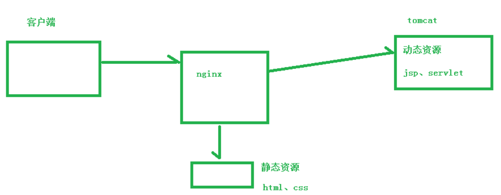
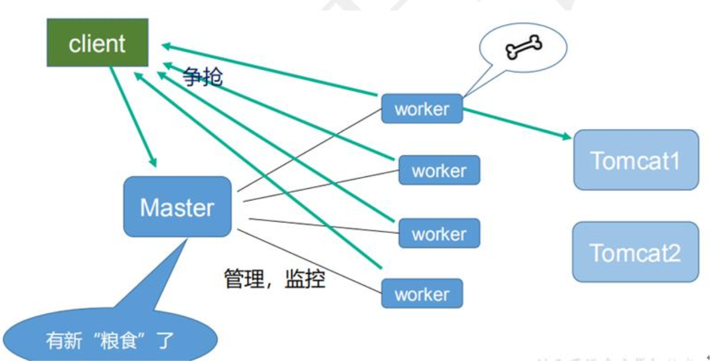

* [nginx简介](#nginx%E7%AE%80%E4%BB%8B)
  * [什么是nginx](#%E4%BB%80%E4%B9%88%E6%98%AFnginx)
  * [正向代理](#%E6%AD%A3%E5%90%91%E4%BB%A3%E7%90%86)
  * [反向代理](#%E5%8F%8D%E5%90%91%E4%BB%A3%E7%90%86)
  * [负载均衡](#%E8%B4%9F%E8%BD%BD%E5%9D%87%E8%A1%A1)
  * [动静分离](#%E5%8A%A8%E9%9D%99%E5%88%86%E7%A6%BB)
* [nginx的安装](#nginx%E7%9A%84%E5%AE%89%E8%A3%85)
* [nginx的常用命令](#nginx%E7%9A%84%E5%B8%B8%E7%94%A8%E5%91%BD%E4%BB%A4)
* [nginx的配置文件](#nginx%E7%9A%84%E9%85%8D%E7%BD%AE%E6%96%87%E4%BB%B6)
* [nginx配置实例\-反向代理](#nginx%E9%85%8D%E7%BD%AE%E5%AE%9E%E4%BE%8B-%E5%8F%8D%E5%90%91%E4%BB%A3%E7%90%86)
  * [nginx反向代理实例1](#nginx%E5%8F%8D%E5%90%91%E4%BB%A3%E7%90%86%E5%AE%9E%E4%BE%8B1)
  * [nginx反向代理实例2](#nginx%E5%8F%8D%E5%90%91%E4%BB%A3%E7%90%86%E5%AE%9E%E4%BE%8B2)
* [nginx配置实例\-负载均衡](#nginx%E9%85%8D%E7%BD%AE%E5%AE%9E%E4%BE%8B-%E8%B4%9F%E8%BD%BD%E5%9D%87%E8%A1%A1)
  * [nginx 分配服务器策略](#nginx-%E5%88%86%E9%85%8D%E6%9C%8D%E5%8A%A1%E5%99%A8%E7%AD%96%E7%95%A5)
* [nginx配置实例\-动静分离](#nginx%E9%85%8D%E7%BD%AE%E5%AE%9E%E4%BE%8B-%E5%8A%A8%E9%9D%99%E5%88%86%E7%A6%BB)
* [nginx 配置高可用的集群](#nginx-%E9%85%8D%E7%BD%AE%E9%AB%98%E5%8F%AF%E7%94%A8%E7%9A%84%E9%9B%86%E7%BE%A4)
  * [什么是nginx的高可用](#%E4%BB%80%E4%B9%88%E6%98%AFnginx%E7%9A%84%E9%AB%98%E5%8F%AF%E7%94%A8)
  * [配置高可用的准备工作](#%E9%85%8D%E7%BD%AE%E9%AB%98%E5%8F%AF%E7%94%A8%E7%9A%84%E5%87%86%E5%A4%87%E5%B7%A5%E4%BD%9C)
  * [安装keepalived](#%E5%AE%89%E8%A3%85keepalived)
  * [完成高可用配置（主从配置）](#%E5%AE%8C%E6%88%90%E9%AB%98%E5%8F%AF%E7%94%A8%E9%85%8D%E7%BD%AE%E4%B8%BB%E4%BB%8E%E9%85%8D%E7%BD%AE)
    * [修改/etc/keepalived/keepalive\.conf 配置文件](#%E4%BF%AE%E6%94%B9etckeepalivedkeepaliveconf-%E9%85%8D%E7%BD%AE%E6%96%87%E4%BB%B6)
    * [在/usr/local/src 添加检测脚本](#%E5%9C%A8usrlocalsrc-%E6%B7%BB%E5%8A%A0%E6%A3%80%E6%B5%8B%E8%84%9A%E6%9C%AC)
    * [把两台服务器上 nginx 和 keepalived 启动](#%E6%8A%8A%E4%B8%A4%E5%8F%B0%E6%9C%8D%E5%8A%A1%E5%99%A8%E4%B8%8A-nginx-%E5%92%8C-keepalived-%E5%90%AF%E5%8A%A8)
    * [测试](#%E6%B5%8B%E8%AF%95)
* [nginx原理](#nginx%E5%8E%9F%E7%90%86)
  * [master和worker](#master%E5%92%8Cworker)
  * [worker如何进行工作的](#worker%E5%A6%82%E4%BD%95%E8%BF%9B%E8%A1%8C%E5%B7%A5%E4%BD%9C%E7%9A%84)
  * [一个 master 和多个 woker 的好处](#%E4%B8%80%E4%B8%AA-master-%E5%92%8C%E5%A4%9A%E4%B8%AA-woker-%E7%9A%84%E5%A5%BD%E5%A4%84)
  * [设置多少个worker合适](#%E8%AE%BE%E7%BD%AE%E5%A4%9A%E5%B0%91%E4%B8%AAworker%E5%90%88%E9%80%82)
  * [连接数 worker\_connection](#%E8%BF%9E%E6%8E%A5%E6%95%B0-worker_connection)

# nginx简介

## 什么是nginx

Nginx 是高性能的 HTTP 和反向代理的服务器，处理高并发能力是十分强大的， 能经受高负
载的考验,有报告表明能支持高达 50,000 个并发连接数。 

## 正向代理

需要在客户端配置代理服务器进行指定网站访问


## 反向代理

暴露的是代理服务器地址,隐藏了真实服务器IP地址


## 负载均衡

增加服务器的数量,然后将请求分发到各个服务器上,将原先请求集中到单个服务器上的情况改为将请求分发到多个服务器上,将负载分发到不同的服务器,也就是我们所说的负载均衡


## 动静分离



# nginx的安装

```shell
# 1.安装pcre依赖
[root@localhost ~]# wget http://downloads.sourceforge.net/project/pcre/pcre/8.37/pcre-8.37.tar.gz
# 2.解压
[root@localhost src]# tar -xvf pcre-8.37.tar.gz
# 需要环境
[root@localhost pcre-8.37]# yum install gcc-c++
# 3../configure
[root@localhost pcre-8.37]# ./configure
# 4.make && make install
[root@localhost pcre-8.37]# make && make install
# 安装成功
[root@localhost pcre-8.37]# pcre-config --version
8.37
# 5.安装其他的依赖
[root@localhost src]# yum -y install make zlib zlib-devel gcc-c++ libtool openssl openssl-devel
# 6.解压nginx压缩包
[root@localhost src]# tar -xvf nginx-1.12.2.tar.gz 
[root@localhost nginx-1.12.2]# ./configure
# 7.安装
[root@localhost nginx-1.12.2]# make && make install
# 启动服务
[root@localhost sbin]# /usr/local/nginx/sbin/nginx

# 在 windows 系统中访问 linux 中 nginx，默认不能访问的，因为防火墙问题
#（1）关闭防火墙
#（2）开放访问的端口号， 80 端口
# 查看开放的端口号
[root@localhost sbin]# firewall-cmd --list-all
# 设置开放的端口号
[root@localhost sbin]# firewall-cmd --add-port=80/tcp --permanent
# 重启防火墙
[root@localhost sbin]# systemctl reload firewalld
# 再次查看开放的端口号
[root@localhost sbin]# firewall-cmd --list-all
```

# nginx的常用命令

```shell
# 1.启动命令
[root@localhost sbin]# ./nginx
# 2.关闭命令
[root@localhost sbin]# ./nginx -s stop
# 3.重新加载命令
[root@localhost sbin]# ./nginx -s reload
# 4.查看版本
[root@localhost sbin]# ./nginx -v
# 5.检查配置文件nginx.conf的正确性命令
[root@localhost sbin]# ./nginx -t
```

# nginx的配置文件

```shell
# -----------------以下是全局块-----------------
#user  nobody;
worker_processes  1;

#error_log  logs/error.log;
#error_log  logs/error.log  notice;
#error_log  logs/error.log  info;

#pid        logs/nginx.pid;

# -----------------以下是evnet块-----------------
events {
    worker_connections  1024;
}

# -----------------以下是http块-----------------
http {
# ---------以下是http全局块---------
    include       mime.types;
    default_type  application/octet-stream;

    #log_format  main  '$remote_addr - $remote_user [$time_local] "$request" '
    #                  '$status $body_bytes_sent "$http_referer" '
    #                  '"$http_user_agent" "$http_x_forwarded_for"';

    #access_log  logs/access.log  main;

    sendfile        on;
    #tcp_nopush     on;

    #keepalive_timeout  0;
    keepalive_timeout  65;

    #gzip  on;


# ---------以下是server全局块---------
    server {
    # ---------以下是server全局块---------
        listen       80;
        server_name  localhost;

        #charset koi8-r;

        #access_log  logs/host.access.log  main;
	# ---------以下是location块---------
        location / {
            root   html;
            index  index.html index.htm;
        }

        #error_page  404              /404.html;

        # redirect server error pages to the static page /50x.html
        #
        error_page   500 502 503 504  /50x.html;
        location = /50x.html {
            root   html;
        }

        # proxy the PHP scripts to Apache listening on 127.0.0.1:80
        #
        #location ~ \.php$ {
        #    proxy_pass   http://127.0.0.1;
        #}

        # pass the PHP scripts to FastCGI server listening on 127.0.0.1:9000
        #
        #location ~ \.php$ {
        #    root           html;
        #    fastcgi_pass   127.0.0.1:9000;
        #    fastcgi_index  index.php;
        #    fastcgi_param  SCRIPT_FILENAME  /scripts$fastcgi_script_name;
        #    include        fastcgi_params;
        #}

        # deny access to .htaccess files, if Apache's document root
        # concurs with nginx's one
        #
        #location ~ /\.ht {
        #    deny  all;
        #}
    }


    # another virtual host using mix of IP-, name-, and port-based configuration
    #
    #server {
    #    listen       8000;
    #    listen       somename:8080;
    #    server_name  somename  alias  another.alias;

    #    location / {
    #        root   html;
    #        index  index.html index.htm;
    #    }
    #}


    # HTTPS server
    #
    #server {
    #    listen       443 ssl;
    #    server_name  localhost;

    #    ssl_certificate      cert.pem;
    #    ssl_certificate_key  cert.key;

    #    ssl_session_cache    shared:SSL:1m;
    #    ssl_session_timeout  5m;

    #    ssl_ciphers  HIGH:!aNULL:!MD5;
    #    ssl_prefer_server_ciphers  on;

    #    location / {
    #        root   html;
    #        index  index.html index.htm;
    #    }
    #}
}
```

# nginx配置实例-反向代理

## nginx反向代理实例1

实现效果：使用 nginx 反向代理，访问http://192.168.44.139/直接跳转到 linux系统的tomcat主页

```shell
server {
    listen       80;
    server_name  192.168.44.139;

    location / {
        root   html;
        proxy_pass  http://127.0.0.1:8080;
        index  index.html index.htm;
	}
```

> 1、 = ：用于不含正则表达式的 uri 前，要求请求字符串与 uri 严格匹配，如果匹配
> 成功，就停止继续向下搜索并立即处理该请求。
> 2、 ~：用于表示 uri 包含正则表达式，并且区分大小写。
> 3、 ~：用于表示 uri 包含正则表达式，并且不区分大小写。
> 4、 ^~：用于不含正则表达式的 uri 前，要求 Nginx 服务器找到标识 uri 和请求字符串匹配度最高的 location 后，立即使用此 location 处理请求，而不再使用 location块中的正则 uri 和请求字符串做匹配。
> **注意：如果 uri 包含正则表达式，则必须要有 ~ 或者 ~ 标识。** 

## nginx反向代理实例2

实现效果: 使用 nginx 反向代理,根据访问的路径跳转到不同端口的服务中,nginx 监听端口为 9001,访问 http://192.168.44.139:9001/edu/a.html 直接跳转到 127.0.0.1:8080,访问 http://192.168.44.139/:9001/vod/a.html 直接跳转到 127.0.0.1:8081  

```shell
    server{
        listen    9001;
        server_name 192.168.44.139;

        location ~/edu/ {
                proxy_pass  http://127.0.0.1:8080;
        }

        location ~/vod/ {
                proxy_pass  http://127.0.0.1:8081;
        }
   }
```

# nginx配置实例-负载均衡

```shell
    upstream myserver {
        server  192.168.44.139:8080;
        server  192.168.44.139:8081;
    }
    server {
        listen       80;
        server_name  192.168.44.139;
        location ~ /edu/ {
                proxy_pass http://myserver;
        }
    }
```

## nginx 分配服务器策略 

第一种 轮询（默认）
每个请求按时间顺序逐一分配到不同的后端服务器，如果后端服务器 down 掉，能自动剔除。
第二种 weight
weight 代表权重默认为 1,权重越高被分配的客户端越多
第三种 ip_hash
每个请求按访问 ip 的 hash 结果分配，这样每个访客固定访问一个后端服务器
第四种 fair（第三方）
按后端服务器的响应时间来分配请求，响应时间短的优先分配。

# nginx配置实例-动静分离

```shell
server {
    listen       80;
    server_name  192.168.44.139;

location ~ /html/ {
    root /data/;
    index index.html;
}
location /img/ {
    root /data/;
    autoindex on;
}
```

# nginx 配置高可用的集群 

## 什么是nginx的高可用


（1）需要两台 nginx 服务器
（2）需要 keepalived
（3）需要虚拟 ip 

## 配置高可用的准备工作 

- 需要两台服务器 192.168.44.139和192.168.44.140
- 在两台服务器安装nginx
- 在两台服务器安装keepalived

## 安装keepalived

```shell
[root@localhost /]# yum install keepalived –y
```

安装之后，在 etc 里面生成目录 keepalived，有文件 keepalived.conf 

## 完成高可用配置（主从配置） 

### 修改/etc/keepalived/keepalive.conf 配置文件 

```shell
! Configuration File for keepalived
global_defs {
   notification_email {
     acassen@firewall.loc
     failover@firewall.loc
     sysadmin@firewall.loc
   }
   notification_email_from Alexandre.Cassen@firewall.loc
   smtp_server 192.168.44.139
   smtp_connect_timeout 30
   router_id LVS_DEVEL
}

vrrp_script chk_http_port {
    script "/usr/local/src/nginx_check.sh"
    interval 2 #（检测脚本执行的间隔）
    weight 2
}

vrrp_instance VI_1 {
    state MASTER
    interface ens33
    virtual_router_id 51
    priority 100
    advert_int 1
    authentication {
        auth_type PASS
        auth_pass 1111
    }
    virtual_ipaddress {
        192.168.44.50
    }
}
```

### 在/usr/local/src 添加检测脚本 

```shell
#!/bin/bash
A=`ps -C nginx -no-header |wc -l`
if [ $A -eq 0 ];then
    /usr/local/nginx/sbin/nginx
    sleep 2
    if [ `ps -C nginx --no-header |wc -l` -eq 0 ];then
        killall keepalived
    fi
fi
```

### 把两台服务器上 nginx 和 keepalived 启动 

```shell
[root@localhost sbin]# ./nginx
[root@zookeeper-clone1 sbin]# systemctl start keepalived.service
```

### 测试 

在浏览器地址栏输入 虚拟 ip 地址 192.168.17.50 ,出现nginx页面

停掉主服务器的nginx和keepalived

在浏览器地址栏输入 虚拟 ip 地址 192.168.17.50 ,出现nginx页面

```shell
# 可以在ens33看到虚拟ip192.168.44.50
[root@zookeeper-clone1 conf]# ip addr
1: lo: <LOOPBACK,UP,LOWER_UP> mtu 65536 qdisc noqueue state UNKNOWN group default qlen 1000
    link/loopback 00:00:00:00:00:00 brd 00:00:00:00:00:00
    inet 127.0.0.1/8 scope host lo
       valid_lft forever preferred_lft forever
    inet6 ::1/128 scope host 
       valid_lft forever preferred_lft forever
2: ens33: <BROADCAST,MULTICAST,UP,LOWER_UP> mtu 1500 qdisc pfifo_fast state UP group default qlen 1000
    link/ether 00:50:56:3a:ed:5d brd ff:ff:ff:ff:ff:ff
    inet 192.168.44.140/24 brd 192.168.44.255 scope global ens33
       valid_lft forever preferred_lft forever
    inet 192.168.44.50/32 scope global ens33
       valid_lft forever preferred_lft forever
    inet6 fe80::250:56ff:fe3a:ed5d/64 scope link 
       valid_lft forever preferred_lft forever
3: virbr0: <NO-CARRIER,BROADCAST,MULTICAST,UP> mtu 1500 qdisc noqueue state DOWN group default qlen 1000
    link/ether 52:54:00:a4:d3:9a brd ff:ff:ff:ff:ff:ff
    inet 192.168.122.1/24 brd 192.168.122.255 scope global virbr0
       valid_lft forever preferred_lft forever
4: virbr0-nic: <BROADCAST,MULTICAST> mtu 1500 qdisc pfifo_fast master virbr0 state DOWN group default qlen 1000
    link/ether 52:54:00:a4:d3:9a brd ff:ff:ff:ff:ff:ff
```

# nginx原理

## master和worker

```shell
[root@localhost sbin]# ps -ef|grep nginx
root     12007     1  0 12:53 ?        00:00:00 nginx: master process ./nginx
nobody   12008 12007  0 12:53 ?        00:00:00 nginx: worker process
```


## worker如何进行工作的



## 一个 master 和多个 woker 的好处 

- 可以使用 nginx –s reload 热部署，利用 nginx 进行热部署操作 
- 每个 woker 是独立的进程，如果有其中的一个 woker 出现问题，其他 woker 独立的，继续进行争抢，实现请求过程，不会造成服务中断 

## 设置多少个worker合适

Nginx 同 redis 类似都采用了 io 多路复用机制，每个 worker 都是一个独立的进程，但每个进程里只有一个主线程，通过异步非阻塞的方式来处理请求， 即使是千上万个请求也不在话下。每个 worker 的线程可以把一个 cpu 的性能发挥到极致。所以 worker 数和服务器的 cpu数相等是最为适宜的。设少了会浪费 cpu，设多了会造成 cpu 频繁切换上下文带来的损耗。 

## 连接数 worker_connection 

第一个：发送请求，占用了 woker 的几个连接数？
答案： 2 或者 4 个 

第二个： nginx 有一个 master，有四个 woker，每个 woker 支持最大的连接数 1024，支持的最大并发数是多少？ 

- 普通的静态访问最大并发数是： worker_connections * worker_processes /2
- 而如果是 HTTP 作 为反向代理来说，最大并发数量应该是 worker_connections *worker_processes/4