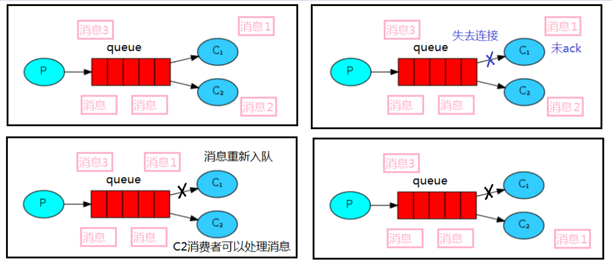
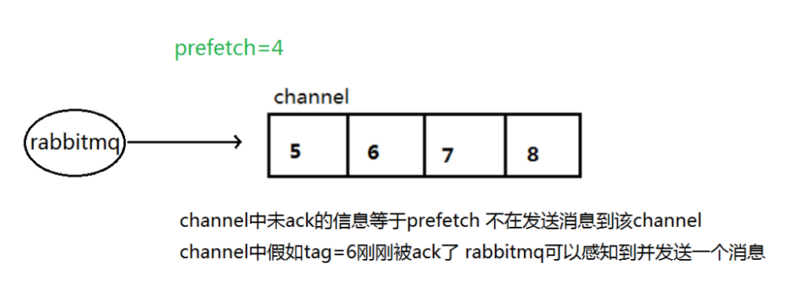

# Work Queues

## 轮训分发消息

工作队列(又称任务队列)的主要思想是避免立即执行资源密集型任务，而不得不等待它完成。相反我们安排任务在之后执行。我们把任务封装为消息并将其发送到队列。在后台运行的工作进程将弹出任务并最终执行作业。当有多个工作线程时，这些工作线程将一起处理这些任务。

一个消息发送线程，两个工作线程。

~~~java
public class Producer {

    public static final String QUEUE_NAME = "two-queue";

    public static void main(String[] args) throws Exception {
        try (Channel channel = RabbitMqUtils.getChannel()) {
            channel.queueDeclare(QUEUE_NAME,true,false,false,null);
            Scanner scanner = new Scanner(System.in);
            while (scanner.hasNext()){
                String message = scanner.next();
                channel.basicPublish("",QUEUE_NAME,null,message.getBytes(StandardCharsets.UTF_8));
            }
            System.out.println("消息发送完成！");
        }
    }
}
~~~

```java
public class Worker {
    public static final String QUEUE_NAME = "two-queue";
    public static void main(String[] args) throws Exception {
        try {
            Channel channel = RabbitMqUtils.getChannel();
            DeliverCallback deliverCallback = (consumerTag, message) -> {
                String ms = new String(message.getBody());
                System.out.println("接收到消息：" + ms + ", consumerTag = " + consumerTag);
            };
            CancelCallback cancelCallback = consumerTag -> {
                System.out.println(consumerTag + "消息消费被中断！");
            };
            channel.basicConsume(QUEUE_NAME, true, deliverCallback, cancelCallback);
        }finally {
        }
    }
}
```

结果：消息轮训被消费

## 消息应答

为了保证消息在发送过程中不丢失，rabbitmq 引入消息应答机制，消息应答就是:消费者在接收到消息并且处理该消息之后，告诉rabbitmq它已经处理了，rabbitmq 可以把该消息删除了。

### 自动应答

消息发送后立即被认为已经传送成功，这种模式需要在高吞吐量和数据传输安全性方面做权衡,因为这种模式如果消息在接收到之前，消费者那边出现连接或者 channel 关闭，那么消息就丢失了,当然另一方面这种模式消费者那边可以传递过载的消息，没有对传递的消息数量进行限制， 当然这样有可能使得消费者这边由于接收太多还来不及处理的消息，导致这些消息的积压，最终使得内存耗尽，最终这些消费者线程被操作系统杀死，所以这种模式仅适用在消费者可以高效并以某种速率能够处理这些消息的情况下使用。

### 消息应答方法

~~~java
A.Channel.basicAck(用于肯定确认)  
 	 	RabbitMQ 已知道该消息并且成功的处理消息，可以将其丢弃了 
    	channel.basicAck(deliverTag,multiple); //multiple：是否批量应答
B.Channel.basicNack(用于否定确认) 
C.Channel.basicReject(用于否定确认) 
		与 Channel.basicNack 相比少一个参数 
 	 	不处理该消息了直接拒绝，可以将其丢弃了
~~~

### 消息自动重新入队

如果消费者由于某些原因失去连接(其通道已关闭，连接已关闭或 TCP 连接丢失)，导致消息未发送 ACK 确认，RabbitMQ 将了解到消息未完全处理，并将对其重新排队。如果此时其他消费者可以处理，它将很快将其重新分发给另一个消费者。这样，即使某个消费者偶尔死亡，也可以确保不会丢失任何消息



### 消息手动应答

#### 生产者

```java
public class Producer {

    public static final String QUEUE_NAME = "three-queue";

    public static void main(String[] args) throws Exception {
        try (Channel channel = RabbitMqUtils.getChannel()) {
            boolean durable = true;
            channel.queueDeclare(QUEUE_NAME,true,false,false,null);
            Scanner scanner = new Scanner(System.in);
            while (scanner.hasNext()){
                String message = scanner.next();
                channel.basicPublish("",QUEUE_NAME, MessageProperties.PERSISTENT_TEXT_PLAIN,message.getBytes(StandardCharsets.UTF_8));
                System.out.println("消息发送: " +message);
            }
        }
    }
}
```

#### 消费者1

```java
public class Consumer01 {

    public static final String QUEUE_NAME = "three-queue";

    public static void main(String[] args) throws Exception {
        Channel channel = RabbitMqUtils.getChannel();
        System.out.println("消费者1处理时间1秒");
        DeliverCallback deliverCallback = (consumerTag, message) -> {
            try {
                Thread.sleep(1000);
            } catch (InterruptedException e) {
                e.printStackTrace();
            }
            String msg = new String(message.getBody());
            System.out.println("收到消息："+msg);
            channel.basicAck(message.getEnvelope().getDeliveryTag(),false);
        };
        CancelCallback cancelCallback = consumerTag -> {
            System.out.println("消费者取消消息消费接口回调！" + consumerTag);
        };
        channel.basicConsume(QUEUE_NAME, false, deliverCallback, cancelCallback);
    }
}
```

#### 消费者2

```java
public class Consumer02 {

    public static final String QUEUE_NAME = "three-queue";

    public static void main(String[] args) throws Exception {
        Channel channel = RabbitMqUtils.getChannel();
        System.out.println("消费者2处理时间30秒");
        DeliverCallback deliverCallback = (consumerTag, message) -> {
            try {
                Thread.sleep(30000);
            } catch (InterruptedException e) {
                e.printStackTrace();
            }
            String msg = new String(message.getBody());
            System.out.println("收到消息："+msg);
            channel.basicAck(message.getEnvelope().getDeliveryTag(),false);
        };
        CancelCallback cancelCallback = consumerTag -> {
            System.out.println("消费者取消消息消费接口回调！" + consumerTag);
        };
        channel.basicConsume(QUEUE_NAME, false, deliverCallback, cancelCallback);
    }
}
```

生产者发送消息aa、bb、cc、dd，消费者1和消费者2在接收，发出消息后立即停掉消费者2，消费者1全部消费掉消息。

### RabbitMQ持久化

刚刚我们已经看到了如何处理任务不丢失的情况，但是如何保障当 RabbitMQ 服务停掉以后消息生产者发送过来的消息不丢失。默认情况下 RabbitMQ 退出或由于某种原因崩溃时，它忽视队列和消息，除非告知它不要这样做。确保消息不会丢失需要做两件事：**我们需要将队列和消息都标记为持久化**。

~~~java
// 队列持久化
boolean durable = true;
channel.queueDeclare(QUEUE_NAME,true,false,false,null);
~~~

~~~java
//消息持久化
channel.basicPublish("",QUEUE_NAME, MessageProperties.PERSISTENT_TEXT_PLAIN,message.getBytes(StandardCharsets.UTF_8));
~~~

将消息标记为持久化并不能完全保证不会丢失消息。尽管它告诉 RabbitMQ 将消息保存到磁盘，但是这里依然存在当消息刚准备存储在磁盘的时候 但是还没有存储完，消息还在缓存的一个间隔点。此时并没有真正写入磁盘。持久性保证并不强，但是对于我们的简单任务队列而言，这已经绰绰有余了。如果需要更强有力的持久化策略，参考后边发布确认。

### 不公平分发

在前面学习到RabbitMQ分发消息采用的轮询分发，但是在某种场景下这种策略并不是很好，比方说有两个消费者在处理任务，其中有个消费者 1 处理任务的速度非常快，而另外一个消费者 2 处理速度却很慢，这个时候我们还是采用轮训分发的化就会到这处理速度快的这个消费者很大一部分时间处于空闲状态，而处理慢的那个消费者一直在干活，这种分配方式在这种情况下其实就不太好，但是RabbitMQ 并不知道这种情况它依然很公平的进行分发。

为了避免这种情况，我们可以在消费者设置参数 `channel.basicQos(1);`

~~~java
prefetchCount – 服务器将传递的最大消息数，如果没有限制则为 0
~~~

设置为1意思就是如果这个任务我还没有处理完或者我还没有应答你，你先别分配给我，我目前只能处理一个任务，然后 rabbitmq 就会把该任务分配给没有那么忙的那个空闲消费者，当然如果所有的消费者都没有完成手上任务，队列还在不停的添加新任务，队列有可能就会遇到队列被撑满的情况，这个时候就只能添加新的 worker 或者改变其他存储任务的策略。

### 预取值

本身消息的发送就是异步发送的，所以在任何时候，channel 上肯定不止只有一个消息另外来自消费者的手动确认本质上也是异步的。因此这里就存在一个未确认的消息缓冲区，因此希望开发人员能限制此缓冲区的大小，以避免缓冲区里面无限制的未确认消息问题。这个时候就可以通过使用 basic.qos 方法设置“预取计数”值来完成的。该值定义通道上允许的未确认消息的最大数量。一旦数量达到配置的数量，RabbitMQ 将停止在通道上传递更多消息，除非至少有一个未处理的消息被确认，例如，假设在通道上有未确认的消息 5、6、7，8，并且通道的预取计数设置为 4，此时RabbitMQ 将不会在该通道上再传递任何消息，除非至少有一个未应答的消息被 ack。比方说 tag=6 这个消息刚刚被确认 ACK，RabbitMQ 将会感知这个情况到并再发送一条消息。消息应答和 QoS 预取值对用户吞吐量有重大影响。通常，增加预取将提高向消费者传递消息的速度。虽然自动应答传输消息速率是最佳的，但是，在这种情况下已传递但尚未处理**的消息的数量也会增加，从而增加了消费者的** **RAM** **消耗**(随机存取存储器)应该小心使用具有无限预处理的自动确认模式或手动确认模式，消费者消费了大量的消息如果没有确认的话，会导致消费者连接节点的内存消耗变大，所以找到合适的预取值是一个反复试验的过程，不同的负载该值取值也不同 100 到 300 范围内的值通常可提供最佳的吞吐量，并且不会给消费者带来太大的风险。预取值为 1 是最保守的。当然这将使吞吐量变得很低，特别是消费者连接延迟很严重的情况下，特别是在消费者连接等待时间较长的环境中。对于大多数应用来说，稍微高一点的值将是最佳的。




