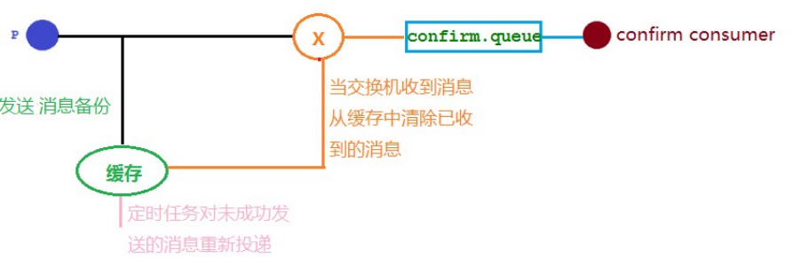

# 发布确认高级

在生产环境中由于一些不明原因，导致 rabbitmq 重启，在 RabbitMQ 重启期间生产者消息投递失败， 导致消息丢失，需要手动处理和恢复。于是，我们开始思考，如何才能进行 RabbitMQ 的消息可靠投递呢？ 特别是在这样比较极端的情况，RabbitMQ 集群不可用的时候，无法投递的消息该如何处理呢:

## 发布确认 springboot 版本

### 确认机制方案



### 代码架构图


### 配置文件

在配置文件当中需要添加

~~~properties
spring.rabbitmq.publisher-confirm-type=correlated
~~~

- NONE：禁用发布确认模式，是默认值
- CORRELATED：发布消息成功到交换器后会触发回调方法
- SIMPLE：经测试有两种效果，其一效果和 CORRELATED 值一样会触发回调方法，其二在发布消息成功后使用 rabbitTemplate 调用 waitForConfirms 或 waitForConfirmsOrDie 方法等待 broker 节点返回发送结果，根据返回结果来判定下一步的逻辑，要注意的点是waitForConfirmsOrDie 方法如果返回 false 则会关闭 channel，则接下来无法发送消息到 broker

### 配置类

```java
@Configuration
public class ConfirmConfig {

    public static final String CONFIRM_EXCHANGE_NAME="confirm.exchange";
    public static final String CONFIRM_QUEUE_NAME = "confirm_queue";
    public static final String CONFIRM_ROUTING_KEY="key1";

    @Bean
    public DirectExchange confirmExchange(){
        return new DirectExchange(CONFIRM_EXCHANGE_NAME);
    }

    @Bean
    public Queue confirmQueue(){
        return QueueBuilder.durable(CONFIRM_QUEUE_NAME).build();
    }

    @Bean
    public Binding confirmQueueBindingConfirmExchange(@Qualifier("confirmExchange") DirectExchange confirmExchange,
                                                      @Qualifier("confirmQueue") Queue confirmQueue){
        return BindingBuilder.bind(confirmQueue).to(confirmExchange).with(CONFIRM_ROUTING_KEY);
    }
}
```

### 回调接口

```java
@Component
@Slf4j
public class MyCallBack implements RabbitTemplate.ConfirmCallback {

    @Autowired
    RabbitTemplate rabbitTemplate;

    @PostConstruct
    public void init() {
        rabbitTemplate.setConfirmCallback(this);
    }

    @Override
    public void confirm(CorrelationData correlationData, boolean ack, String cause) {
        String id = correlationData != null ? correlationData.getId() : "";
        if (ack) {
            log.info("交换机收到id是：{} 的消息", id);
        } else {
            log.info("交换机没有收到id是：{} 的消息，原因是：", cause);
        }
    }
}
```

### 生产者

```java
@RestController
@Slf4j
@RequestMapping("confirm")
public class ConfirmController {

    public static final String CONFIRM_EXCHANGE_NAME = "confirm.exchange";
    public static final String CONFIRM_ROUTING_KEY = "key1";
    public static final String CONFIRM_ROUTING_KEY2 = "key2";

    @Autowired
    RabbitTemplate rabbitTemplate;

    @GetMapping("/sendMsg/{message}")
    public void sendMsg(@PathVariable("message") String message) {
        rabbitTemplate.convertAndSend(CONFIRM_EXCHANGE_NAME, CONFIRM_ROUTING_KEY, message + CONFIRM_ROUTING_KEY, new CorrelationData(CONFIRM_ROUTING_KEY));
        log.info("发送消息：{}", message);
        rabbitTemplate.convertAndSend(CONFIRM_EXCHANGE_NAME, CONFIRM_ROUTING_KEY2, message + CONFIRM_ROUTING_KEY2, new CorrelationData(CONFIRM_ROUTING_KEY2));
        log.info("发送消息：{}", message);
    }
}
```

### 消费者

```java
@Component
@Slf4j
public class ConfirmConsumer {

    public static final String CONFIRM_QUEUE_NAME = "confirm_queue";

    @RabbitListener(queues = CONFIRM_QUEUE_NAME)
    public void receiveMsg(Message message) {
        String msg = new String(message.getBody());
        log.info("接收到队列confirm_queue的消息:{}", msg);
    }
}
```

### 结果分析


可以看到，发送了两条消息，第一条消息的 RoutingKey 为 "key1"，第二条消息的 RoutingKey 为"key2"，两条消息都成功被交换机接收，也收到了交换机的确认回调，但消费者只收到了一条消息，因为第二条消息的 RoutingKey 与队列的 BindingKey 不一致，也没有其它队列能接收这个消息，所有第二条消息被直接丢弃了。

## 回退消息

### Mandatory参数

**在仅开启了生产者确认机制的情况下，交换机接收到消息后，会直接给消息生产者发送确认消息，如果发现该消息不可路由，那么消息会被直接丢弃，此时生产者是不知道消息被丢弃这个事件的**。那么如何让无法被路由的消息帮我想办法处理一下？最起码通知我一声，我好自己处理啊。通过设置 mandatory 参数可以在当消息传递过程中不可达目的地时将消息返回给生产者。

```properties
spring.rabbitmq.publisher-returns=true
```

### 回调接口

```java
@Component
@Slf4j
public class MyCallBack implements RabbitTemplate.ConfirmCallback,RabbitTemplate.ReturnCallback {

    @Autowired
    RabbitTemplate rabbitTemplate;

    @PostConstruct
    public void init() {
        rabbitTemplate.setConfirmCallback(this);
        rabbitTemplate.setReturnCallback(this);
    }

    @Override
    public void confirm(CorrelationData correlationData, boolean ack, String cause) {
        String id = correlationData != null ? correlationData.getId() : "";
        if (ack) {
            log.info("交换机收到id是：{} 的消息", id);
        } else {
            log.info("交换机没有收到id是：{} 的消息，原因是：", cause);
        }
    }

    /**
     * 消息不可路由时的消息回退方法
     * @param message
     * @param replyCode
     * @param replyText
     * @param exchange
     * @param routingKey
     */
    @Override
    public void returnedMessage(Message message, int replyCode, String replyText, String exchange, String routingKey) {
        log.info("消息：{},退回原因：{},交换机：{},路由键：{}",message,replyText,exchange,routingKey);
    }
}
```

### 生产者

```java
@RestController
@Slf4j
@RequestMapping("confirm")
public class ConfirmController {

    public static final String CONFIRM_EXCHANGE_NAME = "confirm.exchange";
    public static final String CONFIRM_ROUTING_KEY = "key1";
    public static final String CONFIRM_ROUTING_KEY2 = "key2";

    @Autowired
    RabbitTemplate rabbitTemplate;

    @GetMapping("/sendMsg/{message}")
    public void sendMsg(@PathVariable("message") String message) {
        rabbitTemplate.convertAndSend(CONFIRM_EXCHANGE_NAME, CONFIRM_ROUTING_KEY, message + CONFIRM_ROUTING_KEY, new CorrelationData(CONFIRM_ROUTING_KEY));
        log.info("发送消息：{}", message);
        rabbitTemplate.convertAndSend(CONFIRM_EXCHANGE_NAME, CONFIRM_ROUTING_KEY2, message + CONFIRM_ROUTING_KEY2, new CorrelationData(CONFIRM_ROUTING_KEY2));
        log.info("发送消息：{}", message);
    }
}
```

### 消费者

```java
@Component
@Slf4j
public class ConfirmConsumer {

    public static final String CONFIRM_QUEUE_NAME = "confirm_queue";

    @RabbitListener(queues = CONFIRM_QUEUE_NAME)
    public void receiveMsg(Message message) {
        String msg = new String(message.getBody());
        log.info("接收到队列confirm_queue的消息:{}", msg);
    }
}
```

### 结果分析


## 备份交换机

有了 **mandatory** 参数和回退消息，我们获得了对无法投递消息的感知能力，有机会在生产者的消息无法被投递时发现并处理。但有时候，我们并不知道该如何处理这些无法路由的消息，最多打个日志，然后触发报警，再来手动处理。而通过日志来处理这些无法路由的消息是很不优雅的做法，特别是当生产者所在的服务有多台机器的时候，手动复制日志会更加麻烦而且容易出错。而且设置 mandatory 参数会增加生产者的复杂性，需要添加处理这些被退回的消息的逻辑。如果既不想丢失消息，又不想增加生产者的复杂性，该怎么做呢？前面在设置死信队列的文章中，我们提到，可以为队列设置死信交换机来存储那些处理失败的消息，可是这些不可路由消息根本没有机会进入到队列，因此无法使用死信队列来保存消息。在 RabbitMQ 中，有一种备份交换机的机制存在，可以很好的应对这个问题。什么是备份交换机呢？备份交换机可以理解为 RabbitMQ 中交换机的“备胎”，当我们为某一个交换机声明一个对应的备份交换机时， 就是为它创建一个备胎，当交换机接收到一条不可路由消息时，将会把这条消息转发到备份交换机中，由备份交换机来进行转发和处理，通常备份交换机的类型为 `Fanout` ，这样就能把所有消息都投递到与其绑定的队列中，然后我们在备份交换机下绑定一个队列，这样所有那些原交换机无法被路由的消息，就会都进入这个队列了。当然，我们还可以建立一个报警队列，用独立的消费者来进行监测和报警。

### 代码架构图


### 修改配置类

```java
@Configuration
public class ConfirmConfig {

    public static final String CONFIRM_EXCHANGE_NAME = "confirm.exchange";
    public static final String CONFIRM_QUEUE_NAME = "confirm_queue";
    public static final String CONFIRM_ROUTING_KEY = "key1";
    /**
     * 备份交换机和队列
     */
    public static final String BACKUP_EXCHANGE_NAME = "backup.exchange";
    public static final String BACKUP_QUEUE_NAME = "backup.queue";
    public static final String WARNING_QUEUE_NAME = "warning_queue";

    @Bean
    public FanoutExchange backupExchange() {
        return new FanoutExchange(BACKUP_EXCHANGE_NAME);
    }

    @Bean
    public Queue backupQueue() {
        return QueueBuilder.durable(BACKUP_QUEUE_NAME).build();
    }

    @Bean
    public Queue warningQueue() {
        return QueueBuilder.durable(WARNING_QUEUE_NAME).build();
    }

    @Bean
    public Binding backupQueueBindingBackupExchange(@Qualifier("backupExchange") FanoutExchange backupExchange,
                                                    @Qualifier("backupQueue") Queue backupQueue) {
        return BindingBuilder.bind(backupQueue).to(backupExchange);
    }

    @Bean
    public Binding warningQueueBindingBackupExchange(@Qualifier("backupExchange") FanoutExchange backupExchange,
                                                     @Qualifier("warningQueue") Queue warningQueue) {
        return BindingBuilder.bind(warningQueue).to(backupExchange);
    }

    @Bean
    public DirectExchange confirmExchange() {
        return ExchangeBuilder.directExchange(CONFIRM_EXCHANGE_NAME).durable(true).alternate(BACKUP_EXCHANGE_NAME).build();
    }

    @Bean
    public Queue confirmQueue() {
        return QueueBuilder.durable(CONFIRM_QUEUE_NAME).build();
    }

    @Bean
    public Binding confirmQueueBindingConfirmExchange(@Qualifier("confirmExchange") DirectExchange confirmExchange,
                                                      @Qualifier("confirmQueue") Queue confirmQueue) {
        return BindingBuilder.bind(confirmQueue).to(confirmExchange).with(CONFIRM_ROUTING_KEY);
    }
}
```

### 报警消费者

```java
@Slf4j
@Component
public class WarningConsumer {

    public static final String WARNING_QUEUE_NAME = "warning_queue";

    @RabbitListener(queues = WARNING_QUEUE_NAME)
    public void receiveWarningMsg(Message message) {
        String msg = new String(message.getBody());
        log.warn("报警发现不可路由消息：{}",msg);
    }
}
```

### 结果分析


**mandatory** 参数与备份交换机可以一起使用的时候，如果两者同时开启，消息究竟何去何从？谁优先级高，经过上面结果显示答案是**备份交换机优先级高**。