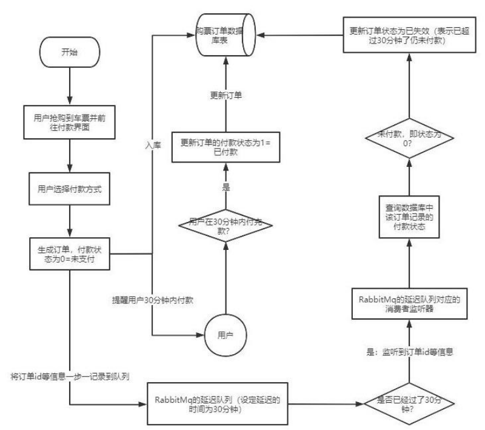
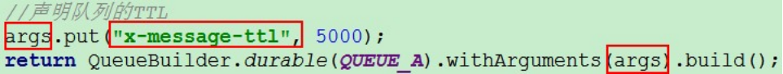
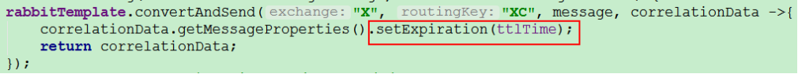
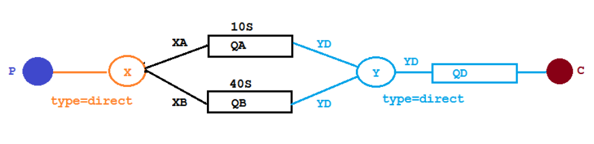
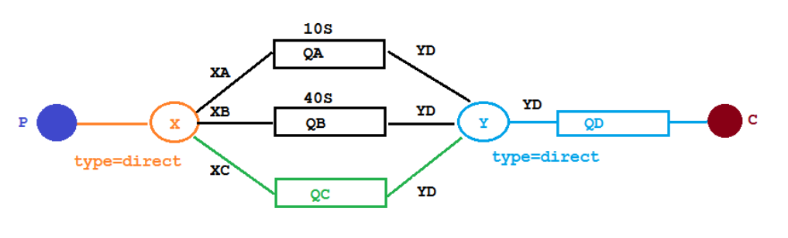
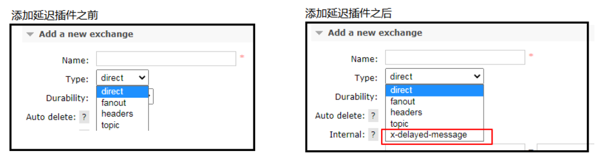
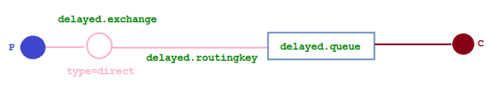

# 延迟队列

## 延迟队列概念

延时队列，队列内部是有序的，最重要的特性就体现在它的延时属性上，延时队列中的元素是希望在指定时间到了以后或之前取出和处理，简单来说，延时队列就是用来存放需要在指定时间被处理的元素的队列。

## 延迟队列使用场景

1、订单在十分钟之内未支付则自动取消
2、新创建的店铺，如果在十天内都没有上传过商品，则自动发送消息提醒。
3、用户注册成功后，如果三天内没有登陆则进行短信提醒。
4、用户发起退款，如果三天内没有得到处理则通知相关运营人员。
5、预定会议后，需要在预定的时间点前十分钟通知各个与会人员参加会议

这些场景都有一个特点，需要在某个事件发生之后或者之前的指定时间点完成某一项任务，如： 发生订单生成事件，在十分钟之后检查该订单支付状态，然后将未支付的订单进行关闭；看起来似乎使用定时任务，一直轮询数据，每秒查一次，取出需要被处理的数据，然后处理不就完事了吗？如果数据量比较少，确实可以这样做，比如：对于“如果账单一周内未支付则进行自动结算”这样的需求， 如果对于时间不是严格限制，而是宽松意义上的一周，那么每天晚上跑个定时任务检查一下所有未支付的账单，确实也是一个可行的方案。但对于数据量比较大，并且时效性较强的场景，如：“订单十分钟内未支付则关闭“，短期内未支付的订单数据可能会有很多，活动期间甚至会达到百万甚至千万级别，对这么庞大的数据量仍旧使用轮询的方式显然是不可取的，很可能在一秒内无法完成所有订单的检查，同时会给数据库带来很大压力，无法满足业务要求而且性能低下。



## RabbitMQ 中的 TTL

TTL 是什么呢？TTL 是 RabbitMQ 中一个消息或者队列的属性，表明一条消息或者该队列中的所有消息的最大存活时间，单位是毫秒。换句话说，如果一条消息设置了 TTL 属性或者进入了设置TTL 属性的队列，那么这条消息如果在TTL 设置的时间内没有被消费，则会成为"死信"。如果同时配置了队列的TTL 和消息的TTL，那么较小的那个值将会被使用，有两种方式设置 TTL。

### 队列设置TTL



### 消息设置TTL



### 两者的区别

​		如果设置了队列的 TTL 属性，那么一旦消息过期，就会被队列丢弃(如果配置了死信队列被丢到死信队列中)，而第二种方式，消息即使过期，也不一定会被马上丢弃，因为**消息是否过期是在即将投递到消费者之前判定的**，如果当前队列有严重的消息积压情况，则已过期的消息也许还能存活较长时间；另外，还需要注意的一点是，如果不设置 TTL，表示消息永远不会过期，如果将 TTL 设置为 0，则表示除非此时可以直接投递该消息到消费者，否则该消息将会被丢弃。
​		前一小节我们介绍了死信队列，刚刚又介绍了 TTL，至此利用 RabbitMQ 实现延时队列的两大要素已经集齐，接下来只需要将它们进行融合，再加入一点点调味料，延时队列就可以新鲜出炉了。想想看，延时队列，不就是想要消息延迟多久被处理吗，TTL 则刚好能让消息在延迟多久之后成为死信，另一方面， 成为死信的消息都会被投递到死信队列里，这样只需要消费者一直消费死信队列里的消息就完事了，因为里面的消息都是希望被立即处理的消息。

## 整合springboot

### 配置文件

```properties
spring.rabbitmq.host=k8s-node1
spring.rabbitmq.port=5672
spring.rabbitmq.username=admin
spring.rabbitmq.password=123
```

### 队列TTL

#### 代码架构图

创建两个队列 QA 和 QB，两者队列 TTL 分别设置为 10S 和 40S，然后在创建一个交换机 X 和死信交换机 Y，它们的类型都是direct，创建一个死信队列 QD，它们的绑定关系如下：



#### 配置文件类

```java
@Configuration
public class TtlQueueConfig {

    public static final String X_EXCHANGE="X";
    public static final String QUEUE_A = "QA";
    public static final String QUEUE_B = "QB";

    public static final String Y_DEAD_LETTER_EXCHANGE = "Y";
    public static final String DEAD_LETTER_QUEUE = "QD";

    @Bean
    public DirectExchange xExchange(){
        return new DirectExchange(X_EXCHANGE);
    }

    @Bean
    public DirectExchange yExchange(){
        return new DirectExchange(Y_DEAD_LETTER_EXCHANGE);
    }

    @Bean
    public Queue queueA(){
        Map<String, Object> arguments = new HashMap<>(4);
        arguments.put("x-dead-letter-exchange",Y_DEAD_LETTER_EXCHANGE);
        arguments.put("x-dead-letter-routing-key","YD");
        arguments.put("x-message-ttl",10000);
        return QueueBuilder.durable(QUEUE_A).withArguments(arguments).build();
    }

    @Bean
    public Queue queueB(){
        Map<String, Object> arguments = new HashMap<>(4);
        arguments.put("x-dead-letter-exchange",Y_DEAD_LETTER_EXCHANGE);
        arguments.put("x-dead-letter-routing-key","YD");
        arguments.put("x-message-ttl",40000);
        return QueueBuilder.durable(QUEUE_B).withArguments(arguments).build();
    }

    @Bean
    public Binding queueABindingX(@Qualifier("queueA") Queue queueA,
                                  @Qualifier("xExchange") DirectExchange xExchange){
        return BindingBuilder.bind(queueA).to(xExchange).with("XA");
    }

    @Bean
    public Binding queueBBindingX(@Qualifier("queueB") Queue queueB,
                                  @Qualifier("xExchange") DirectExchange xExchange){
        return BindingBuilder.bind(queueB).to(xExchange).with("XB");
    }

    @Bean
    public Queue queueD(){
        return QueueBuilder.durable(DEAD_LETTER_QUEUE).build();
    }

    @Bean
    public Binding queueDBindingY(@Qualifier("queueD") Queue queueD,
                                  @Qualifier("yExchange") DirectExchange yExchange){
        return BindingBuilder.bind(queueD).to(yExchange).with("YD");
    }
}
```

#### 生产者

```java
@Slf4j
@RestController
@RequestMapping("ttl")
public class SendMsgController {

    @Autowired
    RabbitTemplate rabbitTemplate;

    @GetMapping("/sendMsg/{msg}")
    public void sendMsg(@PathVariable("msg") String msg){
        rabbitTemplate.convertAndSend("X","XA","消息来自TTL为10秒的队列"+msg);
        rabbitTemplate.convertAndSend("X","XB","消息来自TTL为40秒的队列"+msg);
        log.info("当前时间：{},发送一条消息给两个TTL队列：{}",new Date(),msg);
    }
}
```

消费者

```java
@Slf4j
@Component
public class DeadLetterQueueConsumer {

    @RabbitListener(queues = "QD")
    public void receiveQueueD(Message message, Channel channel){
        String msg = new String(message.getBody());
        log.info("当前时间：{}，收到死信队列消息{}",new Date().toString(),msg);
    }
}
```

> 请求：localhost:8080/ttl/sendMsg/hahahahha

~~~console
当前时间：Tue Nov 30 19:06:40 CST 2021,发送一条消息给两个TTL队列：hahahahha
当前时间：Tue Nov 30 19:06:50 CST 2021，收到死信队列消息消息来自TTL为10秒的队列hahahahha
当前时间：Tue Nov 30 19:07:20 CST 2021，收到死信队列消息消息来自TTL为40秒的队列hahahahha
~~~

## 延时队列优化

### 代码架构图

在这里新增了一个队列 QC,绑定关系如下,该队列不设置TTL 时间



> 发出请求localhost:8080/ttl/sendExpire/你好/20000、localhost:8080/ttl/sendExpire/你好/2000

~~~console
当前时间：Tue Nov 30 19:52:56 CST 2021,发送一条时长20000毫秒的TTL消息给队列C：你好
当前时间：Tue Nov 30 19:53:00 CST 2021,发送一条时长2000毫秒的TTL消息给队列C：你好
当前时间：Tue Nov 30 19:53:16 CST 2021，收到死信队列消息你好
当前时间：Tue Nov 30 19:53:16 CST 2021，收到死信队列消息你好
~~~

看起来似乎没什么问题，但是在最开始的时候，就介绍过如果使用在消息属性上设置 TTL 的方式，消息可能并不会按时“死亡“，因为 RabbitMQ 只会检查第一个消息是否过期，如果过期则丢到死信队列， 如果第一个消息的延时时长很长，而第二个消息的延时时长很短，第二个消息并不会优先得到执行。

## RabbitMq插件实现延时队列

### 安装延时队列插件

在官网上下载 https://www.rabbitmq.com/community-plugins.html，下载rabbitmq_delayed_message_exchange 插件，然后解压放置到 RabbitMQ 的插件目录。进入 RabbitMQ 的安装目录下的 plugins 目录，执行下面命令让该插件生效，然后重启 RabbitMQ

~~~sh
/usr/lib/rabbitmq/lib/rabbitmq_server-3.8.8/plugins
rabbitmq-plugins enable rabbitmq_delayed_message_exchange
~~~



### 代码架构图

在这里新增了一个队列delayed.queue,一个自定义交换机 delayed.exchange，绑定关系如下:



### 配置文件类代码

在我们自定义的交换机中，这是一种新的交换类型，该类型消息支持延迟投递机制 消息传递后并不会立即投递到目标队列中，而是存储在 mnesia(一个分布式数据系统)表中，当达到投递时间时，才投递到目标队列中。

```java
@Configuration
public class DelayedQueueConfig {

    public static final String DELAYED_QUEUE_NAME="delayed.queue";
    public static final String DELAYED_EXCHANGE_NAME="delayed.exchange";
    public static final String DELAYED_ROUTING_KEY="delayed.routingkey";

    @Bean
    public Queue delayedQueue(){
        return QueueBuilder.durable(DELAYED_QUEUE_NAME).build();
    }

    @Bean
    public CustomExchange delayedExchange(){
        Map<String, Object> arguments = new HashMap<>(4);
        arguments.put("x-delayed-type", "direct");
        return new CustomExchange(DELAYED_EXCHANGE_NAME, "x-delayed-message", true, false, arguments);
    }

    @Bean
    public Binding bindingDelayedQueue(@Qualifier("delayedQueue") Queue delayedQueue,
                                       @Qualifier("delayedExchange") CustomExchange delayedExchange){
        return BindingBuilder.bind(delayedQueue).to(delayedExchange).with(DELAYED_ROUTING_KEY).noargs();
    }
}
```

### 生产者

```java
public static final String DELAYED_EXCHANGE_NAME = "delayed.exchange";
public static final String DELAYED_ROUTING_KEY="delayed.routingkey";

@GetMapping("/sendDelayMsg/{message}/{delayTime}")
public void senMsg(@PathVariable("message") String message,
                   @PathVariable("delayTime") Integer delayTime){
    rabbitTemplate.convertAndSend(DELAYED_EXCHANGE_NAME,DELAYED_ROUTING_KEY,message,message1 -> {
        message1.getMessageProperties().setDelay(delayTime);
        return message1;
    });
    log.info("当前时间：{},发送一条延时{}毫秒的消息给队列delayed.queue：{}",new Date(),delayTime,message);
}
```

### 消费者

```java
@RabbitListener(queues = "delayed.queue")
public void receiveDelayedQueue(Message message){
    String msg = new String(message.getBody());
    log.info("当前时间：{}，收到死信队列消息：{}",new Date().toString(),msg);
}
```

> 发出请求localhost:8080/ttl/sendDelayMsg/你好1/20000、localhost:8080/ttl/sendDelayMsg/你好2/2000

当前时间：Tue Nov 30 21:31:14 CST 2021,发送一条延时20000毫秒的消息给队列delayed.queue：你好1
当前时间：Tue Nov 30 21:31:18 CST 2021,发送一条延时2000毫秒的消息给队列delayed.queue：你好2
当前时间：Tue Nov 30 21:31:20 CST 2021，收到死信队列消息：你好2
当前时间：Tue Nov 30 21:31:34 CST 2021，收到死信队列消息：你好1

第二个消息先被消费掉！

### 总结

​		延时队列在需要延时处理的场景下非常有用，使用 RabbitMQ 来实现延时队列可以很好的利用RabbitMQ 的特性，如：消息可靠发送、消息可靠投递、死信队列来保障消息至少被消费一次以及未被正确处理的消息不会被丢弃。另外，通过 RabbitMQ 集群的特性，可以很好的解决单点故障问题，不会因为单个节点挂掉导致延时队列不可用或者消息丢失。

​		当然，延时队列还有很多其它选择，比如利用 Java 的 DelayQueue，利用 Redis 的 zset，利用 Quartz或者利用 kafka 的时间轮，这些方式各有特点,看需要适用的场景