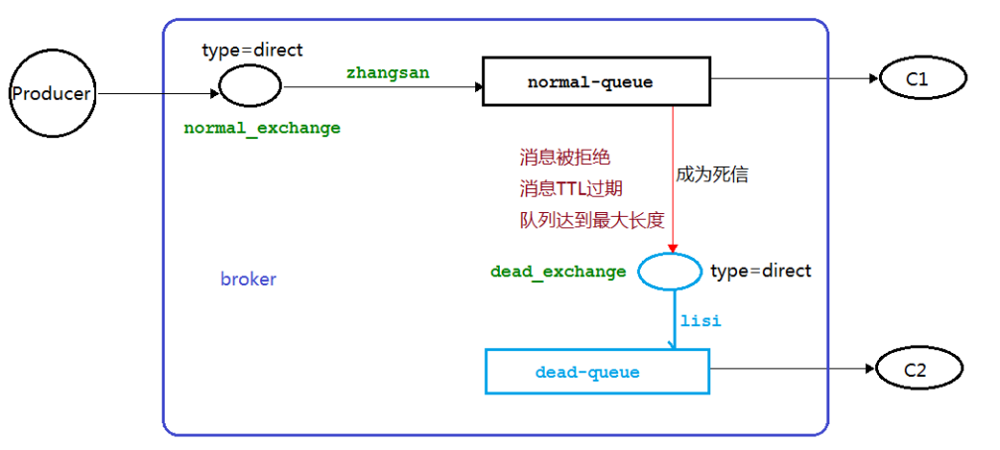
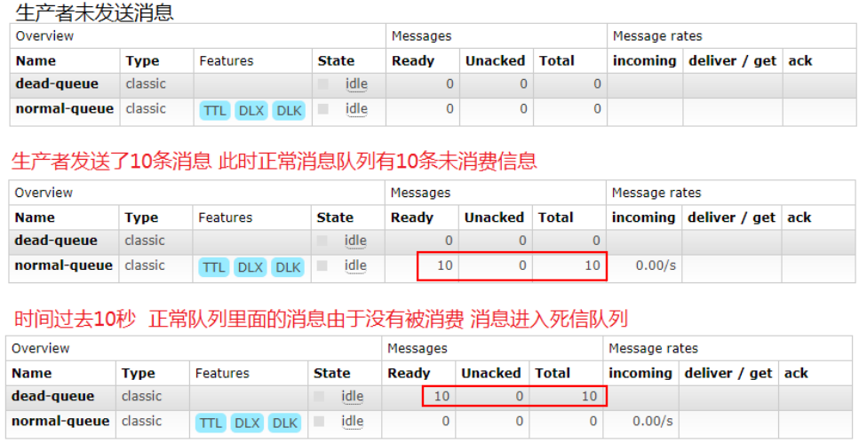
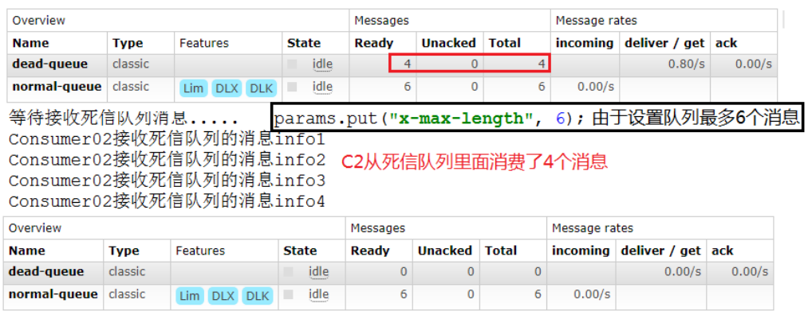
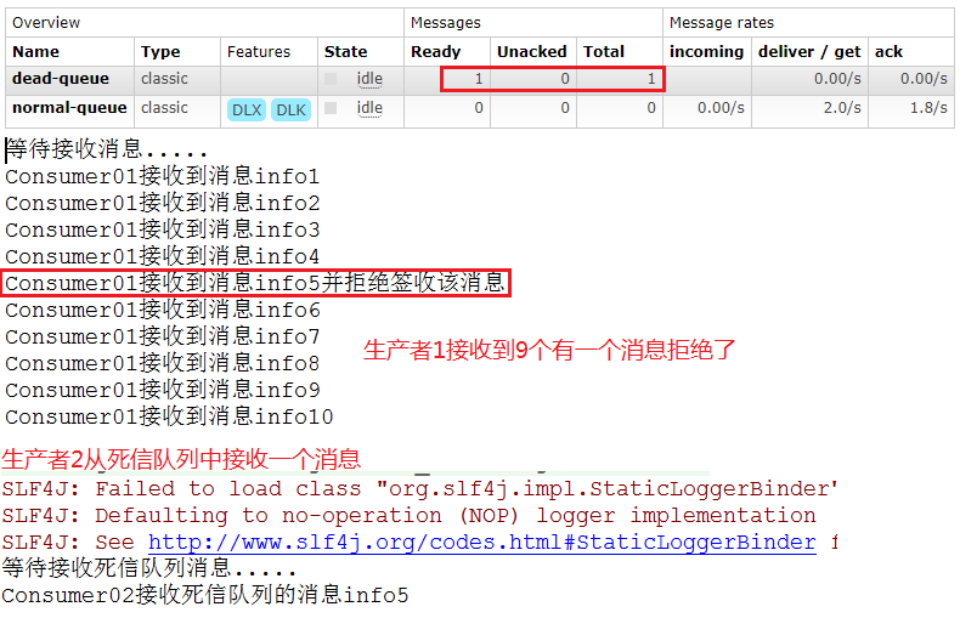

# 死信队列

## 死信的概念

先从概念解释上搞清楚这个定义，死信，顾名思义就是无法被消费的消息，字面意思可以这样理解，一般来说，producer 将消息投递到 broker 或者直接到queue 里了，consumer 从 queue 取出消息进行消费，但某些时候由于特定的原因导致 queue 中的某些消息无法被消费，这样的消息如果没有后续的处理，就变成了死信，有死信自然就有了死信队列。

应用场景:为了保证订单业务的消息数据不丢失，需要使用到 RabbitMQ 的死信队列机制，当消息消费发生异常时，将消息投入死信队列中.还有比如说: 用户在商城下单成功并点击去支付后在指定时间未支付时自动失效

## 死信的来源

- 消息 TTL 过期
- 队列达到最大长度(队列满了，无法再添加数据到 mq 中) 
- 消息被拒绝(basic.reject 或 basic.nack)并且 requeue=false

## 死信实战

### 代码架构图



### 消息TTL过期

#### 生产者

```java
public class Producer {

    public static final String NORMAL_EXCHANGE = "normal_exchange";

    public static void main(String[] args) throws Exception {
        Channel channel = RabbitMqUtils.getChannel();
        channel.exchangeDeclare(NORMAL_EXCHANGE, BuiltinExchangeType.DIRECT);
        AMQP.BasicProperties basicProperties = new AMQP.BasicProperties().builder().expiration("10000").build();
        for (int i = 0; i < 10; i++) {
            String message = i+"";
            channel.basicPublish(NORMAL_EXCHANGE,"zhangsan",basicProperties,message.getBytes(StandardCharsets.UTF_8));
            System.out.println("生产者返送消息："+message);
        }
    }
}
```

#### 消费者1

```java
public class Consumer01 {
    /**
     * 普通交换机名称
     */
    public static final String NORMAL_EXCHANGE = "normal_exchange";
    /**
     * 死信交换机名称
     */
    public static final String DEAD_EXCHANGE = "dead_exchange";
    /**
     * 普通队列
     */
    public static final String NORMAL_QUEUE = "normal_queue";
    /**
     * 死信队列
     */
    public static final String DEAD_QUEUE = "dead_queue";

    public static void main(String[] args) throws Exception {
        Channel channel = RabbitMqUtils.getChannel();
        channel.exchangeDeclare(NORMAL_EXCHANGE, BuiltinExchangeType.DIRECT);
        channel.exchangeDeclare(DEAD_EXCHANGE, BuiltinExchangeType.DIRECT);
        channel.queueDeclare(DEAD_QUEUE, false, false, false, null);
        // 死信队列绑定死信交换机
        channel.queueBind(DEAD_QUEUE, DEAD_EXCHANGE, "lisi");
        // 普通队列绑定死信交换机和路由键
        Map<String, Object> params = new HashMap<>();
        params.put("x-dead-letter-exchange", DEAD_EXCHANGE);
        params.put("x-dead-letter-routing-key", "lisi");
        channel.queueDeclare(NORMAL_QUEUE, false, false, false, params);
        channel.queueBind(NORMAL_QUEUE,NORMAL_EXCHANGE,"zhangsan");
        channel.basicConsume(NORMAL_QUEUE, true, (consumerTag, message) -> {
            String msg = new String(message.getBody(), StandardCharsets.UTF_8);
            System.out.println("C1收到消息：" + msg);
        }, consumerTag -> {
        });
    }
}
```

#### 消费者2

```java
public class Consumer02 {
    /**
     * 死信交换机名称
     */
    public static final String DEAD_EXCHANGE = "dead_exchange";
    /**
     * 死信队列
     */
    public static final String DEAD_QUEUE = "dead_queue";

    public static void main(String[] args) throws Exception {
        Channel channel = RabbitMqUtils.getChannel();
        channel.exchangeDeclare(DEAD_EXCHANGE, BuiltinExchangeType.DIRECT);
        channel.queueDeclare(DEAD_QUEUE, false, false, false, null);
        // 死信队列绑定死信交换机
        channel.queueBind(DEAD_QUEUE, DEAD_EXCHANGE, "lisi");
        // 普通队列绑定死信交换机和路由键
        channel.basicConsume(DEAD_QUEUE, true, (consumerTag, message) -> {
            String msg = new String(message.getBody(), StandardCharsets.UTF_8);
            System.out.println("C2收到死信队列的消息：" + msg);
        }, consumerTag -> {
        });
    }
}
```

启动消费者1后关闭，模拟接收不到消息，启动生产者：



再启动消费者2，死信队列中消息被消费

~~~java
C2收到死信队列的消息：0
C2收到死信队列的消息：1
C2收到死信队列的消息：2
C2收到死信队列的消息：3
C2收到死信队列的消息：4
C2收到死信队列的消息：5
C2收到死信队列的消息：6
C2收到死信队列的消息：7
C2收到死信队列的消息：8
C2收到死信队列的消息：9
~~~

### 队列达到最大长度

#### 生产者

```java
public class Producer {

    public static final String NORMAL_EXCHANGE = "normal_exchange";

    public static void main(String[] args) throws Exception {
        Channel channel = RabbitMqUtils.getChannel();
        channel.exchangeDeclare(NORMAL_EXCHANGE, BuiltinExchangeType.DIRECT);
        for (int i = 0; i < 10; i++) {
            String message = i+"";
            channel.basicPublish(NORMAL_EXCHANGE,"zhangsan",null,message.getBytes(StandardCharsets.UTF_8));
            System.out.println("生产者返送消息："+message);
        }
    }
}
```

#### 消费者1

```java
public class Consumer01 {
    /**
     * 普通交换机名称
     */
    public static final String NORMAL_EXCHANGE = "normal_exchange";
    /**
     * 死信交换机名称
     */
    public static final String DEAD_EXCHANGE = "dead_exchange";
    /**
     * 普通队列
     */
    public static final String NORMAL_QUEUE = "normal_queue";
    /**
     * 死信队列
     */
    public static final String DEAD_QUEUE = "dead_queue";

    public static void main(String[] args) throws Exception {
        Channel channel = RabbitMqUtils.getChannel();
        channel.exchangeDeclare(NORMAL_EXCHANGE, BuiltinExchangeType.DIRECT);
        channel.exchangeDeclare(DEAD_EXCHANGE, BuiltinExchangeType.DIRECT);
        channel.queueDeclare(DEAD_QUEUE, false, false, false, null);
        // 死信队列绑定死信交换机
        channel.queueBind(DEAD_QUEUE, DEAD_EXCHANGE, "lisi");
        // 普通队列绑定死信交换机和路由键
        Map<String, Object> params = new HashMap<>();
        params.put("x-dead-letter-exchange", DEAD_EXCHANGE);
        params.put("x-dead-letter-routing-key", "lisi");
        // 设置队列最大长度
        params.put("x-max-length", 6);
        channel.queueDeclare(NORMAL_QUEUE, false, false, false, params);
        channel.queueBind(NORMAL_QUEUE,NORMAL_EXCHANGE,"zhangsan");
        channel.basicConsume(NORMAL_QUEUE, true, (consumerTag, message) -> {
            String msg = new String(message.getBody(), StandardCharsets.UTF_8);
            System.out.println("C1收到消息：" + msg);
        }, consumerTag -> {
        });
    }
}
```

#### 消费者2

```java
public class Consumer02 {
    /**
     * 死信交换机名称
     */
    public static final String DEAD_EXCHANGE = "dead_exchange";
    /**
     * 死信队列
     */
    public static final String DEAD_QUEUE = "dead_queue";

    public static void main(String[] args) throws Exception {
        Channel channel = RabbitMqUtils.getChannel();
        channel.exchangeDeclare(DEAD_EXCHANGE, BuiltinExchangeType.DIRECT);
        channel.queueDeclare(DEAD_QUEUE, false, false, false, null);
        // 死信队列绑定死信交换机
        channel.queueBind(DEAD_QUEUE, DEAD_EXCHANGE, "lisi");
        // 普通队列绑定死信交换机和路由键
        channel.basicConsume(DEAD_QUEUE, true, (consumerTag, message) -> {
            String msg = new String(message.getBody(), StandardCharsets.UTF_8);
            System.out.println("C2收到死信队列的消息：" + msg);
        }, consumerTag -> {
        });
    }
}
```



### 消息被拒

#### 生产者

```java
public class Producer {

    public static final String NORMAL_EXCHANGE = "normal_exchange";

    public static void main(String[] args) throws Exception {
        Channel channel = RabbitMqUtils.getChannel();
        channel.exchangeDeclare(NORMAL_EXCHANGE, BuiltinExchangeType.DIRECT);
        for (int i = 0; i < 10; i++) {
            String message = i+"";
            channel.basicPublish(NORMAL_EXCHANGE,"zhangsan",null,message.getBytes(StandardCharsets.UTF_8));
            System.out.println("生产者返送消息："+message);
        }
    }
}
```

#### 消费者1

```java
public class Consumer01 {
    /**
     * 普通交换机名称
     */
    public static final String NORMAL_EXCHANGE = "normal_exchange";
    /**
     * 死信交换机名称
     */
    public static final String DEAD_EXCHANGE = "dead_exchange";
    /**
     * 普通队列
     */
    public static final String NORMAL_QUEUE = "normal_queue";
    /**
     * 死信队列
     */
    public static final String DEAD_QUEUE = "dead_queue";

    public static void main(String[] args) throws Exception {
        Channel channel = RabbitMqUtils.getChannel();
        channel.exchangeDeclare(NORMAL_EXCHANGE, BuiltinExchangeType.DIRECT);
        channel.exchangeDeclare(DEAD_EXCHANGE, BuiltinExchangeType.DIRECT);
        channel.queueDeclare(DEAD_QUEUE, false, false, false, null);
        // 死信队列绑定死信交换机
        channel.queueBind(DEAD_QUEUE, DEAD_EXCHANGE, "lisi");
        // 普通队列绑定死信交换机和路由键
        Map<String, Object> params = new HashMap<>();
        params.put("x-dead-letter-exchange", DEAD_EXCHANGE);
        params.put("x-dead-letter-routing-key", "lisi");
        channel.queueDeclare(NORMAL_QUEUE, false, false, false, params);
        channel.queueBind(NORMAL_QUEUE, NORMAL_EXCHANGE, "zhangsan");
        channel.basicConsume(NORMAL_QUEUE, false, (consumerTag, message) -> {
            String msg = new String(message.getBody(), StandardCharsets.UTF_8);
            if (msg.equals("3")) {
                System.out.println("C1收到消息：" + msg + "并拒绝签收该消息");
                channel.basicReject(message.getEnvelope().getDeliveryTag(), false);
            } else {
                channel.basicAck(message.getEnvelope().getDeliveryTag(), false);
                System.out.println("C1收到消息：" + msg);
            }
        }, consumerTag -> {
        });
    }
}
```

#### 消费者2

```java
public class Consumer02 {
    /**
     * 死信交换机名称
     */
    public static final String DEAD_EXCHANGE = "dead_exchange";
    /**
     * 死信队列
     */
    public static final String DEAD_QUEUE = "dead_queue";

    public static void main(String[] args) throws Exception {
        Channel channel = RabbitMqUtils.getChannel();
        channel.exchangeDeclare(DEAD_EXCHANGE, BuiltinExchangeType.DIRECT);
        channel.queueDeclare(DEAD_QUEUE, false, false, false, null);
        // 死信队列绑定死信交换机
        channel.queueBind(DEAD_QUEUE, DEAD_EXCHANGE, "lisi");
        // 普通队列绑定死信交换机和路由键
        channel.basicConsume(DEAD_QUEUE, true, (consumerTag, message) -> {
            String msg = new String(message.getBody(), StandardCharsets.UTF_8);
            System.out.println("C2收到死信队列的消息：" + msg);
        }, consumerTag -> {
        });
    }
}
```




