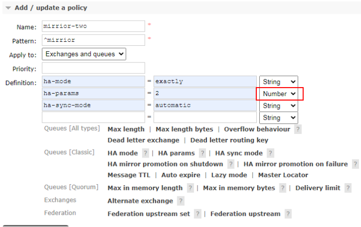
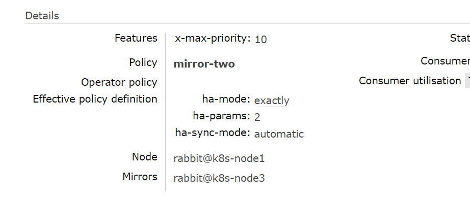
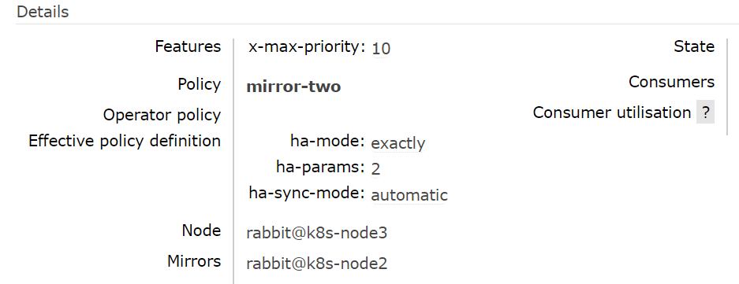
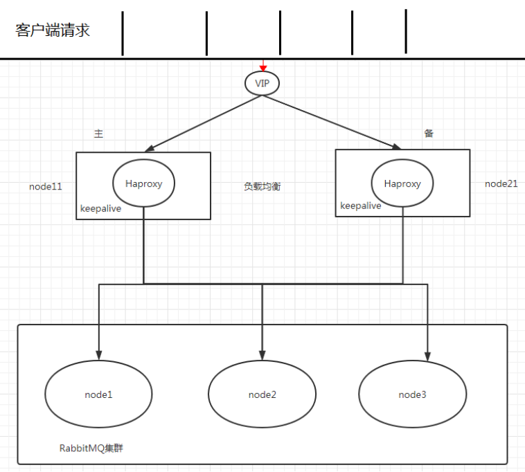
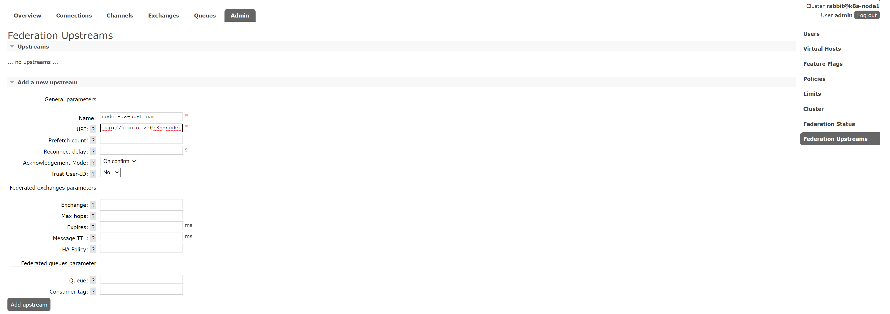
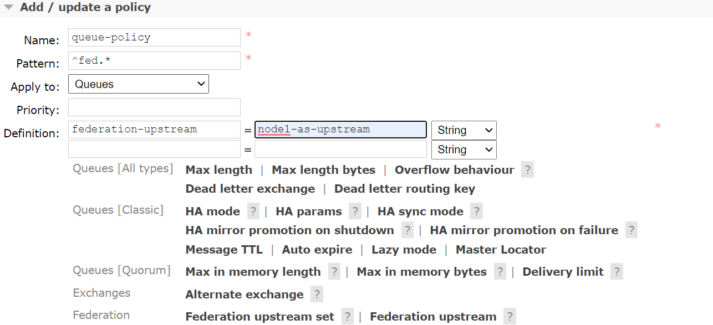
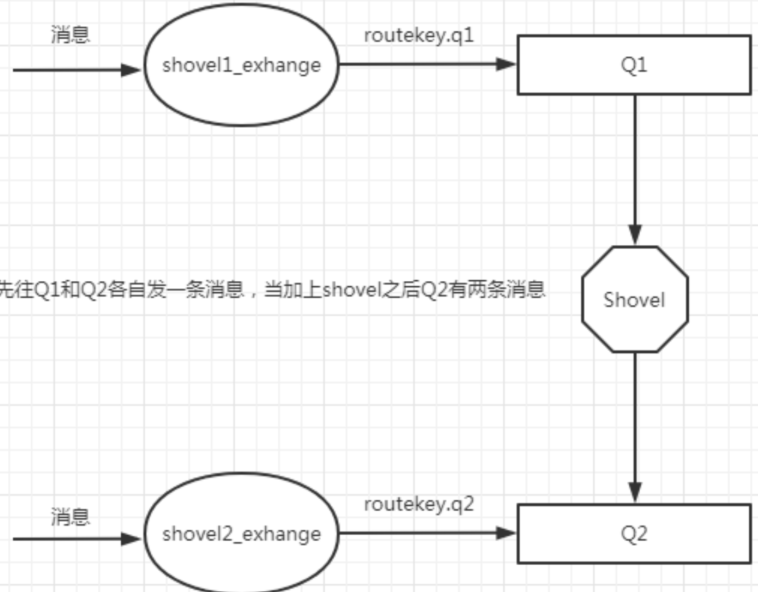

# rabbitmq集群

## clustering

### 使用集群的原因

最开始我们介绍了如何安装及运行 RabbitMQ 服务，不过这些是单机版的，无法满足目前真实应用的要求。如果 RabbitMQ 服务器遇到内存崩溃、机器掉电或者主板故障等情况，该怎么办？单台 RabbitMQ 服务器可以满足每秒 1000 条消息的吞吐量，那么如果应用需要 RabbitMQ 服务满足每秒 10 万条消息的吞吐量呢？购买昂贵的服务器来增强单机 RabbitMQ 务的性能显得捉襟见肘，搭建一个 RabbitMQ 集群才是解决实际问题的关键.

### 搭建步骤

1、修改三台机器的主机名称

~~~sh
vim /etc/hostname
~~~

2、配置各节点的hosts文件，让各个节点可以识别对方

~~~sh
vim /etc/hosts
192.168.48.129 k8s-node1
192.168.48.130 k8s-node2
192.168.48.131 k8s-node3
~~~

3、确保各节点的cookie文件使用的是同一个值

~~~sh
scp /var/lib/rabbitmq/.erlang.cookie  root@k8s-node2:/var/lib/rabbitmq/.erlang.cookie
scp /var/lib/rabbitmq/.erlang.cookie  root@k8s-node3:/var/lib/rabbitmq/.erlang.cookie
~~~

4、启动 RabbitMQ 服务,顺带启动 Erlang 虚拟机和 RbbitMQ 应用服务(在三台节点上分别执行以下命令)

~~~sh
rabbitmq-server -detached
~~~

5、在节点 2 执行

~~~sh
rabbitmqctl stop_app #(rabbitmqctl stop 会将Erlang 虚拟机关闭，rabbitmqctl stop_app 只关闭 RabbitMQ 服务) 
rabbitmqctl reset
rabbitmqctl join_cluster rabbit@k8s-node1 
rabbitmqctl start_app  #(只启动应用服务)
~~~

6、在节点 3 执行

~~~sh
rabbitmqctl stop_app 
rabbitmqctl reset
rabbitmqctl join_cluster rabbit@k8s-node2 
rabbitmqctl start_app
~~~

7、集群状态

~~~sh
rabbitmqctl cluster_status
~~~

8、需要重新设置用户

~~~sh
# 创建账号
rabbitmqctl add_user admin 123
# 设置用户角色
rabbitmqctl set_user_tags admin administrator
# 设置用户权限
rabbitmqctl set_permissions -p "/" admin ".*" ".*" ".*"
~~~

9、解除集群节点(node2 和 node3 机器分别执行) 

~~~sh
rabbitmqctl stop_app
rabbitmqctl reset 
rabbitmqctl start_app 
rabbitmqctl cluster_status
rabbitmqctl forget_cluster_node rabbit@k8s-node2 #(node1 机器上执行)
~~~

## 镜像队列

### 使用原因

如果 RabbitMQ 集群中只有一个 Broker 节点，那么该节点的失效将导致整体服务的临时性不可用，并且也可能会导致消息的丢失。可以将所有消息都设置为持久化，并且对应队列的durable 属性也设置为true， 但是这样仍然无法避免由于缓存导致的问题：因为消息在发送之后和被写入磁盘井执行刷盘动作之间存在一个短暂却会产生问题的时间窗。通过 publisher-confirm 机制能够确保客户端知道哪些消息己经存入磁盘， 尽管如此，一般不希望遇到因单点故障导致的服务不可用

引入镜像队列(Mirror Queue)的机制，可以将队列镜像到集群中的其他 Broker 节点之上，如果集群中的一个节点失效了，队列能自动地切换到镜像中的另一个节点上以保证服务的可用性。

### 搭建步骤

1、启动集群节点

2、随便在一个节点添加policy

3、在k8s-node1节点上创建一个队列发送一条消息，队列存在镜像队列

4、停掉 node1 之后发现 node2 成为镜像队列

5、就算整个集群只剩下一台机器了，依然能消费队列里面的消息说明队列里面的消息被镜像队列传递到相应机器里面了

## Haproxy+Keepalive 实现高可用负载均衡

### 整体架构图

### Haproxy实现负载均衡

HAProxy 提供高可用性、负载均衡及基于TCPHTTP 应用的代理，支持虚拟主机，它是免费、快速并且可靠的一种解决方案，包括 Twitter,Reddit,StackOverflow,GitHub 在内的多家知名互联网公司在使用。

HAProxy 实现了一种事件驱动、单一进程模型，此模型支持非常大的井发连接数。

扩展 nginx,lvs,haproxy 之间的区别: http://www.ha97.com/5646.html

### 搭建步骤

~~~sh
# 1.下载 haproxy(在 node1 和 node2) 
yum -y install haproxy
# 2.修改 node1 和 node2 的 haproxy.cfg 
vim /etc/haproxy/haproxy.cfg
# 3.在两台节点启动 haproxy
haproxy -f /etc/haproxy/haproxy.cfg 
ps -ef | grep haprox
# 4.访问地址
http://k8s-node1:8888/stats
~~~

### Keepalived实现双机(主备)热备

试想如果前面配置的 HAProxy 主机突然宕机或者网卡失效，那么虽然 RbbitMQ 集群没有任何故障但是对于外界的客户端来说所有的连接都会被断开结果将是灾难性的为了确保负载均衡服务的可靠性同样显得十分重要，这里就要引入 Keepalived 它能够通过自身健康检查、资源接管功能做高可用(双机热备)，实现故障转移.

### 搭建步骤

~~~sh
# 1、下载 keepalived
yum -y install keepalived
# 2、节点 node1 配置文件 把资料里面的 keepalived.conf 修改之后替换
vim /etc/keepalived/keepalived.conf
# 3、节点 node2 配置文件
# 需要修改global_defs 的 router_id,如:nodeB
# 其次要修改 vrrp_instance_VI 中 state 为"BACKUP"； 
# 最后要将priority 设置为小于 100 的值
# 4、添加 haproxy_chk.sh
# (为了防止 HAProxy 服务挂掉之后 Keepalived 还在正常工作而没有切换到 Backup 上，所以这里需要编写一个脚本来检测 HAProxy 务的状态,当 HAProxy 服务挂掉之后该脚本会自动重启HAProxy 的服务，如果不成功则关闭 Keepalived 服务，这样便可以切换到 Backup 继续工作) 
vim /etc/keepalived/haproxy_chk.sh #(可以直接上传文件)
# 修改权限 
chmod 777 /etc/keepalived/haproxy_chk.sh
# 5、启动 keepalive 命令(node1 和 node2 启动)
systemctl start keepalived
# 6、观察 Keepalived 的日志
tail -f /var/log/messages -n 200
# 7、观察最新添加的 vip 
ip add show
# 8、node1 模拟 keepalived 关闭状态
systemctl stop keepalived
# 9.使用 vip 地址来访问 rabbitmq 集群
~~~

## Federation Exchange

### 使用它的原因

​		(broker 北京)，(broker 深圳)彼此之间相距甚远，网络延迟是一个不得不面对的问题。有一个在北京的业务(Client 北京) 需要连接(broker 北京)，向其中的交换器 exchangeA 发送消息，此时的网络延迟很小，(Client 北京)可以迅速将消息发送至 exchangeA 中，就算在开启了 publisherconfirm 机制或者事务机制的情况下，也可以迅速收到确认信息。此时又有个在深圳的业务(Client 深圳)需要向 exchangeA 发送消息， 那么(Client 深圳) (broker 北京)之间有很大的网络延迟，(Client 深圳) 将发送消息至 exchangeA 会经历一定的延迟，尤其是在开启了 publisherconfirm 机制或者事务机制的情况下，(Client 深圳) 会等待很长的延迟时间来接收(broker 北京)的确认信息，进而必然造成这条发送线程的性能降低，甚至造成一定程度上的阻塞。

​		将业务(Client 深圳)部署到北京的机房可以解决这个问题，但是如果(Client 深圳)调用的另些服务都部署在深圳，那么又会引发新的时延问题，总不见得将所有业务全部部署在一个机房，那么容灾又何以实现？ 这里使用 Federation 插件就可以很好地解决这个问题.

### 搭建步骤

1、需要保证每台节点单独运行

2、在每台机器上开启federation插件

~~~sh
rabbitmq-plugins enable rabbitmq_federation
rabbitmq-plugins enable rabbitmq_federation_management
~~~

3、原理图（先运行consumer在k8s-node2创建fed_exchange）

  

 4、在downstream（k8s-node2）配置upstream（k8s-node1）

 5、添加policy

 6、成功

 

##  Federation Queue

###  使用它的原因

 联邦队列可以在多个 Broker 节点(或者集群)之间为单个队列提供均衡负载的功能。一个联邦队列可以连接一个或者多个上游队列(upstream queue)，并从这些上游队列中获取消息以满足本地消费者消费消息的需求。

###  搭建步骤

1、原理图

 2、添加upstream（同上）

3、添加policy

## shovel

### 使用它的原因

Federation 具备的数据转发功能类似，Shovel 够可靠、持续地从一个 Broker 中的队列(作为源端，即source)拉取数据并转发至另一个 Broker 中的交换器(作为目的端，即 destination)。作为源端的队列和作为目的端的交换器可以同时位于同一个 Broker，也可以位于不同的 Broker 上。Shovel 可以翻译为"铲子"， 是一种比较形象的比喻，这个"铲子"可以将消息从一方"铲子"另一方。Shovel 行为就像优秀的客户端应用程序能够负责连接源和目的地、负责消息的读写及负责连接失败问题的处理。

###  搭建步骤

1、开启插件(需要的机器都开启)

~~~sh
rabbitmq-plugins enable rabbitmq_shovel
rabbitmq-plugins enable rabbitmq_shovel_management
~~~

2、原理图(在源头发送的消息直接会进入到目的地队列)

 

 3、添加 shovel 源和目的地

 

 

 

 

 

 

 

 

 

 

 

 

 

 

 

 

