# 交换机

在上一节中，我们创建了一个工作队列。我们假设的是工作队列背后，每个任务都恰好交付给一个消费者(工作进程)。在这一部分中，我们将做一些完全不同的事情-我们将消息传达给多个消费者。这种模式称为 ”发布/订阅”。

## Exchange

RabbitMQ 消息传递模型的核心思想是: **生产者生产的消息从不会直接发送到队列**。实际上，通常生产者甚至都不知道这些消息传递传递到了哪些队列中。
相反，**生产者只能将消息发送到交换机(exchange)**，交换机工作的内容非常简单，一方面它接收来自生产者的消息，另一方面将它们推入队列。交换机必须确切知道如何处理收到的消息。是应该把这些消息放到特定队列还是说把他们到许多队列中还是说应该丢弃它们。这就的由交换机的类型来决定。

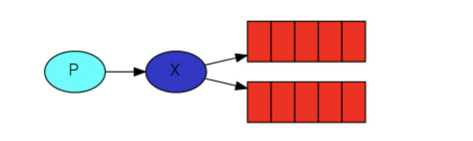

### Exchange的类型

总共有以下类型：直接(direct), 主题(topic) ,标题(headers) , 扇出(fanout)

### 无名Exchange

在本教程的前面部分我们对 exchange 一无所知，但仍然能够将消息发送到队列。之前能实现的原因是因为我们使用的是默认交换，我们通过空字符串(“”)进行标识。

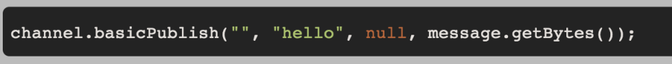

第一个参数是交换机的名称。空字符串表示默认或无名称交换机：消息能路由发送到队列中其实是由 routingKey(bindingkey)绑定 key 指定的，如果它存在的话

## 临时队列

每当我们连接到 Rabbit 时，我们都需要一个全新的空队列，为此我们可以创建一个具有**随机名称的队列**，或者能让服务器为我们选择一个随机队列名称那就更好了。其次**一旦我们断开了消费者的连接，队列将被自动删除。**

~~~java
//创建临时队列的方式如下:
String queueName = channel.queueDeclare().getQueue();
~~~

创建出来之后长成这样:
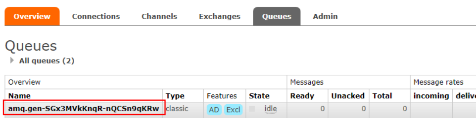

## 绑定（binding）

什么是 binding 呢，binding 其实是 exchange 和 queue 之间的桥梁，它告诉我们 exchange 和那个队列进行了绑定关系。比如说下面这张图告诉我们的就是 X 与 Q1 和 Q2 进行了绑定


## Fanout Exchange

### Fanout介绍

Fanout 这种类型非常简单。正如从名称中猜到的那样，它是将接收到的所有消息**广播**到它知道的所有队列中。系统中默认有些 exchange 类型

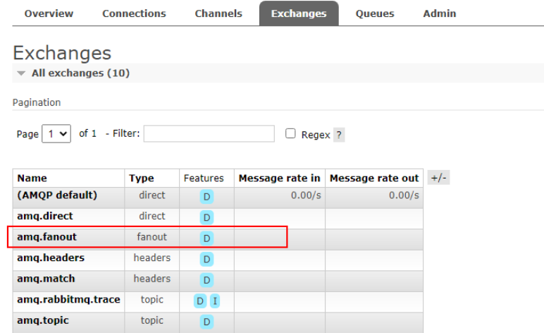

### Fanout实战

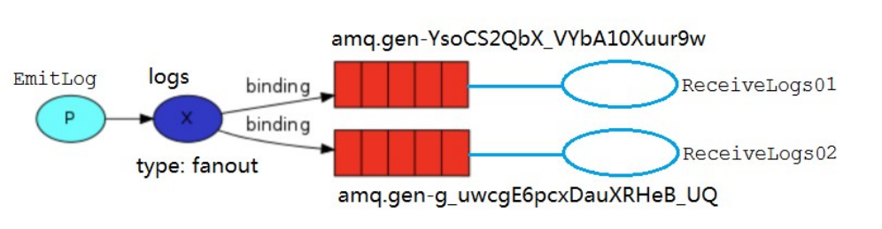

Logs 和临时队列的绑定关系如下图

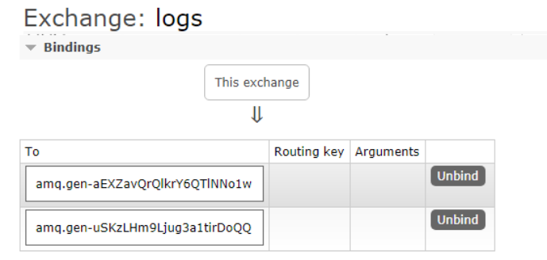

#### 生产者

```java
public class EmitLog {

    public static final String EXCHANGE_NAME = "logs";

    public static void main(String[] args) throws Exception {
        Channel channel = RabbitMqUtils.getChannel();
        channel.exchangeDeclare(EXCHANGE_NAME, BuiltinExchangeType.FANOUT);
        Scanner scanner = new Scanner(System.in);
        System.out.println("输入消息：");
        while (scanner.hasNext()){
            String msg = scanner.nextLine();
            channel.basicPublish(EXCHANGE_NAME,"",null,msg.getBytes(StandardCharsets.UTF_8));
            System.out.println("生产者发出消息："+msg);
        }
    }
}
```

#### 消费者1

```java
public class ReceiveLogs01 {

    public static final String EXCHANGE_NAME = "logs";

    public static void main(String[] args) throws Exception {
        Channel channel = RabbitMqUtils.getChannel();
        channel.exchangeDeclare(EXCHANGE_NAME, BuiltinExchangeType.FANOUT);
        //临时队列
        String queueName = channel.queueDeclare().getQueue();
        channel.queueBind(queueName,EXCHANGE_NAME,"");
        DeliverCallback deliverCallback = (consumerTag, message) -> {
            String msg = new String(message.getBody(), StandardCharsets.UTF_8);
            System.out.println("C1接收到消息："+msg);
        };
        channel.basicConsume(queueName,true, deliverCallback,consumerTag -> {
            System.out.println("消费者取消消费消息的回调");
        });
    }
}
```

消费者2

```java
public class ReceiveLogs02 {

    public static final String EXCHANGE_NAME = "logs";

    public static void main(String[] args) throws Exception {
        Channel channel = RabbitMqUtils.getChannel();
        channel.exchangeDeclare(EXCHANGE_NAME, BuiltinExchangeType.FANOUT);
        //临时队列
        String queueName = channel.queueDeclare().getQueue();
        channel.queueBind(queueName,EXCHANGE_NAME,"");
        DeliverCallback deliverCallback = (consumerTag, message) -> {
            String msg = new String(message.getBody(), StandardCharsets.UTF_8);
            System.out.println("C2接收到消息："+msg);
        };
        channel.basicConsume(queueName,true, deliverCallback,consumerTag -> {
            System.out.println("消费者取消消费消息的回调");
        });
    }
}
```

消费者1和消费者2都可以接收到生产者发出的所有消息

## Direct Exchange

### Direct Exchange的介绍

绑定是交换机和队列之间的桥梁关系。也可以这么理解： **队列只对它绑定的交换机的消息感兴趣**。绑定用参数：routingKey 来表示也可称该参数为 binding key， 创建绑定我们用代码:`channel.queueBind(queueName, EXCHANGE_NAME, "routingKey");`绑定之后的意义由其交换类型决定。

我们将使用 direct 这种类型来进行替换，这种类型的工作方式是，消息只去到它绑定的routingKey 队列中去。

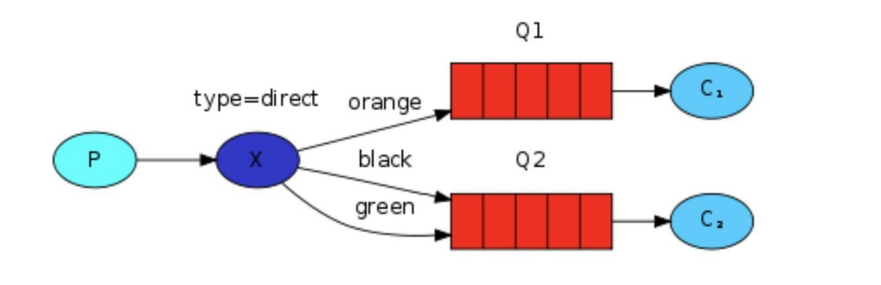

在上面这张图中，我们可以看到 X 绑定了两个队列，绑定类型是 direct。队列 Q1 绑定键为 orange， 队列 Q2 绑定键有两个:一个绑定键为 black，另一个绑定键为 green。

在这种绑定情况下，生产者发布消息到 exchange 上，绑定键为 orange 的消息会被发布到队列Q1。绑定键为 black、green 的消息会被发布到队列 Q2，其他消息类型的消息将被丢弃。

### 多重绑定

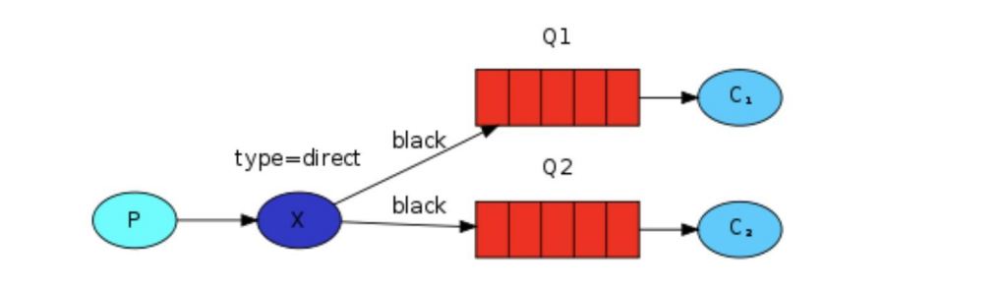

当然如果 exchange 的绑定类型是direct，**但是它绑定的多个队列的** **key** **如果都相同**，在这种情况下虽然绑定类型是 direct ，**但是它表现的就和** **fanout** **有点类似了**，就跟广播差不多，如上图所示。

### Direct 实战

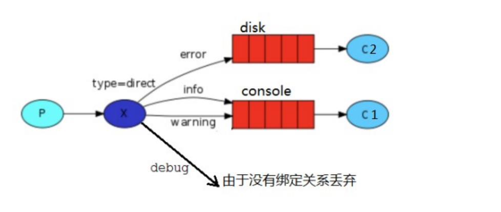

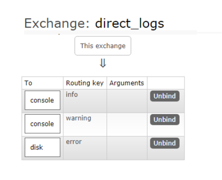

#### 生产者

```java
public class EmitLogDirect {

    public static final String EXCHANGE_NAME="direct_logs";

    public static void main(String[] args) throws Exception {
        Channel channel = RabbitMqUtils.getChannel();
        channel.exchangeDeclare(EXCHANGE_NAME, BuiltinExchangeType.DIRECT);
        HashMap<String, String> bindingMap = new HashMap<>(8);
        bindingMap.put("info","info信息");
        bindingMap.put("warning","warning信息");
        bindingMap.put("error","error信息");
        for (Map.Entry<String, String> entry : bindingMap.entrySet()) {
            String key = entry.getKey();
            String msg = entry.getValue();
            channel.basicPublish(EXCHANGE_NAME,key,null,msg.getBytes(StandardCharsets.UTF_8));
        }
    }
}
```

#### 消费者1

```java
public class ReceiveLogsDirect01 {
    public static final String EXCHANGE_NAME="direct_logs";
    public static final String QUEUE_NAME="console";

    public static void main(String[] args) throws Exception {
        Channel channel = RabbitMqUtils.getChannel();
        channel.exchangeDeclare(EXCHANGE_NAME, BuiltinExchangeType.DIRECT);
        channel.queueDeclare(QUEUE_NAME,false,false,false,null);
        channel.queueBind(QUEUE_NAME,EXCHANGE_NAME,"info");
        channel.queueBind(QUEUE_NAME,EXCHANGE_NAME,"warning");
        channel.basicConsume(QUEUE_NAME,true,(consumerTag, message) -> {
            String msg = new String(message.getBody(), StandardCharsets.UTF_8);
            System.out.println("接收到绑定键："+message.getEnvelope().getRoutingKey()+", 消息是：" + msg);
        },consumerTag -> {});
    }
}
```

#### 消费者2

```java
public class ReceiveLogsDirect02 {
    public static final String EXCHANGE_NAME="direct_logs";
    public static final String QUEUE_NAME="disk";

    public static void main(String[] args) throws Exception {
        Channel channel = RabbitMqUtils.getChannel();
        channel.exchangeDeclare(EXCHANGE_NAME, BuiltinExchangeType.DIRECT);
        channel.queueDeclare(QUEUE_NAME,false,false,false,null);
        channel.queueBind(QUEUE_NAME,EXCHANGE_NAME,"error");
        channel.basicConsume(QUEUE_NAME,true,(consumerTag, message) -> {
            String msg = new String(message.getBody(), StandardCharsets.UTF_8);
            System.out.println("接收到绑定键："+message.getEnvelope().getRoutingKey()+", 消息是：" + msg);
        },consumerTag -> {});
    }
}
```

## Topic Exchange

### 之前类型的问题

在上一个小节中，我们改进了日志记录系统。我们没有使用只能进行随意广播的 fanout 交换机，而是使用了 direct 交换机，从而有能实现有选择性地接收日志。

尽管使用direct 交换机改进了我们的系统，但是它仍然存在局限性-比方说我们想接收的日志类型有

info.base 和 info.advantage，某个队列只想 info.base 的消息，那这个时候direct 就办不到了。这个时候就只能使用 topic 类型

### Topic的要求

发送到类型是 topic 交换机的消息的 routing_key 不能随意写，必须满足一定的要求，它**必须是一个单词列表，以点号分隔开**。这些单词可以是任意单词，比如说："stock.usd.nyse", "nyse.vmw","quick.orange.rabbit".这种类型的。当然这个单词列表最多不能超过 255 个字节。

在这个规则列表中，其中有两个替换符是大家需要注意的

- *(星号)可以代替一个单词
- #(井号)可以替代零个或多个单词

### Topic匹配例子

下图绑定关系如下

- Q1-->绑定的是中间带 orange 带 3 个单词的字符串(`*.orange.*`)

- Q2-->绑定的是最后一个单词是 rabbit 的 3 个单词(`*.*.rabbit`) 和第一个单词是 lazy 的多个单词(`lazy.#`)

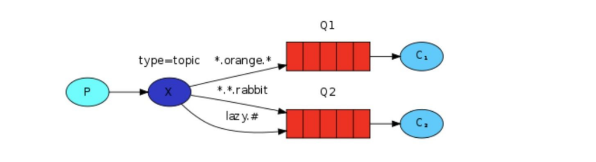

~~~java
//上图是一个队列绑定关系图，我们来看看他们之间数据接收情况是怎么样的
quick.orange.rabbit			被队列 Q1Q2 接收到
lazy.orange.elephant		被队列 Q1Q2 接收到
quick.orange.fox			被队列 Q1 接收到
lazy.brown.fox				被队列 Q2 接收到
lazy.pink.rabbit			虽然满足两个绑定但只被队列 Q2 接收一次
quick.brown.fox				不匹配任何绑定不会被任何队列接收到会被丢弃
quick.orange.male.rabbit	是四个单词不匹配任何绑定会被丢弃
lazy.orange.male.rabbit		是四个单词但匹配 Q2
~~~

> 当一个队列绑定键是#,那么这个队列将接收所有数据，就有点像 fanout 了
>
> 如果队列绑定键当中没有#和*出现，那么该队列绑定类型就是 direct 了

### Topic实战

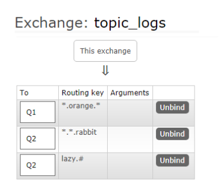

#### 生产者

```java
public class EmitLogTopic {
    private static final String EXCHANGE_NAME = "topic_logs";

    public static void main(String[] argv) throws Exception {
        try (Channel channel = RabbitMqUtils.getChannel()) {
            channel.exchangeDeclare(EXCHANGE_NAME, "topic");
            /**
             *Q1-->绑定的是中间带 orange 带 3 个单词的字符串(*.orange.*)
             *Q2-->绑定的是最后一个单词是 rabbit 的 3 个单词(*.*.rabbit)
             *            第一个单词是 lazy 的多个单词(lazy.#)
             */
            Map<String, String> bindingKeyMap = new HashMap<>();
            bindingKeyMap.put("quick.orange.rabbit", "被队列 Q1Q2 接收到");
            bindingKeyMap.put("lazy.orange.elephant", "被队列 Q1Q2 接收到");
            bindingKeyMap.put("quick.orange.fox", "被队列 Q1 接收到");
            bindingKeyMap.put("lazy.brown.fox", "被队列 Q2 接收到");
            bindingKeyMap.put("lazy.pink.rabbit", "虽然满足两个绑定但只被队列 Q2 接收一次");
            bindingKeyMap.put("quick.brown.fox", "不匹配任何绑定不会被任何队列接收到会被丢弃");
            bindingKeyMap.put("quick.orange.male.rabbit", "是四个单词不匹配任何绑定会被丢弃");
            bindingKeyMap.put("lazy.orange.male.rabbit", "是四个单词但匹配 Q2");

            for (Map.Entry<String, String> bindingKeyEntry : bindingKeyMap.entrySet()) {
                String bindingKey = bindingKeyEntry.getKey();
                String message = bindingKeyEntry.getValue();
                channel.basicPublish(EXCHANGE_NAME, bindingKey, null,
                        message.getBytes("UTF-8"));
                System.out.println("生产者发出消息" + message);
            }
        }
    }
}
```

#### 消费者1

```java
public class ReceiveLogsTopic01 {

    public static final String EXCHANGE_NAME="topic_logs";
    public static final String QUEUE_NAME="Q1";

    public static void main(String[] args) throws Exception {
        Channel channel = RabbitMqUtils.getChannel();
        channel.exchangeDeclare(EXCHANGE_NAME, BuiltinExchangeType.TOPIC);
        channel.queueDeclare(QUEUE_NAME,false,false,false,null);
        channel.queueBind(QUEUE_NAME,EXCHANGE_NAME,"*.orange.*");
        System.out.println("等待接收消息：");
        channel.basicConsume(QUEUE_NAME,true,(consumerTag, message) -> {
            String msg = new String(message.getBody(), StandardCharsets.UTF_8);
            System.out.println("收到绑定键是："+message.getEnvelope().getRoutingKey() + "，消息是："+msg);
        },consumerTag -> {});
    }
}
```

#### 消费者2

```java
public class ReceiveLogsTopic02 {

    public static final String EXCHANGE_NAME="topic_logs";
    public static final String QUEUE_NAME="Q2";

    public static void main(String[] args) throws Exception {
        Channel channel = RabbitMqUtils.getChannel();
        channel.exchangeDeclare(EXCHANGE_NAME, BuiltinExchangeType.TOPIC);
        channel.queueDeclare(QUEUE_NAME,false,false,false,null);
        channel.queueBind(QUEUE_NAME,EXCHANGE_NAME,"*.*.rabbit");
        channel.queueBind(QUEUE_NAME,EXCHANGE_NAME,"lazy.#");
        System.out.println("等待接收消息：");
        channel.basicConsume(QUEUE_NAME,true,(consumerTag, message) -> {
            String msg = new String(message.getBody(), StandardCharsets.UTF_8);
            System.out.println("收到绑定键是："+message.getEnvelope().getRoutingKey() + "，消息是："+msg);
        },consumerTag -> {});
    }
}
```