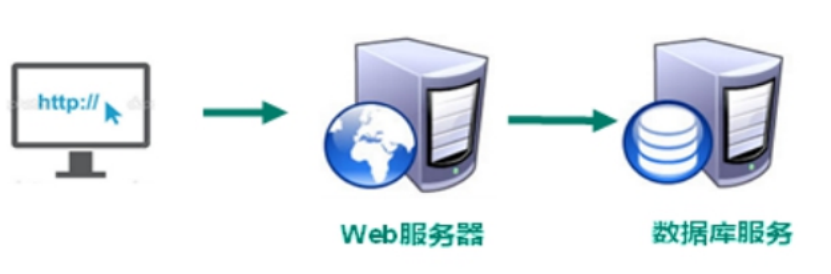
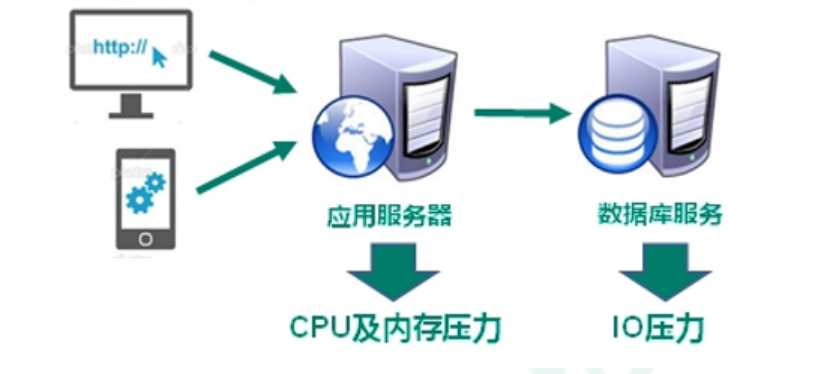
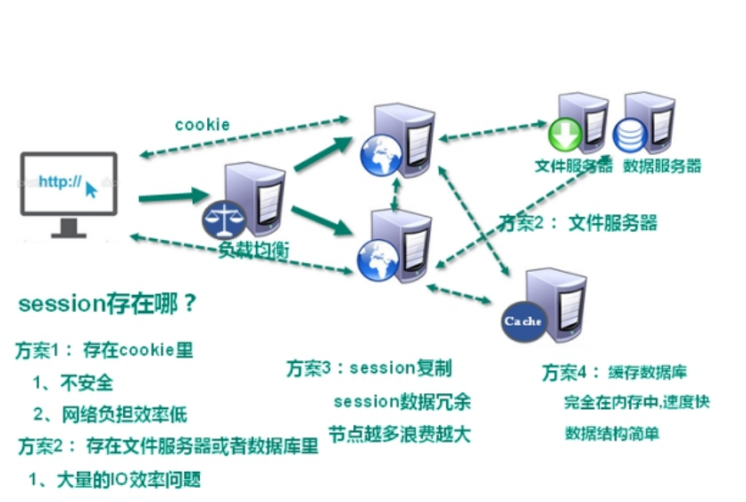
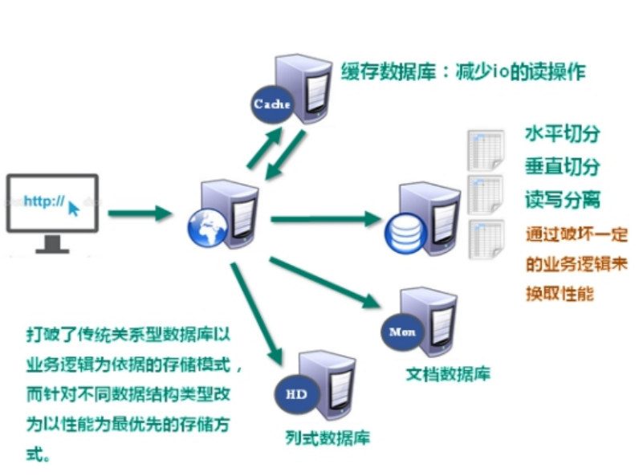

# 第一章_NoSQL数据库简介

## 1. 技术发展

技术的分类：

1、解决功能性的问题：Java、Jsp、RDBMS、Tomcat、HTML、Linux、JDBC、SVN

2、解决扩展性的问题：Struts、Spring、SpringMVC、Hibernate、Mybatis

3、解决性能的问题：NoSQL、Java线程、Hadoop、Nginx、MQ、ElasticSearch

### 1.1、Web1.0时代

Web1.0的时代，数据访问量很有限，用一夫当关的高性能的单点服务器可以解决大部分问题。

### 1.2、Web2.0时代

随着Web2.0的时代的到来，用户访问量大幅度提升，同时产生了大量的用户数据。加上后来的智能移动设备的普及，所有的互联网平台都面临了巨大的性能挑战。

### 1.3、解决CPU及内存压力

### 1.4、解决IO压力

## 2. NoSQL 数据库

### 2.1、NoSQL数据库概述

NoSQL(NoSQL = **Not Only SQL** )，意即“不仅仅是SQL”，泛指**非关系型的数据库**。

NoSQL 不依赖业务逻辑方式存储，而以简单的key-value模式存储。因此大大的增加了数据库的扩展能力。

- 不遵循SQL标准。
- 不支持ACID。
- 远超于SQL的性能。

### 2.2、NoSQL适用场景

- 对数据高并发的读写
- 海量数据的读写
- 对数据高可扩展性的

### 2.3、NoSQL 不适用场景  

- 需要事务支持
- 基于 sql 的结构化查询存储，处理复杂的关系,需要**即席**查询。
- **（用不着 sql 的和用了 sql 也不行的情况，请考虑用 NoSql）**  

### 2.4、Memcache  

- 很**早**出现的 NoSql 数据库 
- 数据都在内存中， 一般**不持久化**
- 支持简单的 key-value 模式， **支持类型单一**
- 一般是作为**缓存数据库**辅助持久化的数据库

### 2.5、Redis

- 几乎覆盖了 Memcached 的绝大部分功能
- 数据都在内存中， **支持持久化**， 主要用作备份恢复
- 除了支持简单的 key-value 模式， 还**支持多种数据结构 的存储， 比如 list、 set、 hash、 zset** 等。
- 一般是作为**缓存数据库**辅助持久化的数据库

### 2.6、MongoDB

- 高性能、 开源、 模式自由(schema free)的**文档型数据库**  
- 数据都在内存中， 如果内存不足， 把不常用的数据保 存到硬盘
- 虽 然 是 key-value 模 式 ， 但 是 对 value （ 尤 其 是 **json**） 提供了丰富的查询功能
- 支持二进制数据及大型对象
- 可以根据数据的特点**替代 RDBMS**，成为独立的数据 库。或者配合 RDBMS， 存储特定的数据。

## 3. DB-Engines 数据库排名  

http://db-engines.com/en/ranking  