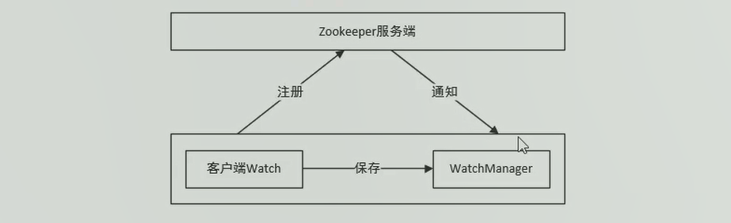
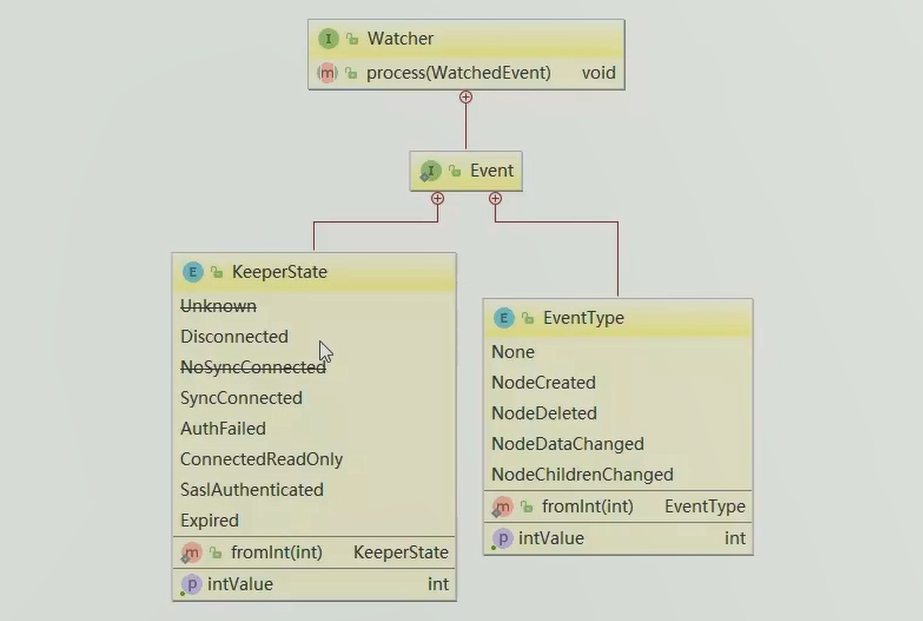
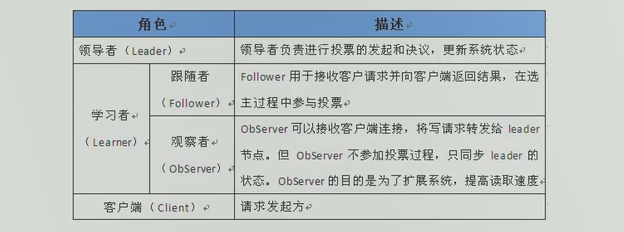
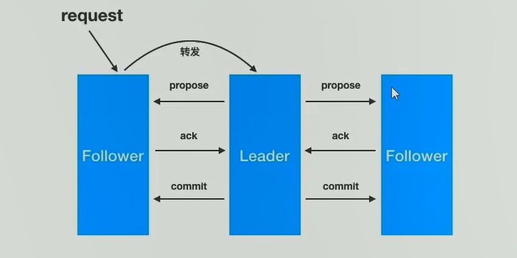

# zookeeper事件监听机制

## watcher概念

zookeeper提供了数据的发布/订阅功能，多个订阅者可同时监听某一特定主题对象，当该对象的自身状态发生变化时（例如节点内容改变、节点下的子节点列表改变等），会实时、主动通知所有订阅者

zookeeper采用了Watcher机制实现数据的发布/订阅功能。该机制在被订阅对象发生变化时会异步通知客户端，因此客户端不必再Watcher注册后轮训阻塞，从而减轻了客户端压力

watcher机制实际上与观察者模式类似，也可看做是一种观察者模式在分布式场景下的实现方式

## watcher架构

客户端首先将Watcher注册到服务端，同时将Watcher对象保存到客户端的Watch管理器中。当zookeeper服务端监听的数据状态发生变化时，服务端会主动通知客户端，接着客户端的Watch管理器会出发相关Watcher来回调相应处理逻辑，从而完成整体的数据发布/订阅流程



## watcher特性

| 特性           | 说明                                                         |
| -------------- | ------------------------------------------------------------ |
| 一次性         | watcher是一次性的，一旦被触发就会移除，再次使用时需要重新注册 |
| 客户端顺序回调 | watcher回调是顺序串行化执行的，只有回调后客户端才能看到最新的数据状态，一个watcher回调逻辑不应该太多，以免影响别的watcher执行 |
| 轻量级         | WatcherEvent是最小的通信单元，结构上只包含通知状态、事件类型和节点路径，并不会告诉数据节点变化前后的具体内容 |
| 时效性         | watcher只有在当前session彻底失效时才会无效，若在session有效期内快速重连成功，则watcher依然存在，仍可接收到通知 |

## watcher接口设计

watcher是一个接口，任何实现了watcher接口的类型就是衣蛾新的watcher。watcher内部包含两个枚举类：`KeeperState`、`EventType`



## 捕获相应的事件

| 注册方式                           | Created | ChildrenChanged | Changed | Deleted |
| ---------------------------------- | ------- | --------------- | ------- | ------- |
| zk.exsits("/node-x",watcher)       | 可监控  |                 | 可监控  | 可监控  |
| zk.getData("/node-x",watcher)      |         |                 | 可监控  | 可监控  |
| zk.getChiledren("/node-x",watcher) |         | 可监控          |         | 可监控  |

## 注册watcher的方法

### 客户端与服务器的连接状态

```java
KeeperState 通知状态
SyncConnected:客户端与服务器正常连接时
Disconnected:客户端与服务器断开连接时
Expired:会话session失效时
AuthFaild:身份认证失败时

事件类型为:None
```

案例

```java
package com.itcast.watcher;

import org.apache.zookeeper.WatchedEvent;
import org.apache.zookeeper.Watcher;
import org.apache.zookeeper.ZooKeeper;

import java.io.IOException;
import java.util.concurrent.CountDownLatch;

/**
 * @author zhanghao
 * @date 2020/6/7 - 19:08
 */
public class ZKConnectionWatcher implements Watcher{

    // 计数器对象
    static CountDownLatch countDownLatch = new CountDownLatch(1);

    // 连接对象
    static ZooKeeper zooKeeper;

    static String  IP = "192.168.44.139:2181";

    public static void main(String[] args) {
        try {
            zooKeeper = new ZooKeeper(IP, 5000, new ZKConnectionWatcher());
            countDownLatch.await();
            System.out.println(zooKeeper.getSessionId());
            zooKeeper.addAuthInfo("digest","jack:jack".getBytes());
            byte[] data = zooKeeper.getData("/node1", false, null);
            System.out.println(new String(data));
            Thread.sleep(50000);
            zooKeeper.close();
            System.out.println("end");
        } catch (Exception e) {
            e.printStackTrace();
        }
    }

    @Override
    public void process(WatchedEvent event) {
        try {
            // 事件类型
            if (event.getType() == Event.EventType.None) {
                if (event.getState() == Event.KeeperState.SyncConnected) {
                    System.out.println("连接创建成功");
                    countDownLatch.countDown();
                }else if (event.getState() == Event.KeeperState.Disconnected) {
                    System.out.println("断开连接!");
                }else if (event.getState() == Event.KeeperState.Expired) {
                    System.out.println("会话超时!");
                }else if (event.getState() == Event.KeeperState.AuthFailed) {
                    System.out.println("认证失败!");
                }
            }
        }catch (Exception e){
            e.printStackTrace();
        }
    }
}
```

### 检查节点是否存在

```java
exists(String path, boolean b)
exists(String path, Watcher w)
    
// NodeCreated:节点创建
// NodeDeleted:节点删除
// NodeDataChanged:节点内容发生变化
```

案例

```java
package com.itcast.watcher;

import org.apache.zookeeper.*;
import org.apache.zookeeper.data.Stat;
import org.junit.After;
import org.junit.Before;
import org.junit.Test;

import java.util.concurrent.CountDownLatch;

public class ZKWatcherExists {

    ZooKeeper zooKeeper;

    String IP = "192.168.44.139:2181";

    @Before
    public void before() throws Exception {
        CountDownLatch countDownLatch = new CountDownLatch(1);

        zooKeeper = new ZooKeeper(IP, 5000, new Watcher() {
            @Override
            public void process(WatchedEvent event) {
                if (event.getState() == Event.KeeperState.SyncConnected) {
                    System.out.println("连接创建成功！");
                    countDownLatch.countDown();
                }
                System.out.println("path = " + event.getPath());
                System.out.println("eventType = " + event.getType());
            }
        });
        countDownLatch.await();
    }

    @After
    public void after() throws Exception {
        zooKeeper.close();
    }

    @Test
    public void exists1() throws Exception {
        //arg1:节点的路径、
        //arg2:使用连接对象的watcher
        zooKeeper.exists("/watcher",true);
        Thread.sleep(50000);
        System.out.println("end");
    }

    @Test
    public void exists2() throws Exception {
        zooKeeper.exists("/watcher1", new Watcher() {
            @Override
            public void process(WatchedEvent event) {
                System.out.println("自定义watcher");
                System.out.println(event.getType());
                System.out.println(event.getPath());
            }
        });
        Thread.sleep(50000);
        System.out.println("end");
    }


    @Test
    public void exists3() throws Exception {
        // watcher是一次性的
        Watcher watcher = new Watcher() {
            @Override
            public void process(WatchedEvent event) {
                System.out.println("自定义watcher");
                System.out.println(event.getType());
                System.out.println(event.getPath());
                try {
                    //可以多次监听到节点的变化
                    zooKeeper.exists("/watcher1",this);
                } catch (KeeperException e) {
                    e.printStackTrace();
                } catch (InterruptedException e) {
                    e.printStackTrace();
                }
            }
        };
        zooKeeper.exists("/watcher1",watcher);
        Thread.sleep(60000);
        System.out.println("end");
    }

    @Test
    public void exists4() throws Exception {
        // 注册多个监听器对象
        zooKeeper.exists("/watcher1", new Watcher() {
            @Override
            public void process(WatchedEvent event) {
                System.out.println("1");
                System.out.println(event.getType());
                System.out.println(event.getPath());
            }
        });
        zooKeeper.exists("/watcher1", new Watcher() {
            @Override
            public void process(WatchedEvent event) {
                System.out.println("2");
                System.out.println(event.getType());
                System.out.println(event.getPath());
            }
        });

        Thread.sleep(60000);
        System.out.println("end");
    }
}
```

### 查看节点

```java
getData(String path, boolean b, Stat stat)
getData(String path, watcher w, Stat stat)

// NodeDeleted:节点删除
// NodeDataChanged:节点内容发生变化
```

案例

```java
package com.itcast.watcher;

import org.apache.zookeeper.*;
import org.apache.zookeeper.data.Stat;
import org.junit.After;
import org.junit.Before;
import org.junit.Test;

import java.util.concurrent.CountDownLatch;

public class ZKWatcherGetData {

    ZooKeeper zooKeeper;

    String IP = "192.168.44.139:2181";

    @Before
    public void before() throws Exception {
        CountDownLatch countDownLatch = new CountDownLatch(1);
        zooKeeper = new ZooKeeper(IP, 5000, new Watcher() {
            @Override
            public void process(WatchedEvent event) {
                if (event.getState() == Event.KeeperState.SyncConnected) {
                    System.out.println("连接创建成功！");
                    countDownLatch.countDown();
                }
                System.out.println("path = " + event.getPath());
                System.out.println("eventType = " + event.getType());
            }
        });
        countDownLatch.await();
    }

    @After
    public void after() throws Exception {
        zooKeeper.close();
    }

    @Test
    public void watcherGetData1() throws Exception {
        //arg1:节点的路径
        //arg2:使用连接对象的watcher
        zooKeeper.getData("/watcher2",true,null);
        Thread.sleep(50000);
        System.out.println("end");
    }

    @Test
    public void watcherGetData2() throws Exception {
        zooKeeper.getData("/watcher2", new Watcher() {
            @Override
            public void process(WatchedEvent event) {
                System.out.println("path = " + event.getPath());
                System.out.println("eventType = " + event.getType());
            }
        },null);
        Thread.sleep(50000);
        System.out.println("end");
    }

    @Test
    public void watcherGetData3() throws Exception {
        // watcher是一次性的
        Watcher watcher = new Watcher() {
            @Override
            public void process(WatchedEvent event) {
                System.out.println("自定义watcher");
                System.out.println("path = " + event.getPath());
                System.out.println("eventType = " + event.getType());

                try {
                    if (event.getType() == Event.EventType.NodeDataChanged){
                        zooKeeper.getData("/watcher2",this,null);
                    }
                } catch (KeeperException e) {
                    e.printStackTrace();
                } catch (InterruptedException e) {
                    e.printStackTrace();
                }
            }
        };
        zooKeeper.getData("/watcher2",watcher,null);
        Thread.sleep(60000);
        System.out.println("end");
    }

    @Test
    public void watcherGetData4() throws Exception {
        // 注册多个监听器对象
        zooKeeper.getData("/watcher2", new Watcher() {
            @Override
            public void process(WatchedEvent event) {
                System.out.println("1");
                System.out.println("path = " + event.getPath());
                System.out.println("eventType = " + event.getType());
                try {
                    if (event.getType() == Event.EventType.NodeDataChanged){
                        zooKeeper.getData("/watcher2",this,null);
                    }
                } catch (KeeperException e) {
                    e.printStackTrace();
                } catch (InterruptedException e) {
                    e.printStackTrace();
                }
            }
        },null);

        zooKeeper.getData("/watcher2", new Watcher() {
            @Override
            public void process(WatchedEvent event) {
                System.out.println("2");
                System.out.println("path = " + event.getPath());
                System.out.println("eventType = " + event.getType());
                try {
                    if (event.getType() == Event.EventType.NodeDataChanged){
                        zooKeeper.getData("/watcher2",this,null);
                    }
                } catch (KeeperException e) {
                    e.printStackTrace();
                } catch (InterruptedException e) {
                    e.printStackTrace();
                }
            }
        },null);

        Thread.sleep(60000);
        System.out.println("end");
    }
}
```

### 查看子节点

```java
getChildren(String path, boolean b);
getChildren(String path, Watcher w);

//NodeChildrenChanged:子节点发生变化
//NodeDeleted:当前节点删除 
```

案例

```java
package com.itcast.watcher;

import org.apache.zookeeper.*;
import org.apache.zookeeper.data.Stat;
import org.junit.After;
import org.junit.Before;
import org.junit.Test;

import java.util.List;
import java.util.concurrent.CountDownLatch;

public class ZKWatcherGetChild {

    ZooKeeper zooKeeper;

    String IP = "192.168.44.139:2181";

    @Before
    public void before() throws Exception {
        CountDownLatch countDownLatch = new CountDownLatch(1);
        zooKeeper = new ZooKeeper(IP, 5000, new Watcher() {
            @Override
            public void process(WatchedEvent event) {
                if (event.getState() == Event.KeeperState.SyncConnected) {
                    System.out.println("连接创建成功！");
                    countDownLatch.countDown();
                }
                System.out.println("path = " + event.getPath());
                System.out.println("eventType = " + event.getType());
            }
        });
        countDownLatch.await();
    }

    @After
    public void after() throws Exception {
        zooKeeper.close();
    }

    @Test
    public void watcherGetChild1() throws Exception {
        zooKeeper.getChildren("/watcher3",true);
        Thread.sleep(50000);
        System.out.println("end");
    }

    @Test
    public void watcherGetChild2() throws Exception {
        zooKeeper.getChildren("/watcher3", new Watcher() {
            @Override
            public void process(WatchedEvent event) {
                System.out.println("path = " + event.getPath());
                System.out.println("eventType = " + event.getType());
            }
        });
        Thread.sleep(50000);
        System.out.println("end");
    }
    @Test
    public void watcherGetChild3() throws Exception {
        // watcher是一次性的
        Watcher watcher = new Watcher() {
            @Override
            public void process(WatchedEvent event) {
                System.out.println("path = " + event.getPath());
                System.out.println("eventType = " + event.getType());

                if (event.getType() == Event.EventType.NodeChildrenChanged) {
                    try {
                        zooKeeper.getChildren("/watcher3",this);
                    } catch (Exception e) {
                        e.printStackTrace();
                    }
                }
            }
        };
        zooKeeper.getChildren("/watcher3",watcher);
        Thread.sleep(50000);
        System.out.println("end");
    }

    @Test
    public void watcherGetChild4() throws Exception {
        // 注册多个监听器对象
        zooKeeper.getChildren("/watcher3", new Watcher() {
            @Override
            public void process(WatchedEvent event) {
                System.out.println("1");
                System.out.println("path = " + event.getPath());
                System.out.println("eventType = " + event.getType());

                if (event.getType() == Event.EventType.NodeChildrenChanged) {
                    try {
                        zooKeeper.getChildren("/watcher3",this);
                    } catch (Exception e) {
                        e.printStackTrace();
                    }
                }
            }
        });
        zooKeeper.getChildren("/watcher3", new Watcher() {
            @Override
            public void process(WatchedEvent event) {
                System.out.println("2");
                System.out.println("path = " + event.getPath());
                System.out.println("eventType = " + event.getType());

                if (event.getType() == Event.EventType.NodeChildrenChanged) {
                    try {
                        zooKeeper.getChildren("/watcher3",this);
                    } catch (Exception e) {
                        e.printStackTrace();
                    }
                }
            }
        });
        Thread.sleep(50000);
        System.out.println("end");
    }
}
```

## 配置中心案例

工作中有这样的一个场景：数据库用户名和密码信息放在一个配置文件中，应用读取该配置文件，配置文件信息放入缓存。

若数据库的用户名和密码改变时候，还需要加载缓存，比较麻烦，通过zookeeper可以轻松完成，当数据库发生变化时自动完成缓存同步。

设计思路：

- 连接zookeeper服务器
- 读取zookeeper中的配置信息，注册watcher监听器，存入本地变量
- 当zookeeper中的配置信息发生变化时，通过watcher的回调方法捕获数据变化事件
- 重新获取配置信息

案例

```java
package com.itcast.example;

import com.itcast.watcher.ZKConnectionWatcher;
import org.apache.zookeeper.WatchedEvent;
import org.apache.zookeeper.Watcher;
import org.apache.zookeeper.ZooKeeper;

import java.util.concurrent.CountDownLatch;
import java.util.concurrent.TimeUnit;

/**
 * @author zhanghao
 * @date 2020/6/8 - 10:01
 */
public class MyConfigCenter implements Watcher {

    // zk的IP
    String IP = "192.168.44.139:2181";

    static ZooKeeper zooKeeper;

    CountDownLatch countDownLatch = new CountDownLatch(1);

    private String url;
    private String username;
    private String password;

    public static void main(String[] args) {
        try {
            MyConfigCenter myConfigCenter = new MyConfigCenter();
            for (int i = 0; i < 10; i++) {
                try {TimeUnit.SECONDS.sleep(3);} catch (InterruptedException e) {e.printStackTrace();}
                System.out.println("url = " + myConfigCenter.getUrl());
                System.out.println("username = " + myConfigCenter.getUsername());
                System.out.println("password = " + myConfigCenter.getPassword());
                System.out.println("=============================================");
            }
        }catch (Exception exception){
            exception.printStackTrace();
        }
    }

    @Override
    public void process(WatchedEvent event) {
        try {
            // 捕获事件状态
            if (event.getType() == Event.EventType.None) {
                if (event.getState() == Event.KeeperState.SyncConnected) {
                    System.out.println("连接创建成功");
                    countDownLatch.countDown();
                }else if (event.getState() == Event.KeeperState.Disconnected) {
                    System.out.println("断开连接!");
                }else if (event.getState() == Event.KeeperState.Expired) {
                    System.out.println("会话超时!");
                    // 超时后服务器已经将连接释放，需要冲洗连接服务器
                    Watcher watcher;
                    zooKeeper = new ZooKeeper(IP, 5000, new ZKConnectionWatcher());
                }else if (event.getState() == Event.KeeperState.AuthFailed) {
                    System.out.println("认证失败!");
                }
            }else if (event.getType() == Event.EventType.NodeDataChanged){
                initValue();
            }
        }catch (Exception e){
            e.printStackTrace();
        }
    }

    // 连接zookeeper服务器，读取配置信息
    public void initValue(){
        try {
            // 创建连接对象
            zooKeeper = new ZooKeeper(IP, 5000, this);
            // 等待连接创建成功
            countDownLatch.await();
            // 读取配置信息
            this.url = new String(zooKeeper.getData("/config/url",true,null));
            this.username = new String(zooKeeper.getData("/config/username",true,null));
            this.password = new String(zooKeeper.getData("/config/password",true,null));
        }catch (Exception exception){
            exception.printStackTrace();
        }
    }

    // 构造方法
    public MyConfigCenter(){
        initValue();
    }

    public String getUrl() {
        return url;
    }

    public void setUrl(String url) {
        this.url = url;
    }

    public String getUsername() {
        return username;
    }

    public void setUsername(String username) {
        this.username = username;
    }

    public String getPassword() {
        return password;
    }

    public void setPassword(String password) {
        this.password = password;
    }
}
```

## 生成分布式唯一ID

在过去的单库单表型系统中，通常可以使用数据库字段自带的auto_increment属性来自动为每条记录生成一个唯一的ID。但是分开与分表后，就无法在依靠数据库的auto_increment属性来标识一条记录了。此时我们就可以用zookeeper在分布式环境下生成全局唯一ID。

设计思路：

- 连接zookeeper服务器
- 指定路径生成临时有序节点
- 取序列号及为分布式环境下的唯一ID

案例

```java
package com.itcast.example;

import com.itcast.watcher.ZKConnectionWatcher;
import org.apache.zookeeper.*;

import java.util.concurrent.CountDownLatch;

/**
 * @author zhanghao
 * @date 2020/6/8 - 10:52
 */
public class GloballyUniqueId implements Watcher {

    // zk的IP
    String IP = "192.168.44.139:2181";
    // 连接对象
    ZooKeeper zooKeeper;
    // 计数器
    CountDownLatch countDownLatch = new CountDownLatch(1);
    // 用户生成序号的节点
    String defaultPath = "/uniqueId";

    @Override
    public void process(WatchedEvent event) {
        try {
            // 捕获事件状态
            if (event.getType() == Event.EventType.None) {
                if (event.getState() == Event.KeeperState.SyncConnected) {
                    System.out.println("连接创建成功");
                    countDownLatch.countDown();
                }else if (event.getState() == Event.KeeperState.Disconnected) {
                    System.out.println("断开连接!");
                }else if (event.getState() == Event.KeeperState.Expired) {
                    System.out.println("会话超时!");
                    // 超时后服务器已经将连接释放，需要冲洗连接服务器
                    Watcher watcher;
                    zooKeeper = new ZooKeeper(IP, 5000, new ZKConnectionWatcher());
                }else if (event.getState() == Event.KeeperState.AuthFailed) {
                    System.out.println("认证失败!");
                }
            }
        }catch (Exception e){
            e.printStackTrace();
        }
    }

    public GloballyUniqueId(){
        try {
            // 打开连接
            zooKeeper = new ZooKeeper(IP, 5000, this);
            // 阻塞线程，等待连接的创建成功
            countDownLatch.await();
        }catch (Exception exception){
            exception.printStackTrace();
        }
    }

    // 生成id的方法
    public String getUniqueId(){
        String path = "";
        try {
            // 创建临时有序节点
            path = zooKeeper.create(defaultPath,new byte[0], ZooDefs.Ids.OPEN_ACL_UNSAFE, CreateMode.EPHEMERAL_SEQUENTIAL);

        }catch (Exception exception){
            exception.printStackTrace();
        }
        // /uniqueId0000000001
        return path.substring(9);
    }

    public static void main(String[] args) {
        GloballyUniqueId globallyUniqueId = new GloballyUniqueId();
        for (int i = 0; i < 5; i++) {
            String uniqueId = globallyUniqueId.getUniqueId();
            System.out.println(uniqueId);
        }
    }
}
```

## 分布式锁

分布式锁有多重实现方式，比如数据库、redis都可实现。作为分布式协同工具zookeeper，当然也有着标准的实现方式。下面介绍zookeeper中实现排他锁。

设计思路

- 每个客户端往/Locks下创建临时有序节点/Locks/Lock_，创建成功后/Locks下面会有每个客户端对应的节点，比如/Locks/Lock_000000001
- 客户端取得/Locks下子节点，并进行排序，判断排在最前面的是否为自己，如果自己的锁节点在第一位，代表获取锁成功
- 如果自己的锁节点不在第一位，则监听自己前一位的锁节点，例如，自己锁节点Lock_000000002,那么则监听Lock_000000001
- 当前一位锁节点（Lock_000000001）对应的客户端执行完成，释放了锁，将会出发监听客户端（Lock_000000002）的逻辑
- 监听客户端重新执行第2步逻辑，判断自己是否获得了锁

案例

```java
package com.itcast.example;

import org.apache.zookeeper.*;
import org.apache.zookeeper.data.Stat;

import java.util.Collections;
import java.util.List;
import java.util.concurrent.CountDownLatch;

/**
 * @author zhanghao
 * @date 2020/6/8 - 12:14
 */
public class MyLock {
    // zk的IP
    String IP = "192.168.44.139:2181";
    // 连接对象
    ZooKeeper zooKeeper;
    // 计数器
    CountDownLatch countDownLatch = new CountDownLatch(1);

    private static final String LOCK_ROOT_PATH = "/Locks";
    private static final String LOCK_NODE_NAME = "Lock_";
    private String lockPath;

    public MyLock(){
        try {
            zooKeeper = new ZooKeeper(IP, 5000, new Watcher() {
                @Override
                public void process(WatchedEvent event) {
                    if(event.getType() == Event.EventType.None){
                        if (event.getState() == Event.KeeperState.SyncConnected) {
                            System.out.println("连接成功");
                            countDownLatch.countDown();
                        }
                    }
                }
            });
            countDownLatch.await();
        }catch (Exception exception){
            exception.printStackTrace();
        }
    }

    // 获取锁
    public void acquireLock() throws Exception {
        // 创建锁节点
        createLock();
        // 尝试获取锁
        attemptLock();
    }

    private void createLock()throws Exception {
        // 判断Locks是否存在，不存在创建
        Stat stat = zooKeeper.exists(LOCK_ROOT_PATH, false);
        if (stat == null) {
            zooKeeper.create(LOCK_ROOT_PATH,new byte[0], ZooDefs.Ids.OPEN_ACL_UNSAFE, CreateMode.PERSISTENT);
        }
        // 创建临时有序节点
        lockPath = zooKeeper.create(LOCK_ROOT_PATH + "/" + LOCK_NODE_NAME,new byte[0],ZooDefs.Ids.OPEN_ACL_UNSAFE,CreateMode.EPHEMERAL_SEQUENTIAL);
        System.out.println("节点创建成功：" + lockPath);
    }

    Watcher watcher = new Watcher() {
        @Override
        public void process(WatchedEvent event) {
            if (event.getType() == Event.EventType.NodeDeleted) {
                synchronized (this){
                    notifyAll();
                }
            }
        }
    };

    private void attemptLock()throws Exception {
        // 获取/Locks节点下的所有子节点
        List<String> children = zooKeeper.getChildren(LOCK_ROOT_PATH, false);
        // 对子节点进行排序
        Collections.sort(children);
        int index = children.indexOf(lockPath.substring(LOCK_ROOT_PATH.length()+1));
        if (index == 0) {
            System.out.println("获取锁成功");
            return;
        }else {
            String path = children.get(index - 1);
            Stat stat = zooKeeper.exists(LOCK_ROOT_PATH + "/" + path, watcher);
            if (stat == null) {
                attemptLock();
            }else {
                synchronized (watcher){
                    watcher.wait();
                }
                attemptLock();
            }
        }
    }
    public void releaseLock() throws Exception {
        // 删除临时有序节点
        zooKeeper.delete(this.lockPath,-1);
        zooKeeper.close();
        System.out.println("锁已经释放：" + this.lockPath);
    }

    public static void main(String[] args) throws Exception {
        MyLock myLock = new MyLock();
        myLock.createLock();
    }
}
```

启动多个客户端

```java
package com.itcast.example;

import sun.security.krb5.internal.Ticket;

import java.util.concurrent.TimeUnit;
import java.util.concurrent.locks.Lock;

/**
 * @author zhanghao
 * @date 2020/6/8 - 14:50
 */
public class TicketSeller {

    private void sell(){
        System.out.println("售票开始");
        //线程随机休眠毫秒，模拟现实中的费时操作
        int sleepMillis = 5000;
        try {
            try { TimeUnit.MILLISECONDS.sleep(sleepMillis);} catch (InterruptedException e) {e.printStackTrace();}
        }catch (Exception exception){
            exception.printStackTrace();
        }
        System.out.println("售票结束");
    }

    public void sellTicketWithLock()throws Exception{
        MyLock myLock = new MyLock();
        // 获得锁
        myLock.acquireLock();
        sell();
        // 释放锁
        myLock.releaseLock();
    }

    public static void main(String[] args)throws Exception {
        TicketSeller ticketSeller = new TicketSeller();
        for (int i = 0; i < 10; i++) {
            ticketSeller.sellTicketWithLock();
        }
    }
}
```

# zookeeper集群搭建

[zookeeper集群搭建](https://github.com/jackhusky/doc/blob/master/zookeeper/zookeeper%E5%AE%89%E8%A3%85.md)

# 一致性协议：zab协议

zab协议的全称是Zookeeper Atomic Broadcast（zookeeper原子广播）。zookeeper是通过zab协议来保证分布式事务的最终一致性

基于zab协议，zookeeper集群中的角色主要有以下三类，如下表所示



zab广播模式工作原理，通过类似两阶段提交协议的方式解决数据一致性：



# zookeeper的leader选举

## 服务器状态

looking：寻找learder状态。当服务器处于该状态时，他会认为当前及群众没有leader，因此徐亚进入leader选举状态

leading：领导者状态。表明当前服务器角色是leader

following：跟随者状态。表明当前服务器角色是follower

observing：观察者状态。表明当前服务器角色是observer

## 服务器启动时期的leader选举

在集群初始化阶段，当有一台服务器server1启动时，其单独无法进行和完成leader选举，当第二台服务器server2启动时，此时两台机器可以相互通信，每台机器都试图找到leader，于是进入leader选举过程。

- 每个server发出一个投票。由于是初始情况，server1和server2都会讲自己作为服务器来进行投票，每次的投票会包含所推举的服务器的myid和zxid，使用（myid，zxid）来表示，此时server1的投票为（1,0），server2的投票为（2,0），然后各自将这个投票发给集群中其他机器

- 集群中的每台服务器接收来自集群中各自服务器的投票

- 处理投票。针对每一个投票，服务器都需要将别人的投票和自己的投票进行PK，PK规则如下

  - 优先检查zxid。zxid比较大的服务器优先作为leader

  - 如果zxid相同，那么久比较myid。myid较大的服务器作为leader服务器

    对于server1而言，他的投票是（1,0），接收server2的投票为（2,0），首先比较两者的zxid，均为0，在比较myid，此时server2的myid最大，于是更新自己的投票为（2,0），然后重新投票，对于server2而言，其无须更新自己的投票，只是再次向集群中所有机器发出上一次投票信息即可。

- 统计投票。每次投票后，服务器斗湖统计投票信息，判断是否已经有过半机器接收到相同的投票信息，对于server1，server2而言，都统计出集群中已经有两台机器接收了（2，0）的投票信息，此时便认为已经选出了leader

- 改变服务器状态。一旦确定了leader，每个服务器就会更新自己的状态，如果是follower，那么久变更为following，如果是leader，就变更为leading

## 服务器运行时期的leader选举

在zookeeper运行期间，leader与非leader服务器各司其职，即便当有非leader服务器宕机或新加入，此时也不会影响leader，但是一旦leader服务器挂了，那么这个集群将暂停对外服务，进入新一轮leader选举，其过程和启动时期的leader选举过程基本一致。

假设正在运行的有server1、server2、server3三台服务器，当前leader是server2，若某一时刻leader挂了，此时便开始leader选举。过程如下：

- 变更状态。leader挂后，余下的服务器都会将自己的服务器状态变更为looking，然后开始进入leader选举过程
- 每个server会发出一个投票。在运行期间，每个服务器上的zxid可能不同，此时假设server1的zxid为122，server3的zxid为122，在第一轮投票中，server1和server3都会投自己，产生投票（1,122），（3,122），然后各自将投票发送给集群中所有机器
- 接收来自各个服务器的投票。与启动时过程相同
- 处理投票。与启动时过程相同，此时，server3将会成为leader
- 统计投票。与启动时过程相同
- 改变服务器状态。与启动时过程相同

# observer角色及其配置

observer角色特点：

- 不参与集群的leader选举

- 不参与集群中写数据时的ack反馈

  为了使用observer角色，在任何想变成observer角色的配置文件中加入配置：

  ```cfg
  peerType=observer
  ```

  并在所有server的配置文件中，配置成observer模式的server的那行配置追加:observer，例如：

  ```cfg
  server.3=192.168.44.139:2290:3390:observer
  ```

# zookeeperAPI连接集群

```java
package com.itcast.zookeeper;

import org.apache.zookeeper.WatchedEvent;
import org.apache.zookeeper.Watcher;
import org.apache.zookeeper.ZooKeeper;

import java.util.concurrent.CountDownLatch;

/**
 * @author zhanghao
 * @date 2020/6/5 - 22:12
 */
public class ZookeeperConnection {

    public static void main(String[] args) {
        try{
            CountDownLatch countDownLatch = new CountDownLatch(1);
            ZooKeeper zooKeeper = new ZooKeeper("192.168.44.139:2181,192.168.44.139:2182,192.168.44.139:2183",
                    5000, new Watcher() {
                @Override
                public void process(WatchedEvent event) {
                    if (event.getState()== Event.KeeperState.SyncConnected) {
                        System.out.println("连接创建成功！");
                        countDownLatch.countDown();
                    }
                }
            });
            countDownLatch.await();
            System.out.println(zooKeeper.getSessionId());
            zooKeeper.close();
        }catch (Exception e){
            e.printStackTrace();
        }
    }
}
```


